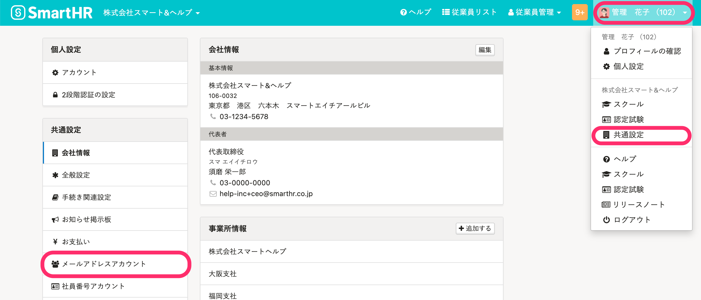

管理者は任意のタイミングでSmartHRのメールアドレスアカウントを削除できます。

# 削除手順

## 1\. 画面右上のアカウント名 >［共通設定］>［メールアドレスアカウント］をクリック

管理者アカウントでログインし、 **画面右上のアカウント名 >［共通設定］>［メールアドレスアカウント］** をクリックします。

## 2\. ［...］メニュー >［アカウントを削除する］をクリック

メールアドレスアカウント一覧で、削除したい対象者の **［...］メニュー >［アカウントを削除する］** をクリックします。

確認画面の **［OK］** をクリックすると、メールアドレスアカウントを削除します。

# 削除した場合の影響範囲

メールアドレスアカウントを削除すると、**過去の申請情報** や **［手続き一覧］** の情報も一緒に削除されます。

ただし **［手続き一覧］** は、一覧のステータスにより影響が異なります。

-  **［管理者確認中］** の状態でアカウントを削除すると、 **［手続き一覧］** から情報が削除されます。
-  **［管理者対応中］** の状態でアカウントを削除すると、 **［手続きToDo一覧］** には情報が残ります。

:::tips
メールアドレスアカウントを削除しても、紐付いた従業員情報は削除されません。
:::
:::alert
誤って削除してしまった場合は再度メールアドレスアカウントの招待を行なう必要があります。
招待方法は下記のページをご覧ください。
[招待済みの従業員に招待メールを再送する](https://knowledge.smarthr.jp/hc/ja/articles/360026265393)
:::
