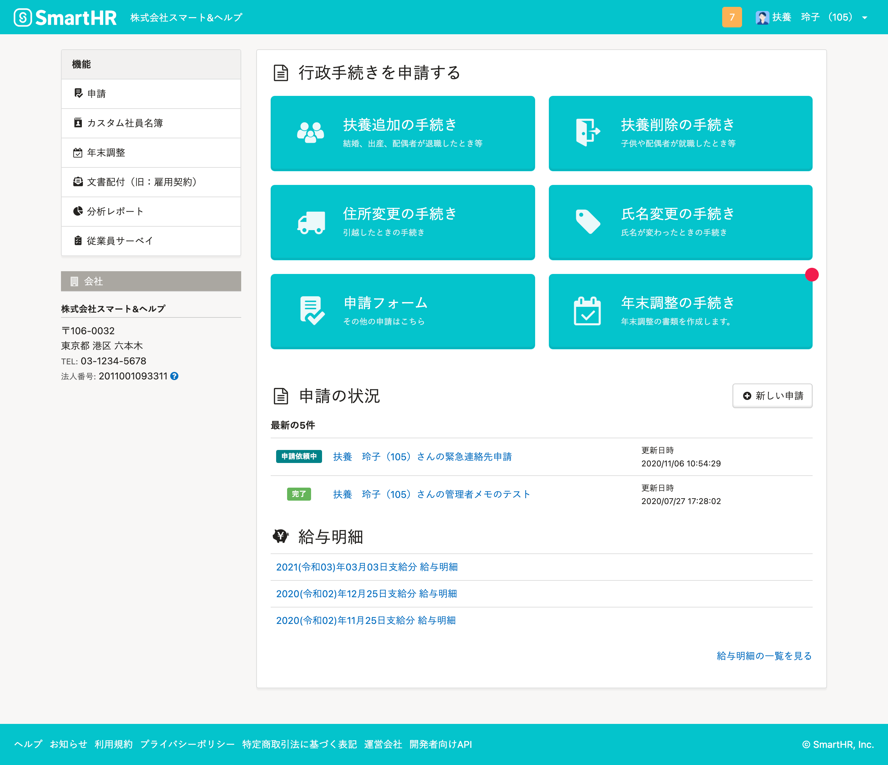
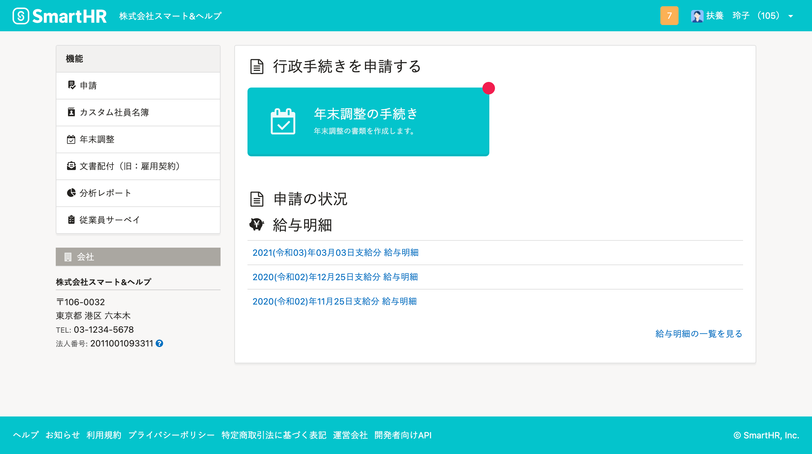
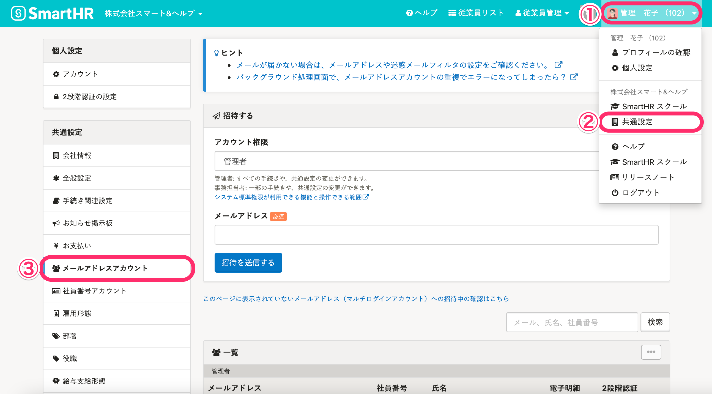
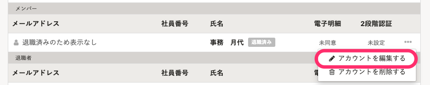
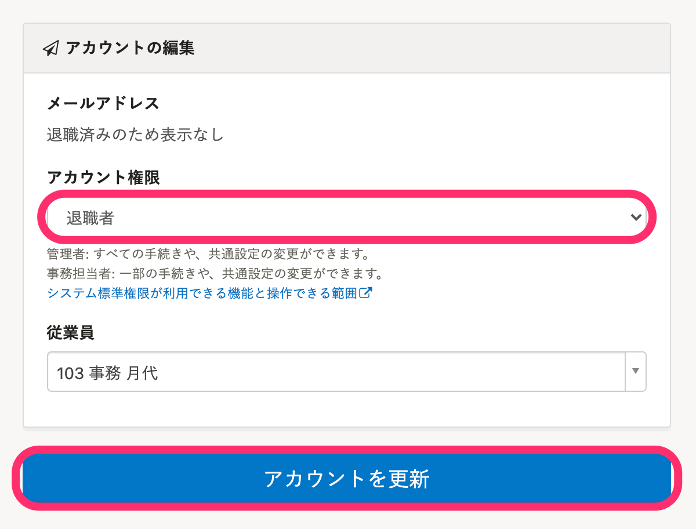
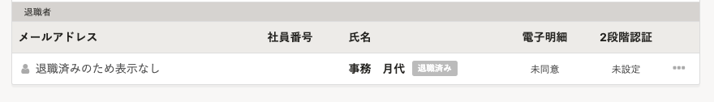

退職した従業員のSmartHRアカウントの権限を「退職者」に設定し、利用できる機能を制限できます。

退職者権限が適用されたアカウントは、管理者がアカウントを削除しない限り、給与明細や源泉徴収の閲覧など一部の機能を引き続き利用できます。

ここでは、メールアドレスアカウントに退職者権限を適用するための設定を説明します。

# 「退職者」権限とは？

退職した従業員のアカウントの権限を「退職者」に設定することで、利用できる機能を制限できます。

 **［退職者］** 権限を適用すると、アカウントを持っている退職済みの従業員が、退職後に給与明細や源泉徴収の閲覧など、SmartHRの一部の機能だけを利用できます。

:::tips
- アカウントの有効期限はありません。
    -  **［退職者］** 権限が適用されたアカウントは、管理者がアカウントを削除しない限り、SmartHRにログインして給与明細などを閲覧できます。
- 退職日を迎えたアカウントは、自動で **［退職者］** 権限に変更するように設定できます。
    - 詳しくは、[退職日を迎えたアカウントの権限を自動で退職者に変更する](https://knowledge.smarthr.jp/hc/ja/articles/360051420433)を参照してください。
:::

その他、退職者権限で利用できる機能の詳細は、[システム標準権限が利用できる機能と操作できる範囲](https://knowledge.smarthr.jp/hc/ja/articles/360026266513)を参照してください。

## 退職者権限が適用される前の従業員画面

※申請フォームは、スタンダードプラン以上の場合のみ表示されます。

## 退職者権限が適用された従業員画面

# 退職者権限をアカウントに適用する

## 1\. 画面右上のアカウント名 >［共通設定］>［メールアドレスアカウント］をクリック

画面右上のアカウント名 > **［**  **共通設定］** \> **［メールアドレス**  **アカウント］** の順にクリックすると、メールアドレスアカウント一覧が表示されます。

## 2\. ［…］メニュー >［アカウントを編集する］をクリック

退職者権限を適用する従業員を探し、該当する行の端にある **［...］メニュー >［アカウントを編集する］** をクリックすると、アカウントの編集画面が表示されます。

## 3\. ［アカウント権限］を［退職者］に変更し、［アカウントを更新］をクリック

アカウントの編集画面で、 **［アカウント権限］** を選択するプルダウン項目から **［退職者］** を選び、 **［アカウントを更新］** をクリックしてください。

## 4\. 権限の変更を確認する

該当従業員の権限がメールアドレスアカウント一覧上で **［退職者］** になっていることを確認します。

退職日を迎えたアカウントの権限を自動で退職者に変更する設定については、[退職日を迎えたアカウントの権限を自動で退職者に変更する](https://knowledge.smarthr.jp/hc/ja/articles/360051420433)を参照してください。
