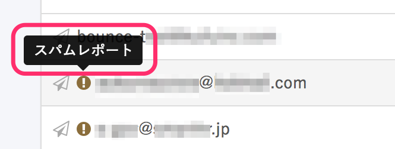
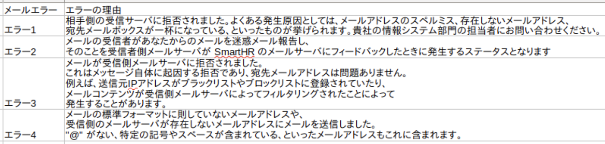

従業員にSmartHRからのメールが届かない場合の原因と対応方法です。

必要に応じて、エラーの確認方法もご覧ください。

# メールが届かない原因

## 入力したメールアドレスが誤っている

入力したメールアドレスに誤りがある場合があります。

### 対応方法

入力されたメールアドレスが正しいかをご確認ください。

アカウントのメールアドレスは **［個人設定］>［メールアドレス設定］** で変更・確認が可能です。

## メール受信が拒否設定されている

キャリアメールの場合は、「PC からのメールの受信拒否」や「URL 付きメールの拒否」などの設定により、正しく受信できない場合があります。

### 対応方法

「smarthr.jp」ドメインからのメールを受信できるよう設定してください。

以下は、キャリア別の対応方法です。

- #### docomo
    

[指定受信／拒否設定 | お知らせ | NTTドコモ](https://www.nttdocomo.co.jp/info/spam_mail/spmode/domain/index.html#p02) へアクセスし、該当する設定方法を参考に「smarthr.jp」 を受信リストへ追加してください。

- #### au
    

[受信リスト設定 | 迷惑メールフィルター機能 | au](https://www.au.com/support/service/mobile/trouble/forestalling/mail/anti-spam/fillter/function-11/) へアクセスし、該当する設定方法を参考に「smarthr.jp」を受信リストへ追加してください。

上記を設定しても受信できない場合は、 [なりすまし規制 | 迷惑メールフィルター機能 | au](https://www.au.com/support/service/mobile/trouble/forestalling/mail/anti-spam/fillter/function-09/) の設定変更をお試しください。

- #### Softbank
    

[迷惑メールの受信許可・拒否設定をする | 迷惑メールでお困りのとき | お客さまサポート | モバイル | ソフトバンク](https://www.softbank.jp/mobile/support/antispam/settings/whiteblack/) へアクセスし、該当する設定方法を参考に「smarthr.jp」を受信許可リストへ追加してください。

- #### キャリアメール以外の場合：Google Workspace
    

[Gmail で IP アドレスをホワイトリストに登録する｜Google Workspace 管理者 ヘルプ](https://support.google.com/a/answer/60751?hl=ja) を参考に、送信元 IP アドレス 「168.245.113.131」をホワイトリストへ追加してください。

## RFC違反のメールアドレス

RFC違反のメールアドレスには、SmartHRから通知メールが届かない場合があります。

### 対応方法

RFCに準拠したメールアドレスに変更してください。

:::tips
RFC（Request for Comments）とは、「IETF（インターネット技術標準化委員会）」が発行する、国際的なインターネットの技術ルールを定めた文書を指します。
RFCのルールに準じたメールアドレスは、以下の条件を満たしている必要があります。
- 半角英数字のみを使用している
- 「.（ドット）」「-（ハイフン）」「\_（アンダースコア）」以外の記号を使用していない
- 記号を最初と@の直前に使用していない
- 記号を2文字以上続けて使用していない
:::

## メールアドレスに大文字が含まれている

SmartHRでは、登録されたメールアドレスはすべて小文字に変換されます。

たとえば、 「SmartHR@smathr.co.jp」というメールアドレスを登録した場合、 「smarthr@smarthr.co.jp」というメールアドレスに変換されます。

そのため、メールの受信側のサーバーが大文字と小文字を区別して管理している場合、SmartHRからのメールを受信できません。

### 対応方法

英字部分はすべて小文字にし、RFCに準拠したメールアドレスに変更してください。

# エラーの確認方法

SmartHRから送信したメールが従業員に届かなかった場合、 **［共通設定］** \> **［メールアドレスアカウント］／［社員番号アカウント］** \> **［一覧］** の従業員のメールアドレスに **［！］** が表示されます。

 **［！］** にカーソルをあわせると、メールが届かなかったエラー原因を確認できます。

 **［！］** が表示されている間は、再度送信の操作をしても、システム上で配信が停止してしまうおそれがあります。原因を解消して、再度操作してください。

**メールアドレスアカウント**

**社員番号アカウント**

## エラーの意味

### バウンス

送信したメールが受信側メールサーバに拒否されたときに発生するステータスです。

よくある発生原因としては、下記が挙げられます。

- メールアドレスのスペルに誤りがある
- 存在しないメールアドレスが指定されている
- 宛先メールボックスが一杯になっている

### スパムレポート

メールの受信者が受信したメールを迷惑メールとして報告し、受信者側のメールサーバーからSmartHRのメールサーバーにフィードバックされたときに発生するステータスです。

### ブロック

メールが受信側のメールサーバーに拒否されたときに発生するステータスです。

これはメッセージ自体に起因する拒否であり、宛先メールアドレスは問題ありません。

たとえば、送信元のIPアドレスがブラックリストやブロックリストに登録されていたり、メールのコンテンツが受信側のメールサーバーによってフィルタリングされて発生することがあります。

受信設定の確認方法は、同ページの「2. メール受信が拒否設定されている」をご覧ください。

### 無効なメール

メールの標準フォーマットに則していないメールアドレスや、受信側のメールサーバーが存在しないメールアドレスにメールを送信した場合に発生するステータスとなります。

“@” がない、特定の記号やスペースがある、といったメールアドレスはこれに含まれます。

SmartHRのメールサーバーだけでなく、受信側メールサーバーが無効だと判断する場合もあります。

:::tips
#### アカウント一覧をCSVでダウンロードした場合のエラー確認方法
CSVファイルに、エラー番号と理由が出力されます。
- エラー1 = バウンス
- エラー2 = スパムレポート
- エラー3 = ブロック
- エラー4 = 無効なメール
 **【CSVダウンロード結果の例】** 

エラーを解除する方法については、下記のページをご覧ください。
[メールアドレスアカウントのメールのエラーを解除する](https://knowledge.smarthr.jp/hc/ja/articles/4404565820697)
[社員番号アカウントのメールのエラーを解除する](https://knowledge.smarthr.jp/hc/ja/articles/360036957333)
:::
