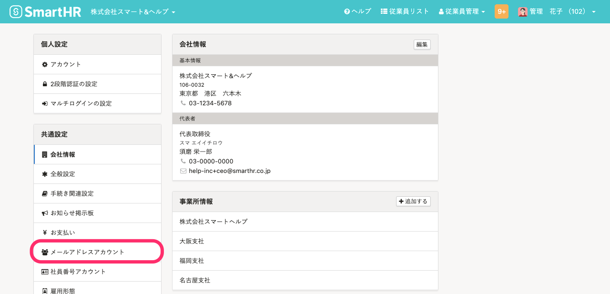
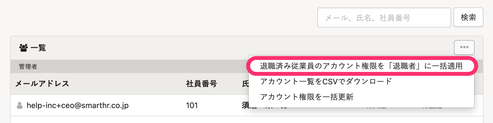
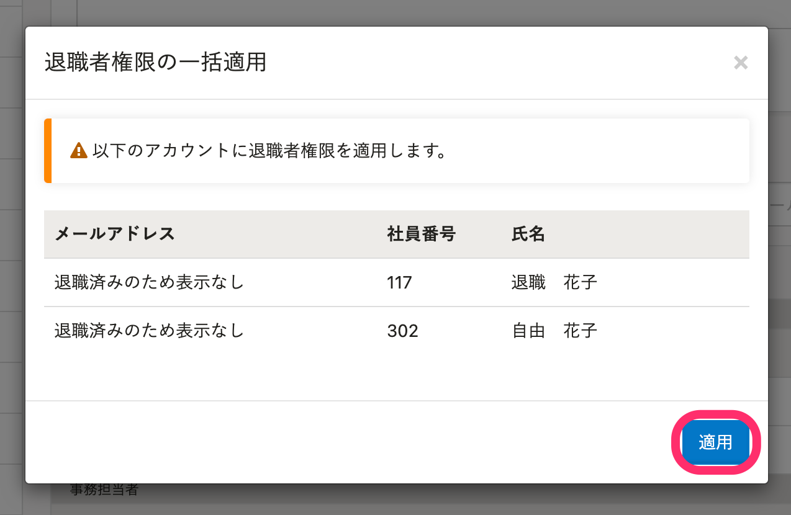
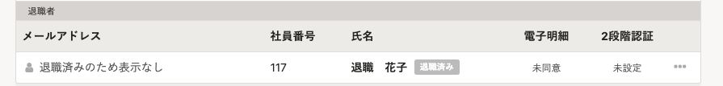

以下の手順で **［退職済み］** ステータスの従業員に対して、一括で **退職者権限** を適用できます。

退職者権限については [メールアドレスアカウントに退職者権限を適用する](https://knowledge.smarthr.jp/hc/ja/articles/360026106034) をご覧ください。

# 1\. 画面右上のアカウント名 >［共通設定］をクリック

トップページ右上のアカウント名をクリックしてメニューを開き、 **［共通設定］** をクリックして、共通設定画面を表示します。

# 2\. ［共通設定］>［メールアドレスアカウント］をクリック

画面左側に表示される  **［共通設定］>［メールアドレスアカウント］** をクリックして、メールアドレスアカウント一覧を表示します。

# 3\. ［...］メニュー >［退職済みアカウントの権限を「退職者」に一括適用］をクリック

**\[一覧\]** の右端にある **［…］メニュー >［退職済みアカウントの権限を「退職者」に一括適用］** をクリックします。

# 4\. ［適用する］をクリック

確認のダイアログが表示されますので、 **［適用する］** をクリックします。

:::tips
［退職済み］ステータスのアカウントのメールアドレスは、個人情報保護のため表示されません。
:::

# 5\. ［退職者］欄に移ったことを確認する

該当従業員がメールアドレスアカウント一覧上で **［退職者］** 欄に移ったことを確認します。

退職日を迎えたアカウントの権限を自動で退職者に変更する設定については、以下のヘルプページをご覧ください。

:::related
[退職日を迎えたアカウントの権限を自動で退職者に変更する](https://knowledge.smarthr.jp/hc/ja/articles/360051420433)
:::
