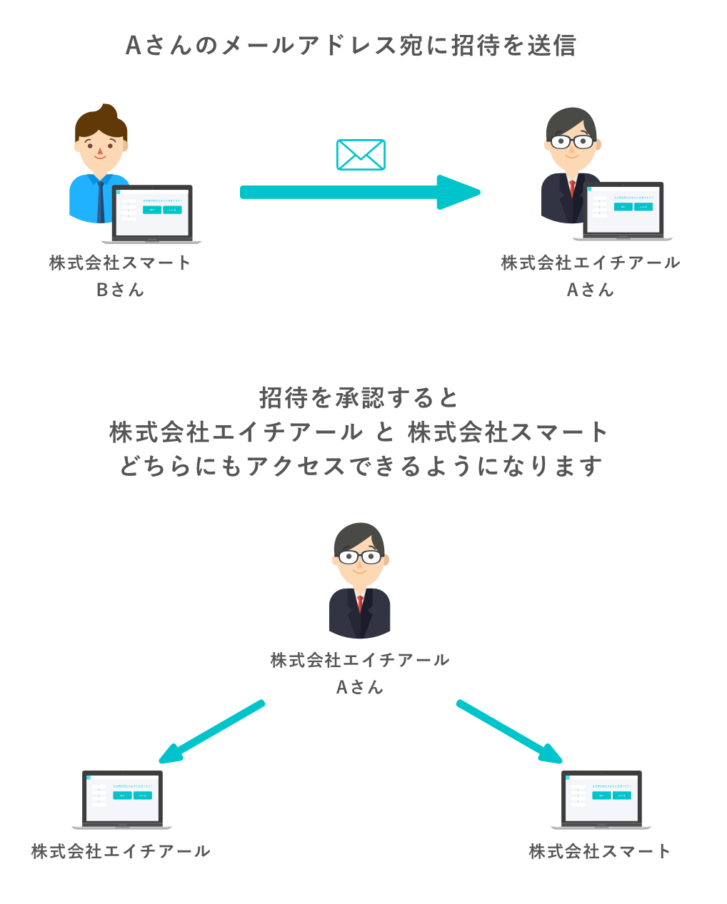
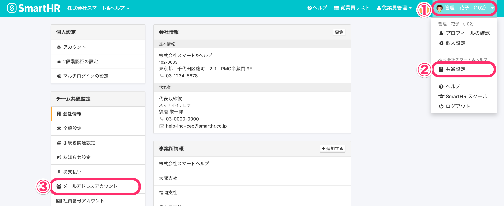
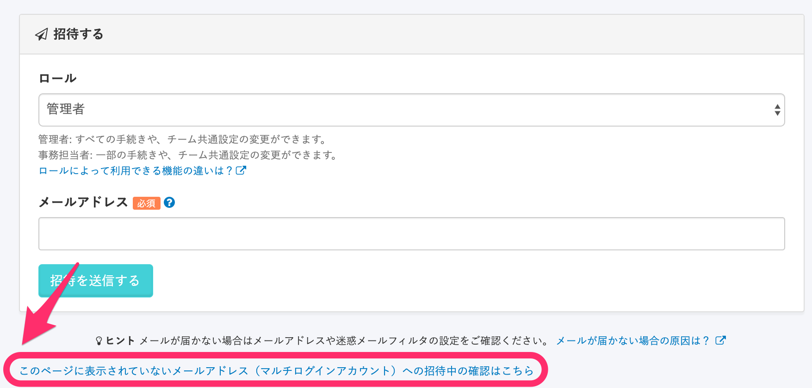
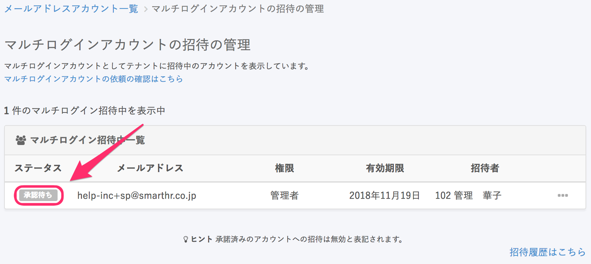
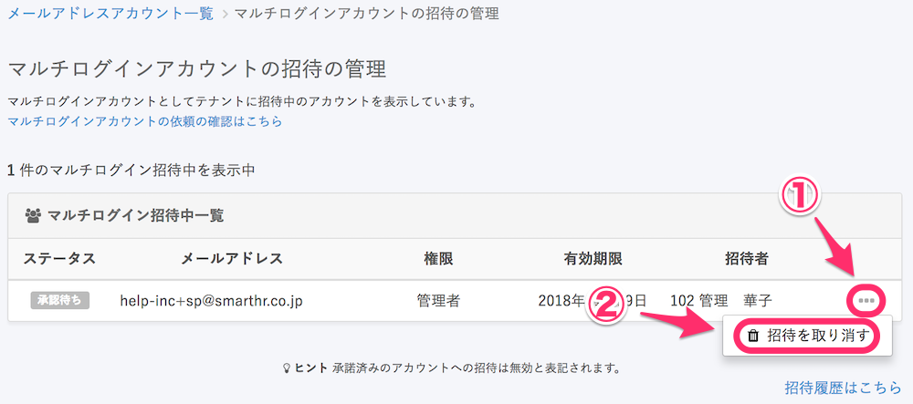
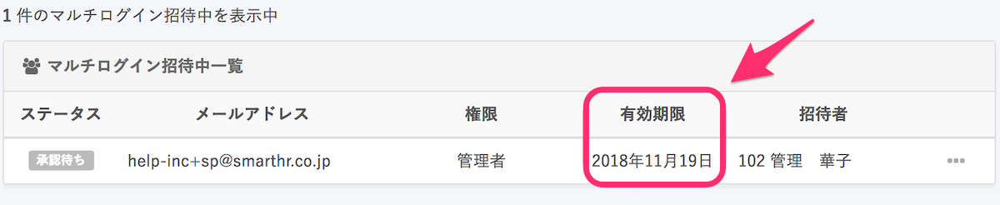
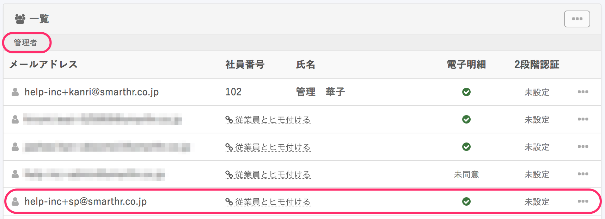
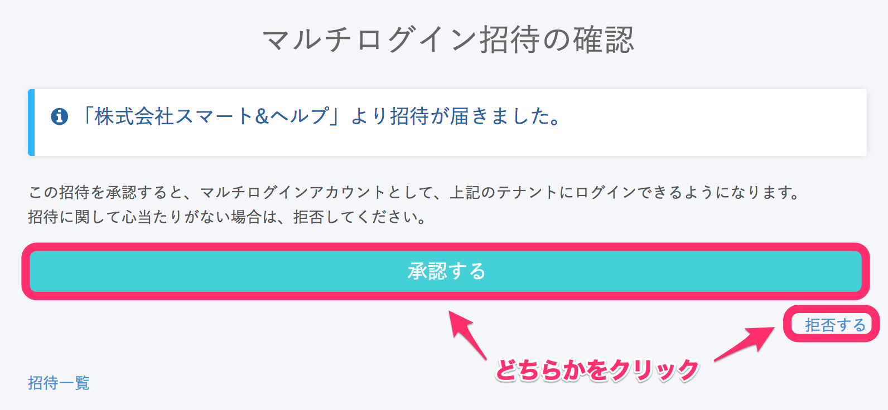
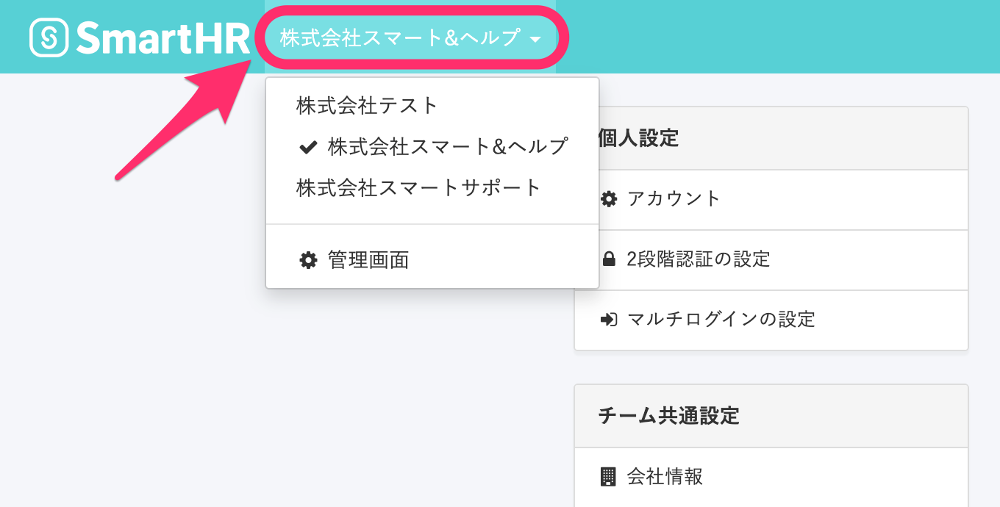

マルチログインアカウントの招待方法と、招待を受けた方がマルチログインを利用する方法を説明します。

# マルチログインとは

1つのメールアドレスで複数の企業アカウントにアクセスできる機能です。

この機能をご利用いただくことで、ログイン / ログアウトを繰り返すことなく、複数の企業アカウントを切り替えられます。

社労士さまなど外部パートナーの方や、子会社やグループ会社など複数の会社を一括で管理している場合などに、ご活用いただけます。

# マルチログインアカウントとは

既に他のSmartHR企業アカウントに登録されているメールアドレスを招待した場合、対象のアカウントは、自動的にマルチログインアカウントとなります。

## 招待方法

下記3通りの招待方法があります。

1.  [入社手続き（本人に基本情報を入力してもらう場合）の招待](https://knowledge.smarthr.jp/hc/ja/articles/360026265893)
2.  [従業員をSmartHRに招待する](https://knowledge.smarthr.jp/hc/ja/articles/360026264133) （入社手続き不要な従業員向け）
3.  [メールアドレスアカウント一覧からの招待](https://knowledge.smarthr.jp/hc/ja/articles/360026265313)

招待後、 **［メールアドレスアカウント］** 一覧 にアカウントの表示が無い場合は、マルチログインアカウントとして招待メールが送信されています。

1と2の場合、選択した招待フォームに紐付いたメールが送られます。

3の場合は、下記のようなメールが送られます。

| 件名 | マルチログインアカウントへの招待が届きました｜ **［会社名］**  |
| --- | --- |
| 本文 |   マルチログインアカウントへの招待がありました。  会社名: **［会社名］**   招待者: **［招待者のメールアドレス］**   招待を確認する  心当たりがない場合はこのメールは破棄し、招待については拒否して下さい。  \-------------------------------------------------  https://app.smarthr.jp/  本メールは SmartHR をご利用いただいているお客様宛に配信しています。  【 運営会社 】株式会社SmartHR https://smarthr.co.jp  \-------------------------------------------------  ※本メールは配信専用のため、返信いただいてもご回答ができません。あらかじめご了承ください。   |

:::tips
**招待時に、「次のメールアドレスはすでに他のテナントで招待中のため招待できません」が表示される場合**
貴社より招待を行なった時点で、対象者さまが別の企業アカウントからの招待を承諾していない状態です。
まずは未対応の招待を **［承諾］** または **［拒否］** していただくよう、対象者さまへお伝えください。
:::

## 招待中のマルチログインアカウントの確認・削除方法

下記手順で、アカウントの確認および削除を行なってください。

### 1\. 画面右上のアカウント名 >［共通設定］>［メールアドレスアカウント］をクリック

**画面右上のアカウント名** をクリックして開くメニューから **［共通設定］** を選び、画面左側に表示される  **［メールアドレスアカウント］** をクリックしてください。

### 2\. ［ヒント］欄の下にあるリンクをクリック

 **［ヒント］** 欄の下にあるリンク **［このページに表示されていないメールアドレス（マルチログインアカウント）への招待中の確認はこちら］** をクリックすると、 **［**  **マルチログインアカウントの招待の管理］** 画面に移動します。

### 3\. ［承認待ち］のステータスを確認する

招待したアカウントのステータスが **［承認待ち］** と表示されていることを確認してください。

### 4\. 削除する場合、［...］メニュー >［招待を取り消す］をクリック

招待中アカウントを削除する場合は、 **［マルチログインアカウントの招待の管理］** 画面の招待者の右側にある **［...］メニュー**  を開いて、 **［招待を取り消す］** をクリックしてください。

:::tips
 **［入社の手続き］** から招待した場合や、従業員管理の **［SmartHRに招待する］** から招待した場合に表示される **［アカウント発行中の従業員］** 画面からもアカウントは削除されます。
また、 **［アカウント発行中の従業員］** 画面にてアカウント発行を取り消した場合も、上記の **［マルチログインアカウントの招待の管理］** 画面からアカウントは削除されます。
 **［アカウント発行中の従業員］** 画面でのアカウント発行の取り消し方法について詳しくは、下記のページをご覧ください。
[招待メールを再送する](https://knowledge.smarthr.jp/hc/ja/articles/360026103574)
:::

## 招待の有効期限について

招待の有効期限は、招待日から**2週間**です。

期限が過ぎてしまった場合は、前項の **［招待中のマルチログインアカウントの確認・削除方法］** を参考に、招待の削除（招待の取り消し）を行なった後に、再度招待をしてください。

▼ 有効期限は、マルチログイン招待中一覧でも確認できます。

## 招待が承認された後のアカウント確認・削除方法

### 1\. 画面右上のアカウント名 >［共通設定］>［メールアドレスアカウント］をクリック

マルチログインの招待が承認されると、 **［メールアドレスアカウント］** 一覧にアカウントが表示されます。

**画面右上のアカウント名** をクリックして開くメニューから **［共通設定］** を選び、画面左側に表示される  **［メールアドレスアカウント］** をクリックしてください。

### 2\. アカウントを確認する

 **［メールアドレスアカウント］** をクリックすると、 **［一覧］** 項目に招待を承認したアカウントが表示されます。

下記の画面は **［管理者］** ロールで招待を行なった場合の表示となります。

### 3\. アカウントを削除する場合

招待の承認後、自社のSmartHR企業アカウントへのログインを取り消したい場合は、下記のページに記載の手順でメールアドレスアカウントの削除を行なってください。

[メールアドレスアカウントを削除する](https://knowledge.smarthr.jp/hc/ja/articles/360026107594)

# 招待を受けた方がマルチログインを利用する方法

招待を受けた方が **［マルチログイン招待の確認］** 画面にて **［承認する］** をクリックしたあと、画面左上から企業アカウントを切り替えられるようになります。

## 1\. SmartHRにログインした状態で、招待メールに記載のリンクをクリック

管理者が、 **［入社手続き］** や **［従業員をSmartHRに招待する］** から招待した方がマルチログインアカウントになる場合は、招待フォームに紐付いたメールが届きます。

**SmartHRにログインした状態で**メール内のリンクをクリックすると、手順2の **［マルチログイン招待の確認］** 画面が表示されます。

### 招待メールの例

管理者がメールアドレスアカウント一覧から招待した方がマルチログインアカウントになる場合、下記の招待メールが届きます。

メール内にある **［招待を確認する］** のリンクをクリックしてください。

| 件名 | マルチログインアカウントへの招待が届きました｜ **［会社名］**  |
| --- | --- |
| 本文 |   会社名: **［会社名］**   招待者: **［招待者のメールアドレス］**   招待を確認する  心当たりがない場合はこのメールは破棄し、招待については拒否して下さい。  \-------------------------------------------------  https://app.smarthr.jp/  本メールは SmartHR をご利用いただいているお客様宛に配信しています。  【 運営会社 】株式会社SmartHR https://smarthr.co.jp  \-------------------------------------------------  ※本メールは配信専用のため、返信いただいてもご回答ができません。あらかじめご了承ください   |

## 2\. ［承認する］もしくは［拒否する］をクリック

 **［マルチログイン招待の確認］** 画面 にて、 **［承認する］** もしくは **［拒否する］** をクリックしてください。

## 3\. 画面左上で企業アカウントを切り替える

マルチログイン招待を承認したあと、画面左上から企業アカウントを切り替えられるようになります。

