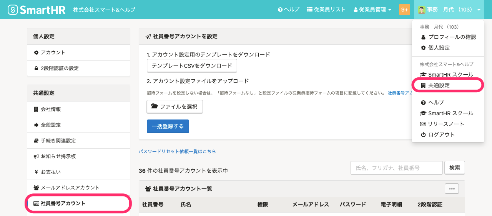
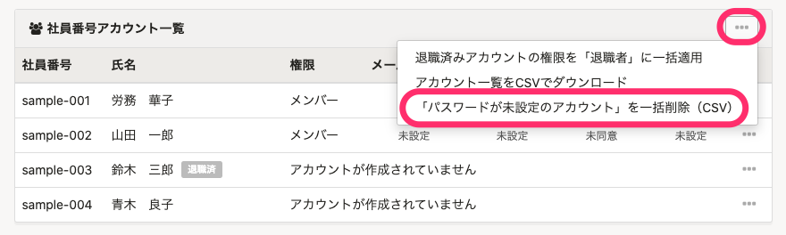
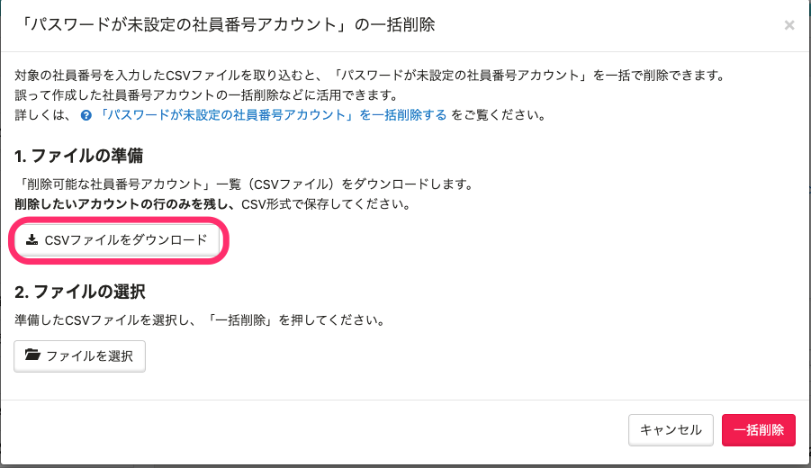
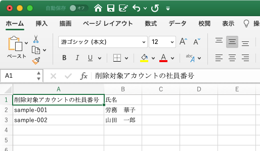
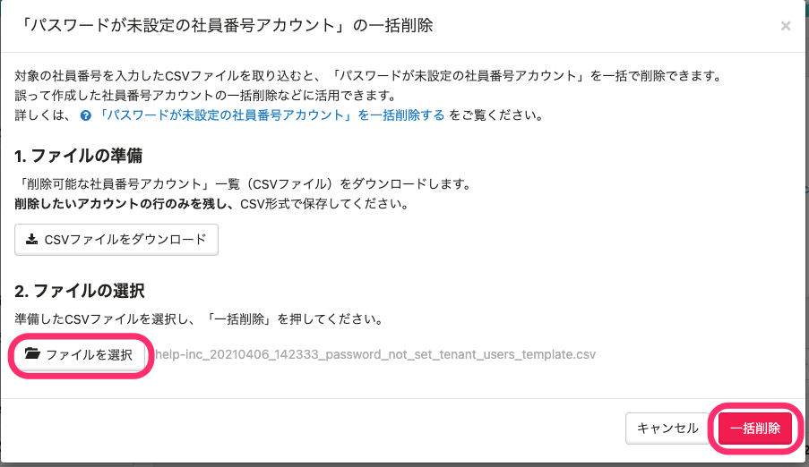
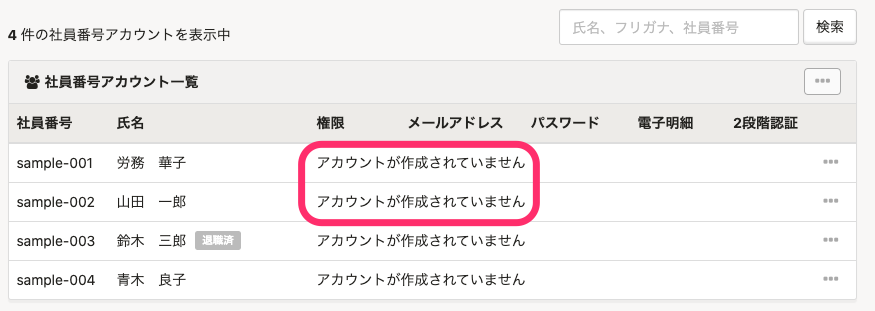

管理者からの招待後に、未承諾の（パスワードを初回設定していない）社員番号アカウントを一括で削除する方法を説明します。

誤って社員番号アカウントを作成してしまった際などにご利用ください。

:::alert
この機能で削除できるのは、管理者が設定した初期パスワードでログインした後に、新しいパスワードを設定していない社員番号アカウントです。
すでにSmartHRをご利用中の社員番号アカウントは一括削除できないため、個別に削除してください。
[社員番号アカウントを削除する](https://knowledge.smarthr.jp/hc/ja/articles/360026263033)
:::

# 1\. 画面右上のアカウント名>［共通設定］>［社員番号アカウント］をクリック

 **画面右上のアカウント名 >［共通設定］** をクリックし、画面左に表示される **［**  **共通設定］** メニューで **［**  **社員番号アカウント］** をクリックします。

# 2\. ［…］メニューから［「パスワードが未設定のアカウント」を一括削除（CSV）］をクリック

 **［社員番号アカウント一覧］** の **［…］メニュー**  \> **［「パスワードが未設定のアカウント」を一括削除（CSV）］** をクリックします。

:::alert
管理者がパスワードをリセットしている場合も、 **［パスワード］** は **［未設定］** と表示されますが、削除の対象にはなりません。
:::

# 3\. ［CSVファイルをダウンロード］をクリック

 **［「パスワードが未設定の社員番号アカウント」の一括削除］** ダイアログで、 **［CSVファイルをダウンロード］** をクリックします。

削除対象アカウントのCSVファイルのダウンロードが開始します。

# 4\. ［バックグラウンド処理］からCSVファイルをダウンロード

[バックグラウンド処理後にデータをダウンロードする](https://knowledge.smarthr.jp/hc/ja/articles/360026105494)を参考に、バックグラウンド処理からCSVファイルをダウンロードします。

# 5\. CSVファイルを編集する

ダウンロードしたCSVファイルをMicrosoft Excelなどで開き、編集します。

削除したくないアカウントがある場合は、行を削除して、CSV形式で保存します。

:::tips
削除できるアカウントのみがCSVファイルに書き出されます。書き出されたアカウント以外のアカウントを追加しても、削除されません。
:::

# 6\. ［ファイルを選択］>［一括削除］をクリック

 **［「パスワードが未設定の社員番号アカウント」の一括削除］** ダイアログで、 **［ファイルを選択］** をクリックします。

編集したCSVファイルを選択し、 **［一括削除］** をクリックすると、アカウントの削除が開始します。

画面をリロードして、 **［アカウントが作成されていません］** と表示されていれば、削除は完了です。

削除結果は、バックグラウンド処理からも確認できます。
