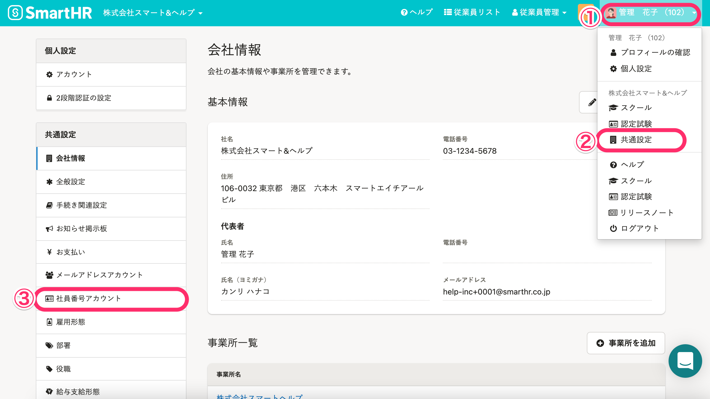
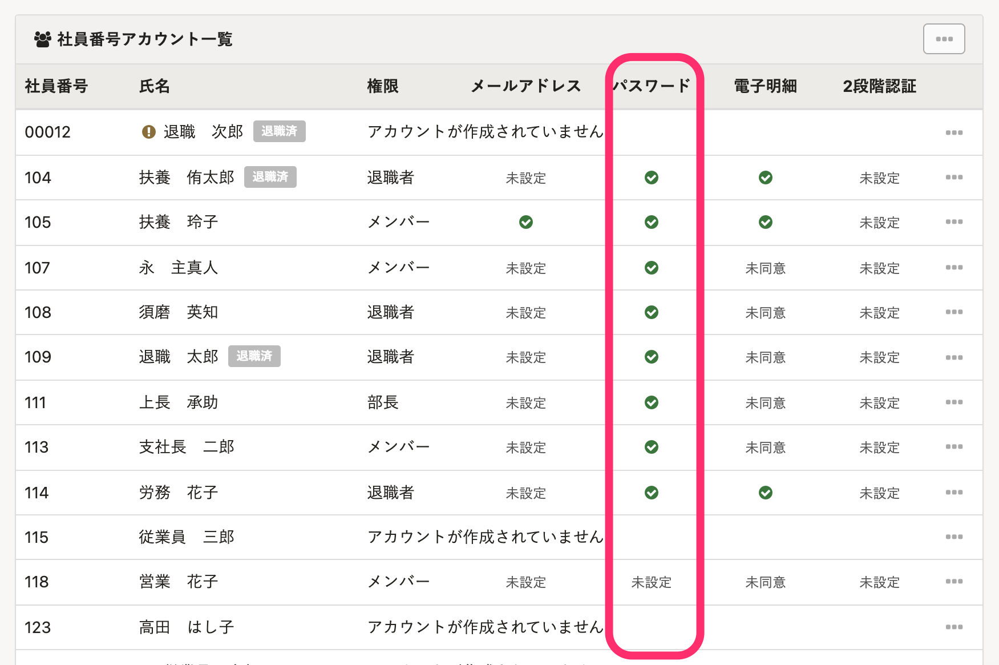
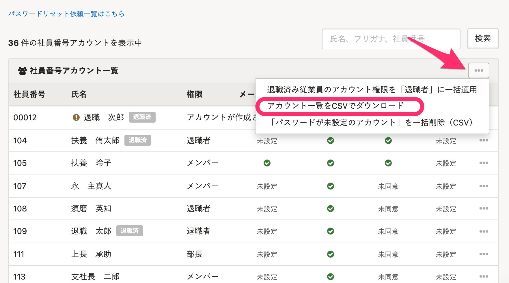
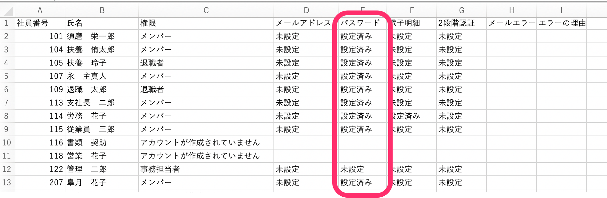

社員番号アカウントの従業員が初期パスワード使ってSmartHRにログインし、各自パスワードの設定が完了したかを確認する方法を説明します。

# 社員番号アカウントの状況を確認する

## 1\. ［共通設定］>［社員番号アカウント］をクリック

画面右上のアカウント名から、 **［共通設定］** \> **［社員番号アカウント］** をクリックして、社員番号アカウント一覧を表示します。

## 2\. ［社員番号アカウント一覧］の［パスワード］の列を確認

従業員によってパスワードの設定が完了している場合、チェックマークが表示されます。

## ダウンロードできるCSVファイルを利用する確認方法

### 1\. ［社員番号アカウント］画面でCSVをダウンロードする

 **［社員番号アカウント一覧］** の右上の **［…］メニュー** 　から、 **［アカウント一覧をCSVでダウンロード］** をクリックすると、社員番号アカウント一覧のCSVファイルをダウンロードできます。

### 2.ダウンロードしたCSVの［パスワード］の列を確認する

ダウンロードしたCSVファイルをMicrosoft Excelなどで開き、 **［パスワード］** の列を確認します。

 **［未設定］** ／ **［設定済み］** が表示されていることを確認します。

**\[未設定\]**　のアカウントは、SmartHRに未ログインで、管理者が発行した初期パスワードが有効のままです。

**\[設定済み\]**　のアカウントは、SmartHRにログイン済みで、各自パスワードを設定しています。

:::tips
メールアドレスが未設定の社員番号アカウントで、初期パスワードや自分が設定したパスワードがわからなくなってしまった場合には、管理者権限のあるアカウントでリセットする必要があります。
[社員番号アカウントのパスワードをリセットする](https://knowledge.smarthr.jp/hc/ja/articles/360026263673)
:::
