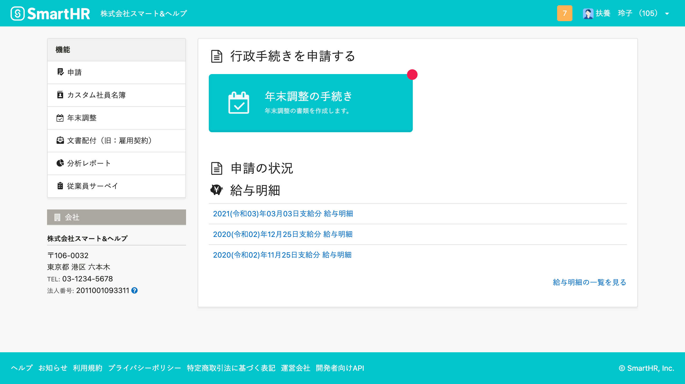

退職した従業員のSmartHRアカウントの権限を「退職者」に設定し、利用できる機能を制限できます。

退職者権限が適用されたアカウントは、管理者がアカウントを削除しない限り、給与明細や源泉徴収の閲覧など一部の機能を引き続き利用できます。

ここでは、社員番号アカウントに退職者権限を適用するための設定を説明します。

# 「退職者」権限とは？

退職した従業員のSmartHRアカウントの権限を「退職者」に設定し、利用できる機能を制限できます。

 **［退職者］** 権限を適用することで、退職後、SmartHRのアカウントを持っている退職済みの従業員を、給与明細や源泉徴収の閲覧など一部の機能だけを利用可能な状態にします。

:::tips
- 従業員リストで **［**  **退職済みの従業員］** として表示されていても、社員番号アカウント設定画面で  **［**  **退職者］** に権限変更しない限り、権限は適用されません。
- アカウントの有効期限はありません。退職者権限が適用されたアカウントは、管理者がアカウントを削除しない限り、SmartHRにログインし、給与明細などの閲覧ができます。
:::

その他、退職者権限で利用できる機能の詳細は、下記のヘルプページをご覧ください。

[システム標準権限が利用できる機能と操作できる範囲](https://knowledge.smarthr.jp/hc/ja/articles/360026266513)

## 退職者権限が適用される前の従業員画面

※申請フォームは、スタンダードプラン以上の場合のみ表示されます。

## 退職者権限が適用された従業員画面

# 退職者権限をアカウントに適用する

## 1\. 画面右上のアカウント名 >［共通設定］>［社員番号アカウント］をクリック

画面右上のアカウント名 > **［**  **共通設定］** \> **［**  **社員番号アカウント］** の順にクリックすると、 **［社員番号アカウント一覧］** が表示されます。

## 2\. ［…］メニュー >［アカウントを編集する］をクリック

退職者権限を適用する従業員を探し、該当する行の端にある **［**  **...］メニュー >［アカウントを編集する］** をクリックすると、アカウントの編集画面が表示されます。

## 3\. ［アカウント権限］を［退職者］に変更し、［アカウントを更新］をクリック

社員番号アカウントの編集画面で、 **［**  **アカウント権限］** を選択するプルダウン項目から **［**  **退職者］** を選び、  **［アカウントを更新］** をクリックしてください。

## 4\. 権限の変更を確認する

該当従業員の権限が、社員番号アカウント一覧上で **［**  **退職者］** になっていることを確認します。

退職日を迎えたアカウントの権限を自動で退職者に変更する設定については、以下のヘルプページをご覧ください。

[退職日を迎えたアカウントの権限を自動で退職者に変更する](https://knowledge.smarthr.jp/hc/ja/articles/360051420433)
