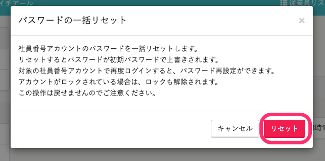
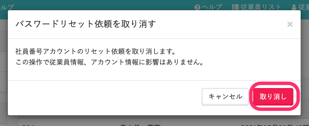

社員番号アカウントのみ保持している従業員が [パスワードのリセットの手順](https://knowledge.smarthr.jp/hc/ja/articles/360026104374) を踏んだ場合、管理者のみ、リセット依頼の確認と一括リセットができます。

# 1\. 画面右上のアカウント名 >［共通設定］>［社員番号アカウント］をクリック

**画面右上のアカウント名** \>［ **共通設定］** \> **［社員番号アカウント］** をクリックし、 **［社員番号アカウント一覧］** を表示します。

# 2\. ［パスワードリセット依頼一覧はこちら］をクリック

 **［社員番号アカウント一覧］** の上部にある **［パスワードリセット依頼一覧はこちら］** をクリックすると、 **［社員番号アカウントの管理 パスワードリセット依頼］** の一覧画面が表示されます。

# 3\. ［…］メニュー >［パスワードの一括リセット］をクリック

依頼一覧の右側にある **［…］メニュー**  を開き、 **［パスワードの一括リセット］** をクリックすると、確認のダイアログが表示されます。

 **［リセット］** をクリックすると、パスワードリセットのバックグランド処理が始まります。

# 4\. 結果の確認

 **［バックグラウンド処理一覧］** 画面に移動すると、パスワード一括リセットの結果を確認できます。

 **［状態］** 欄に緑色の **［完了］** が表示されていれば 、問題なく一括リセットが完了しています。

:::tips
一覧画面の **［操作］列** にある **［リセット］** をクリックして、個別にリセットもできます。

また、 **［社員番号アカウント一覧］** 画面でも個別にパスワードをリセットできます。詳しくは下記のヘルプページをご覧ください。
[社員番号アカウントのパスワードをリセットする](https://knowledge.smarthr.jp/hc/ja/articles/360026263673)
:::

# 依頼を取り消す

 **［パスワードリセット依頼一覧］** の **［操作］** 列にある **［依頼を取り消す］** をクリックすると、依頼を削除できます。

 **［パスワードリセット依頼を取り消す］** ダイアログが表示されるので、 **［取り消し］** をクリックすると、パスワードリセット依頼が取り消され、依頼一覧から表示が消えます。

