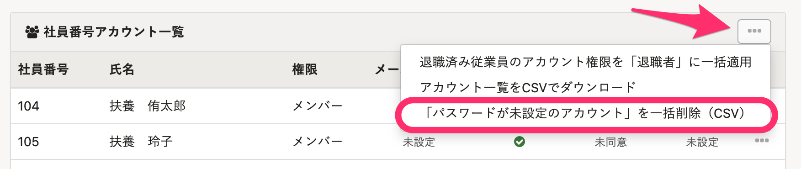

# 社員番号アカウントとは

メールアドレスを持っていないなど、メールアドレスの事前収集が難しい従業員を、**社員番号**でSmartHRに招待できる機能です。

従業員が[ログイン・通知用メールアドレスを設定（変更）する](https://knowledge.smarthr.jp/hc/ja/articles/360026263093)と、通知を受け取ったり、メールアドレスでのログインもできるようになります。

# 社員番号アカウントの設定について

設定方法は2通りあります。

:::tips
下記の方法で社員番号アカウントの設定をするには、あらかじめ従業員情報に**社員番号**が登録されている必要があります。
従業員情報の登録について詳しくは、以下をご覧ください。
[従業員情報を追加・登録する](https://knowledge.smarthr.jp/hc/ja/articles/360026266493)
:::

## 個別に設定する場合

### 1\. 画面右上のアカウント名 >［共通設定］>［社員番号アカウント］をクリック

**画面右上のアカウント名 >［共通設定］>** **［社員番号アカウント］** の順にクリックします。

### 2\. ［...］メニュー >［社員番号アカウントを作成］をクリック

該当社員の欄の **［…］メニュー >［社員番号アカウントを作成］** をクリックしてください。

### 3\. ［初期パスワード］、［アカウント権限］、［従業員招待フォーム］を設定し［アカウントを作成する］をクリック

 **［初期パスワード］、［アカウント権限］、［従業員招待フォーム］** を設定し、 **［アカウントを作成する］** をクリックします。
※ セキュリティ上、アカウント作成後に再度この画面を表示しても、初期パスワードは表示されません。

:::tips
従業員情報に、 **［社員番号］［姓名］［姓名（ヨミガナ）］［生年月日］［戸籍上の性別］［住所］［在籍状況］** の項目が登録済みの場合は、従業員招待フォームを設定せずにアカウント発行もできます。
 **［初期パスワード］** は 8文字以上（72文字以下）でご登録ください。（半角英数字と、「¥」「\\」以外の記号が使えます）
:::

## CSVで一括設定する場合

### 1\. 画面右上のアカウント名 >［共通設定］>［社員番号アカウント］をクリック

 **画面右上のアカウント名 >［共通設定］>［社員番号アカウント］** の順にクリックします。

### 2\. ［テンプレートCSVをダウンロード］で設定用CSVをダウンロードする

 **［テンプレートCSVをダウンロード］** をクリックすると、登録されている情報をもとにした設定用CSVのダウンロードが始まります。

### 3\. ［バックグラウンド処理］にあるCSVファイルをダウンロード

[バックグラウンド処理後にデータをダウンロードする](https://knowledge.smarthr.jp/hc/ja/articles/360026105494) ページを参考に、バックグラウンド処理からCSVファイルをダウンロードします。

### 4\. CSVファイルを編集する

ダウンロードしたCSVファイル上で **［初期パスワード］、［従業員招待フォーム］、［権限］** を設定します。

:::tips
 **［従業員招待フォーム］** および **［権限］** は、SmartHR上に登録されている名称を入力してください。
招待フォームを設定しない場合は、 **［従業員招待フォーム］** 欄に「**招待フォームなし**」と入力して取り込みを行ってください。
 **［初期パスワード］** は 8文字以上（72文字以下）でご登録ください。（半角英数字と、「¥」「\\」以外の記号が使えます）
:::

### 5\. ファイルを選択し、［一括登録する］をクリック

 **［アカウント設定ファイルをアップロード］** 内にある **［ファイルを選択］** をクリックして編集したファイルを選択し、 **［一括登録する］** をクリックすると、情報が取り込まれます。

:::alert
取り込んだ時点でアカウントが作成されます。
別の招待フォームで招待しなおすなど、一括登録完了後にフォームを変更したい場合は、発行された社員番号アカウントを削除し、新しい情報とともに再度社員番号アカウントを作成する必要があります。
アカウントを削除する場合は、該当社員の欄の **［…］メニュー >［アカウントを削除する］** からできます。

パスワードが未設定のアカウントは、社員番号アカウント一覧の右側にある **［…］** \> **［「パスワードが未設定のアカウント」を一括削除（CSV）］** より一括削除ができます。

なお、アカウントを削除しても従業員情報は削除されませんのでご安心ください。
:::

# 設定完了後、従業員への連絡

別途、メールなどSmartHR以外のツールで、下記の情報を従業員へ連絡してください。

- 貴社専用ログインURL（例：https://\*\*\*\*\*\*.smarthr.jp/login）
- 社員番号
- 初期パスワード

:::tips
ログインURLの例にある（\*\*\*\*\*\*）には、貴社専用のサブドメインが入ります。
現在ログインしているSmartHRのURLを確認してください。
サブドメインについて詳しくは、以下のページをご覧ください。
[サブドメインとは](https://knowledge.smarthr.jp/hc/ja/articles/360026264893)
:::
:::alert
**https://app.smarthr.jp/login**というURLのログイン画面からは、社員番号を使ってのログインはできませんので、ご注意ください。
:::

社員番号アカウントでログインする手順については、以下のページをご覧ください。

:::related
[社員番号アカウントでログインする](https://knowledge.smarthr.jp/hc/ja/articles/360026263133)
:::
