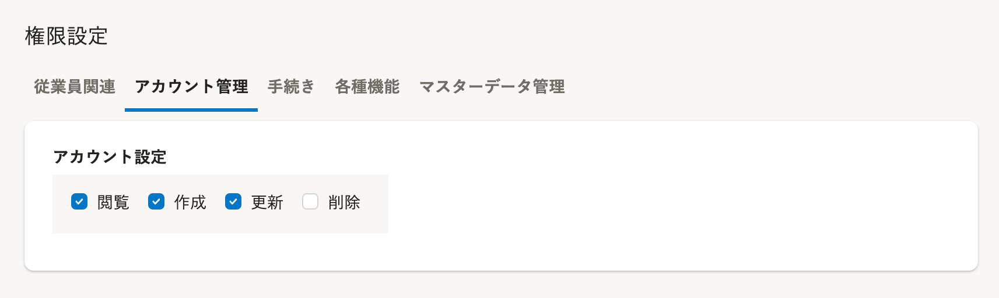
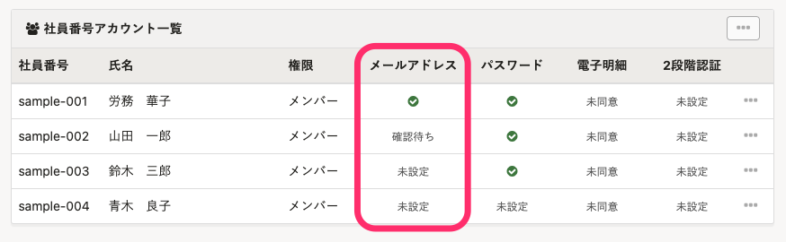
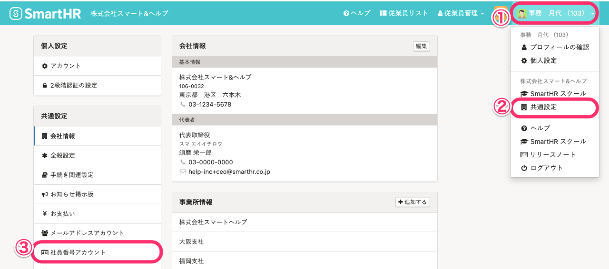
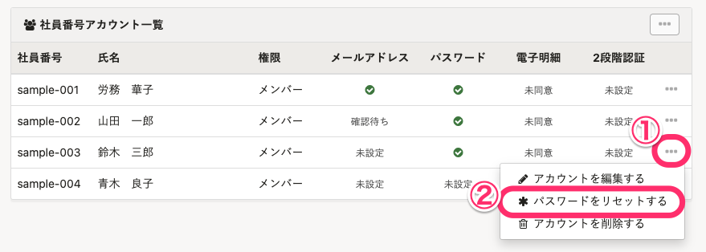
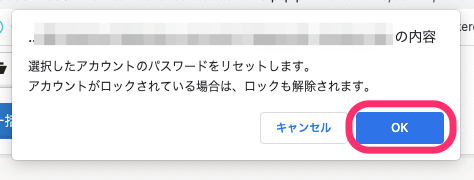
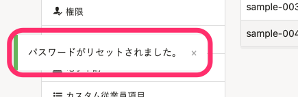
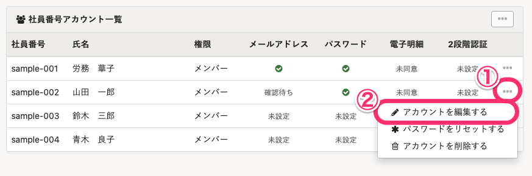

# リセットに必要な権限

社員番号アカウントのパスワードをリセットする場合、以下いずれかの権限が必要です。

- 管理者権限
-  **［アカウント管理］>［アカウント設定］** の **［更新］** ができるカスタム権限

なお、上記担当者によるリセットが必要なのは、 **［社員番号アカウント一覧］** の **［メールアドレス］** が、 **［未設定］** または **［確認待ち］** のアカウントです。

- **緑丸のチェックマーク**… メールアドレス設定済み（従業員にて設定 & 認証完了済み）
-  **［未設定］** …メールアドレス未設定
-  **［確認待ち］** …メールアドレス登録後、メールアドレスの認証が完了していない状態

メールアドレスが設定済みの場合は、アカウント所有者の従業員側でリセットできます。

[パスワードを忘れてしまったら？](https://knowledge.smarthr.jp/hc/ja/articles/360026265593)を参照してください。

# パスワードリセット手順

## 1\. 画面右上のアカウント名 >［共通設定］>［社員番号アカウント］をクリック

**画面右上のアカウント名** \>［ **共通設定］** \> **［社員番号アカウント］** をクリックし、 **［社員番号アカウント一覧］** を表示します。

## 2\. 対象者の ［...］メニュー >［パスワードをリセットする］をクリック

パスワードをリセットしたいアカウント列の右端にある **［…］メニュー**  \> **［パスワードをリセットする］** をクリックします。

## 3\. ［OK］をクリック

 **［OK］** をクリックします。

 **［OK］** をクリックすると、画面左下に［パスワードがリセットされました］と表示されます。

# 初期パスワードを使ってログインし、パスワードを設定する

従業員にパスワードのリセットが完了した旨と、初期パスワードを伝え、初期パスワードを使って再度パスワードを設定するように依頼してください。

:::related
[社員番号アカウントでログインする](https://knowledge.smarthr.jp/hc/ja/articles/360026263133)
:::

## 初期パスワードがわからなくなってしまった場合には

管理者による初期パスワードの再設定は、当該アカウントの **［…］メニュー**  > **［アカウントを編集する］** から、操作できます。

