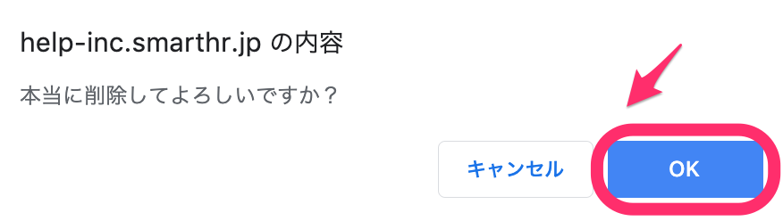

事業所情報を削除するには、削除したい事業所を「事業所」として登録している従業員がいないことを確認した上で、 **画面右上のアカウント >［共通設定］>［会社情報］** の項目にアクセスし、削除を行います。

# 事前準備

## 従業員情報を確認する

削除したい事業所を所属する「事業所」として登録している従業員がいた場合、事業所情報を削除できません。

削除したい事業所を「事業所」の欄に登録している従業員がいるか否かを調べるには、画面右上にある **［従業員リスト］** をクリックしてください。

画面左上にある検索バーに事業所名を打ち込むと、該当の事業所に所属している従業員を調べられます。

# 削除手順

## 1\. 画面右上のアカウント名 >［共通設定］をクリック

いずれの従業員も、削除したい事業所を所属する事業所として登録していないことを確認したら、 **画面右上のアカウント名 >［共通設定］** をクリックしてください。

## 2\. ［会社情報］> 削除したい事業所名 をクリック

画面左にある **［共通設定］** メニューで **［会社情報］** をクリックすると、 **［事業所一覧］** が表示されます。

削除したい事業所名をクリックすると、該当事業所の情報が表示されます。

## 3\. ［...］メニュー >［編集］をクリック

画面上部の **［基本情報］** 横にある **［...］メニュー >［編集］** をクリックしてください。

事業所情報の編集画面に遷移します。

## 4\. ［...］メニュー >［削除］をクリック

事業所情報の編集画面右上にある **［**  **...］メニュー >［削除］** をクリックしてください。

:::alert
該当の事業所を所属する事業所として登録している従業員がいた場合、 **［...］メニュー**  は表示されません。 
:::

## 5\. ［OK］をクリック

「本当に削除してよろしいですか？」というメッセージが表示されます。

 **［OK］** をクリックすると、事業所情報の削除が完了します。
