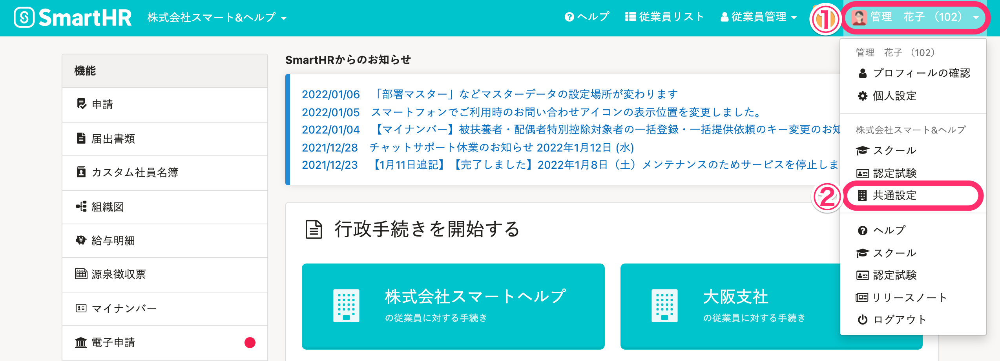
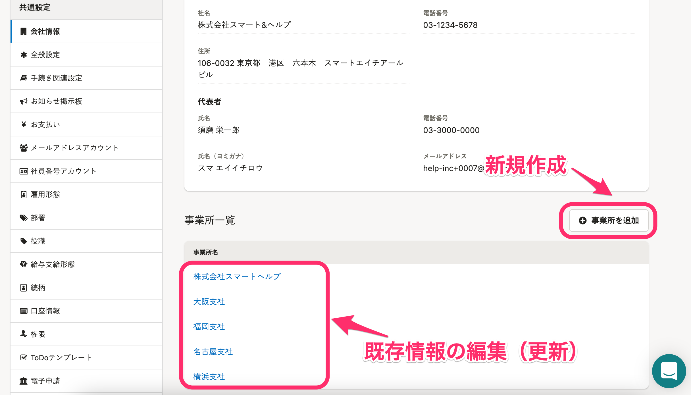
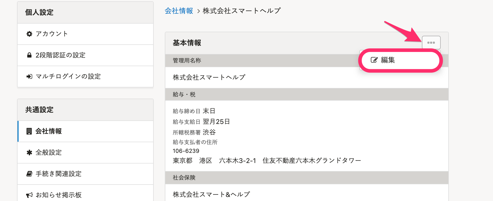
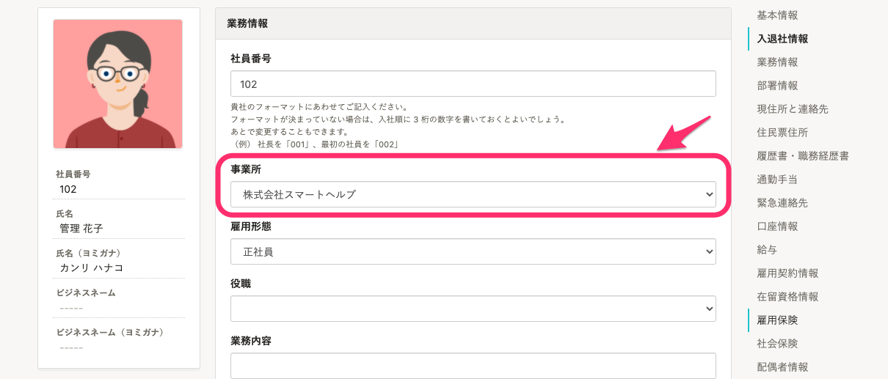

事業所情報は、ひとつの企業アカウントに複数登録できます。

そのため、事業所番号や健康保険タイプが異なる事業所に関する手続きや従業員情報を、ひとつの企業アカウントで管理できます。

# 1\. 画面右上のアカウント名 >［共通設定］をクリック

 **画面右上のアカウント名 >［共通設定］** をクリックすると、画面左側に **［共通設定］** のメニューが表示されます。

# 2\. ［会社情報］> 事業所名をクリック

 **［共通設定］** の **［会社情報］** 画面にて **［事業所一覧］** を確認できます。

事業所情報を新規作成する場合は、 **［+事業所を追加］** をクリックして各種情報を登録してください。

既に登録してある事業所情報を編集するには、任意の事業所名をクリックして詳細ページに移動してください。

# 3\. ［...］メニュー >［編集］をクリック

既存の事業所情報を編集する場合、画面右上にある **［…］メニュー >［編集］** をクリックすると、編集画面へ移動して情報の更新ができます。

:::alert
事業所情報を変更しても、既に作成された手続き書類の内容は変更されません。 書類への反映が必要な場合は、 下記のページをご覧ください。
[書類作成後に変更した情報を、作成済みの書類に反映する](https://knowledge.smarthr.jp/hc/ja/articles/360026106774)
また、健康保険組合に変更がある場合は、様式が異なるため、再度手続きの作成が必要です。
:::
:::tips
事業所を登録すると、従業員情報ページの **［業務情報］** にて **［事業所］** を登録できるようになります。

:::

# 項目

以下の項目を登録できます。

## 代表者

登録されている従業員情報から代表者を指定します

## 基本情報

- 管理名 ※1
- 事業所名
- 電話番号 ※2
- 住所

※1 書類には表示されません
※2「0」から始まる番号であること、また、入力欄3番目の枠では4桁のみ入力可能です。例えば、電話番号が「0120-123-456（4桁-3桁-3桁）」だった場合は、「0120-12-3456（4桁-2桁-4桁）」のように入力してください

## 給与・税

- 給与締め日 ※
- 給与支給日 ※
- 管轄の税務署

※ 給与締め日・支給日はデフォルト値として登録されますが、給与明細データ登録時に手動で変更できます

## 社会保険

- （厚生年金）事業所整理記号
- （厚生年金）事業所番号
- 健康保険タイプ
- （健康保険）事業所整理記号

## 雇用保険

- 管轄の公共職業安定所
- （雇用保険）事業所番号
- 労働保険番号

## 社会保険労務士

- 姓名
- 代理区分
- 肩書
- 社会保険労務士都道府県会
- 事務所名
- 住所
- 電話番号

## 管轄

ここで登録しておくと、電子申請時に都度管轄を選択する必要がなくなります。

- 公共職業安定所
- 事務センター
- 年金事務所
- 労働基準監督署又は公共職業安定所
- 労働基準監督署
- 労働局又は労働基準監督署
- 労働局
