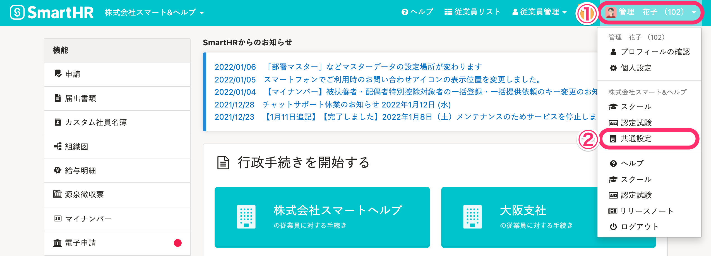
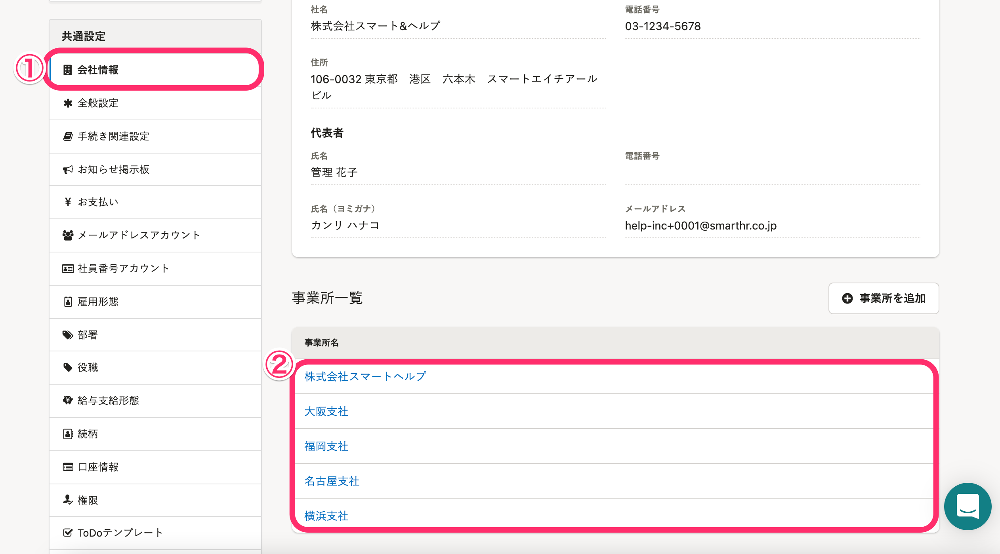
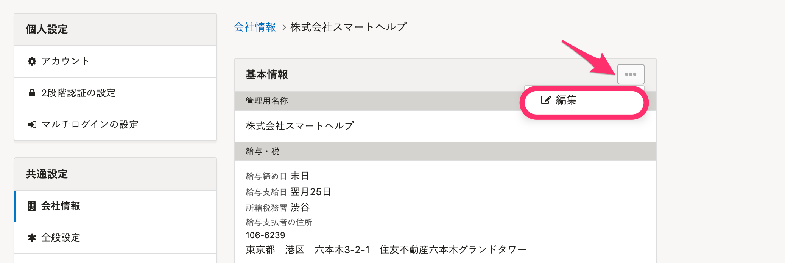
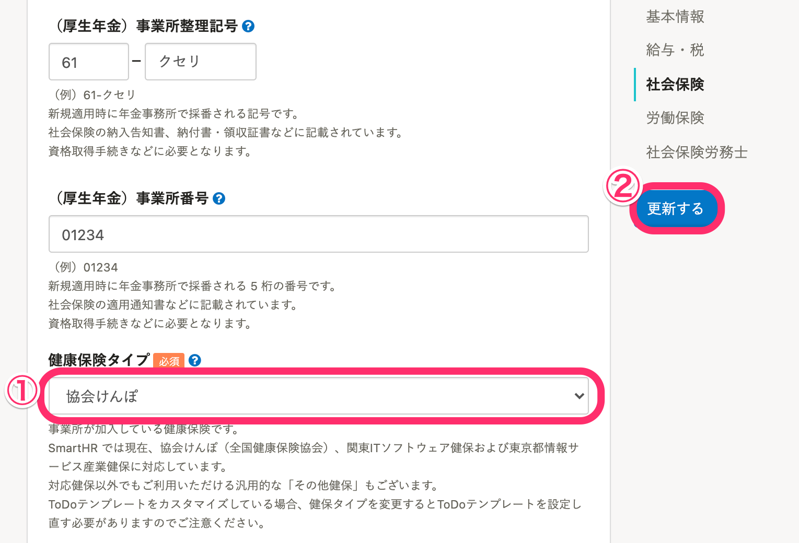

SmartHRでは、現在下記の健保組合の書類に対応しています。

- 全国健康保険協会（協会けんぽ）
- 関東ITソフトウェア健康保険組合（関東ITS）
- 東京都情報サービス産業健康保険組合（TJK）

上記以外の健保組合にご加入の会社さま向けに、汎用的にご利用いただける「**その他健保**」という設定もあります。

詳しくは下記のページをご覧ください。

[「その他健保」とは](https://knowledge.smarthr.jp/hc/ja/articles/360026105294)

# 1\. 画面右上のアカウント名 >［共通設定］をクリック

 **画面右上のアカウント名 >［共通設定］** をクリックすると、画面左側に **［共通設定］** のメニューが表示されます。

# 2\. ［会社情報］> 任意の事業所名をクリック

 **［共通設定］** \> **［会社情報］** をクリックすると、 **［事業所一覧］** が表示されるので任意の事業所名を選びます。

# 3\. ［...］メニュー >［編集］をクリック

事業所情報の **［基本情報］** 右端にある **［...］メニュー >［編集］** をクリックすると、編集画面が表示されます。

# 4\. ［社会保険］の［健康保険タイプ］を選択する

 **［社会保険］** の **［健康保険タイプ］** をプルダウンメニューから選択し、 **［更新する］** をクリックしてください。

