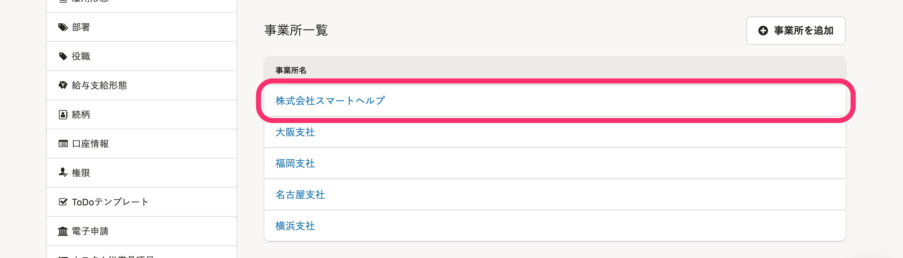
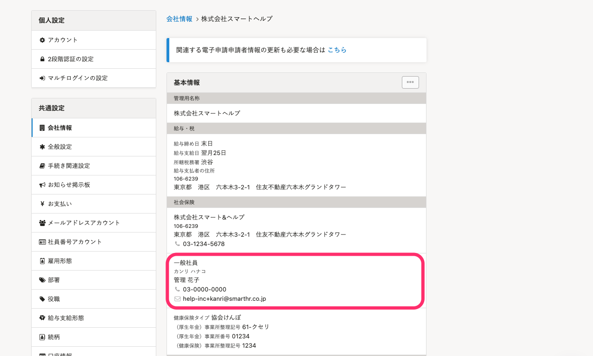

代表者が変更となった場合は、次の2箇所の設定を変更してください。

なお、代表者が変更となり、役所への届出が必要な場合は、下記のページをご確認ください。

:::related
[会社の名称・所在地を変更した場合に必要な手続きは？](https://knowledge.smarthr.jp/hc/ja/articles/360026106974)
:::

# 会社情報に登録している代表者を変更する

## 1\. アカウント名 >［共通設定］>［会社情報］をクリック

画面右上にあるアカウント名から **［共通設定］** を選び、画面左のリストにある **［会社情報］** をクリックします。

## 2\. ［会社情報］>［基本情報を編集］をクリック

 **［基本情報］** 横の **［基本情報を編集］** をクリックします。

## 3\. 代表者として設定する従業員を選択し、［更新する］をクリック

 **［代表者］** 項目で、代表者として設定する従業員を選択し、 **［更新する］** をクリックします。

## 4\. ［代表者］を確認する

会社情報の **［代表者］** が変更されていることを確認します。

# 事業所情報に登録している代表者を変更する

各書類に印字される代表者情報は、この事業所情報に登録されているものとなります。

## 1\. アカウント名 >［共通設定］>［会社情報］をクリック

画面右上にあるアカウント名から **［共通設定］** を選び、画面左のリストにある **［会社情報］** をクリックします。

## 2\. ［事業所情報］から任意の事業所名をクリック

ページ中央に表示される **［事業所一覧］** から、**任意の事業所名**をクリックします。

## 3\. ［...］メニュー >［編集］をクリック

 **［基本情報］** 横の **［...］メニュー >［編集］** をクリックします。

## 4\. 代表者として設定する従業員を選択し、［更新する］をクリック

 **［社会保険］** および **［労働保険］** 項目にて、代表者として設定する従業員を選択し、 **［更新する］** をクリックします。

## 5\. ［代表者］を確認する

事業所情報の［代表者］が変更されていることを確認します。

