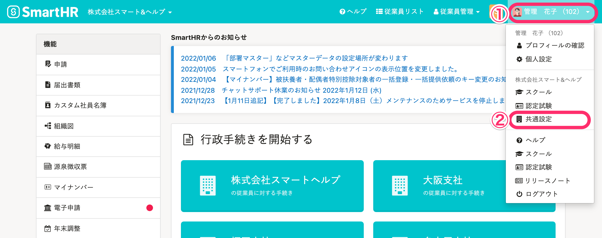
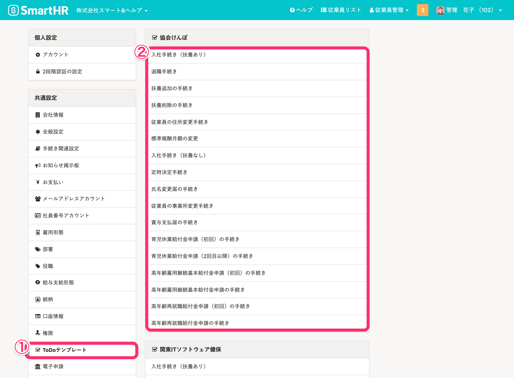
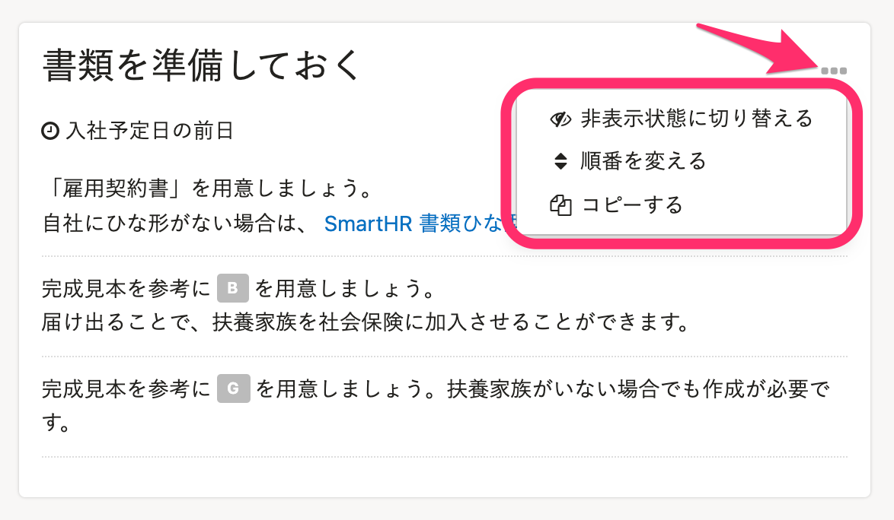

管理者は手続きに付随するToDoリスト内容をカスタマイズできます。

# ToDoテンプレート画面へのアクセス

## 1\. 画面右上のアカウント名 >［共通設定］をクリック

 **画面右上のアカウント名 >［共通設定］** をクリックします。

## 2\. ［ToDoテンプレート］> カスタマイズしたい手続きをクリック

画面左にある **［ToDoテンプレート］** をクリックし、事業所ごとに表示された手続きのリストから、カスタマイズしたい手続きをクリックしてください。

:::tips
複数事業所で異なる健保組合に加入されている場合、それぞれの手続きについてカスタマイズが可能です。
:::

# ToDoリストの項目を追加する手順

詳細は以下のページをご確認ください。

[ToDoリストをカスタマイズする](https://knowledge.smarthr.jp/hc/ja/articles/360026266693)

# システム標準の既存項目の編集について

システム側で用意されているToDoリストの既存項目は、編集／削除ができない仕組みとなっています。

編集／削除ができない項目も、 **［…］メニュー**  から、以下の操作をすることは可能です。

- 非表示状態に切り替える
- 順番を変える
- コピーする

順番を変える手順は、下記のページをご確認ください。

[ToDoリストをカスタマイズする](https://knowledge.smarthr.jp/hc/ja/articles/360026266693)
