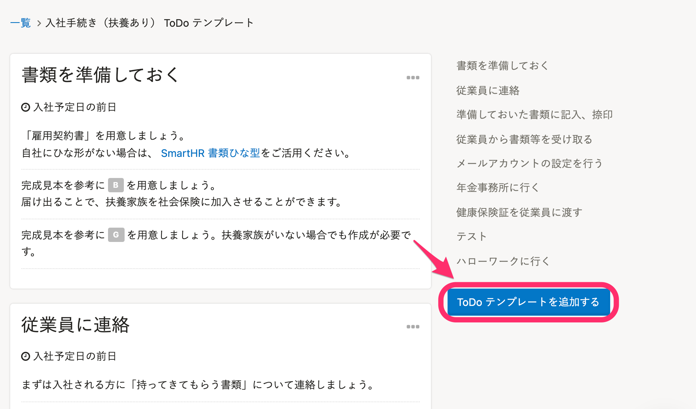
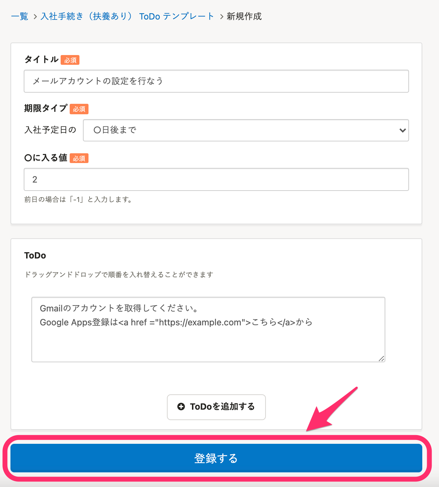
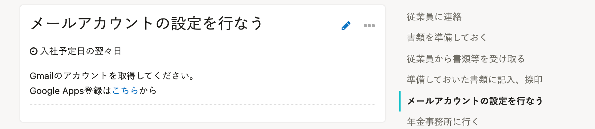
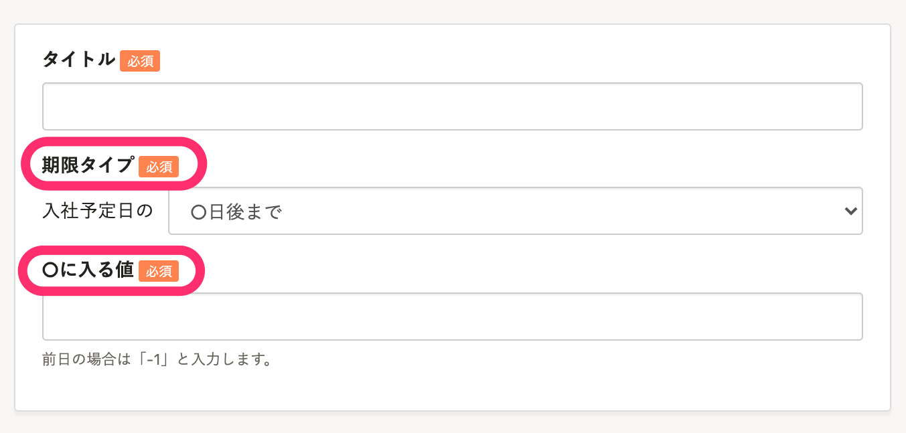
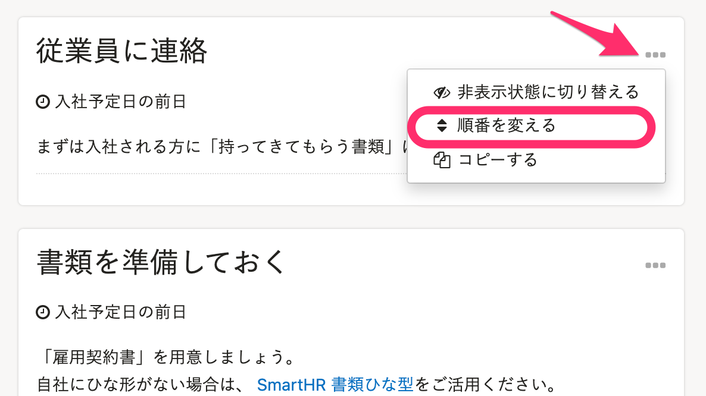
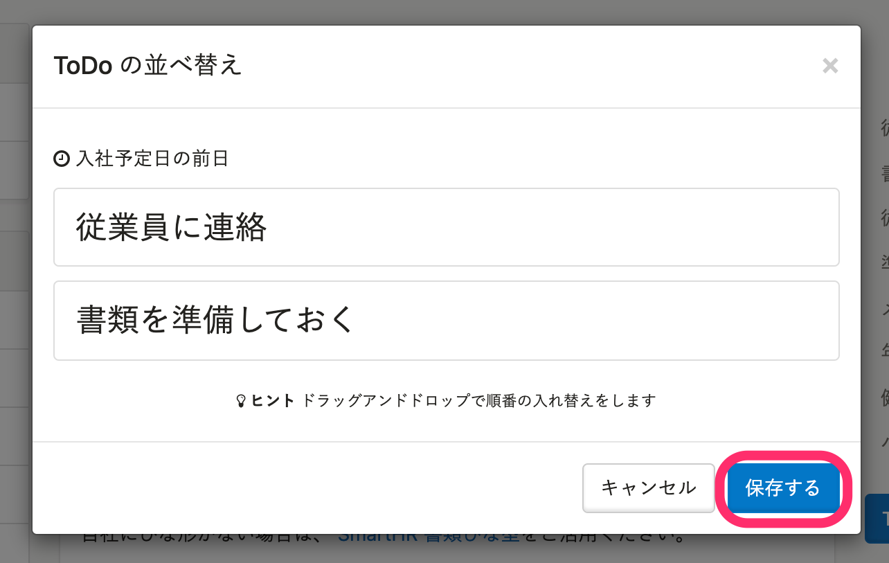

手続きに付随するToDoリストは、 **［共通設定］>［ToDoテンプレート］** 画面から、カスタマイズできます。

# ToDoリスト内に、独自の項目を追加する

## 1\. ［ToDoテンプレートを追加する］をクリック

「ToDoテンプレート」画面右にある **［ToDoテンプレートを追加する］** をクリックします。

## 2\. ［登録する］をクリック

新規作成画面に遷移するので、必要項目を入力のうえ **［登録する］** をクリックします。

## 3\. ToDoリストを確認する

ToDoリスト内に反映されていることを確認します。

# ToDoリストの項目に画像やリンクを貼りつける

ToDoの入力欄はHTMLタグを入力することができます。
以下サンプルを参考に入力していただくと、画像やファイルへのリンクとなります。

## 画像表示

## リンク

<a href="リンク先のURL">リンクの名称</a>

リンクについては、下記のページでもご案内しています。

[ToDo リスト内に自社資料をリンクさせるには？](https://knowledge.smarthr.jp/hc/ja/articles/360026107194)

# ToDoリストの項目の順番を入れ替える

ToDoの順番は、 **［期限タイプ］・［○に入る値］** を元にソートされます。
 **［期限タイプ］・［○に入る値］** を調整して配置を変更してください。

また、同じ期日で設定されている予定に限り、下記手順で順番を変えることも可能です。

## 1\. ［...］メニュー >［順番を変える］をクリック

項目の **［…］メニュー >［順番を変える］** をクリックします。

:::tips
同じ期日の予定が無い場合は、 **［順番を変える］** の選択肢が表示されません。
:::

## 2\. ［保存する］をクリック

ドラッグ&ドロップで任意の順番に入れ替え後、 **［保存する］** をクリックします。

