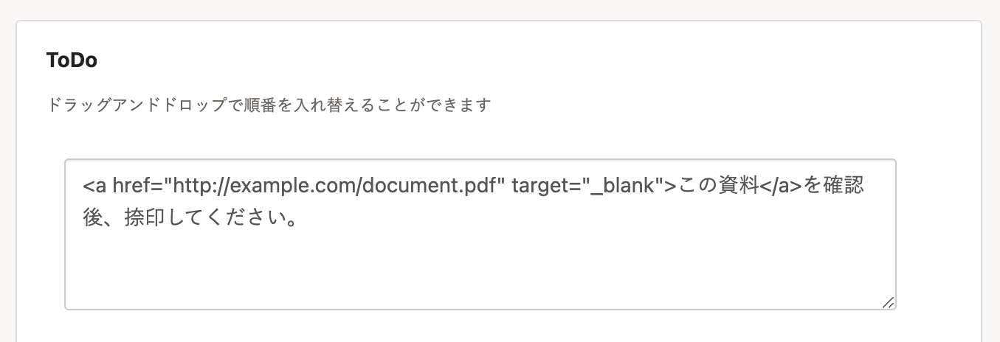
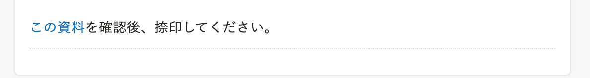

SmartHRで用意している「ひな形サンプル」以外の資料（例えば自社フォーマットの資料）も、ToDoリストからリンクできます。

※ 事前にファイルを任意の場所にアップロードしておく必要があります。

ToDoリストのカスタマイズ方法は、下記のページをご覧ください。

[ToDoリストをカスタマイズする](https://knowledge.smarthr.jp/hc/ja/articles/360026266693)

# リンク記入例

ToDo記入欄はHTML形式で入力できます。

    // サンプルコード
    <a href="http://example.com/document.pdf" target="_blank">この資料</a>を確認後、捺印してください。
    

# 完成見本

上記のサンプルコードを入力すると、ToDoリストには以下のように表示されます。

