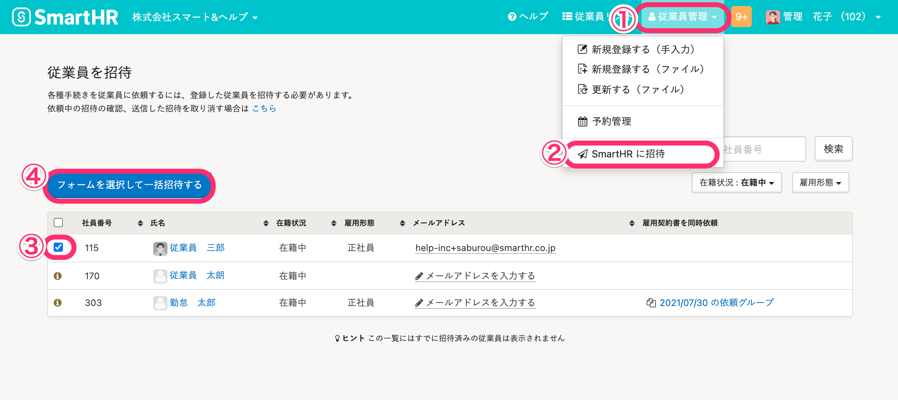

従業員をSmartHRに招待する際に、従業員本人に情報を入力してもらうことができます。

招待承認時に入力してもらう情報項目を、従業員の雇用形態などに合わせて選択できます。

フォームの作成方法は下記のページでご案内しています。

[従業員招待フォームのカスタマイズ](https://knowledge.smarthr.jp/hc/ja/articles/360026265233)

# 入社手続きの入力依頼をする場合

## 1\. フォームを都度選択する方法

トップページの **［入社の手続き］** \> **［本人に基本情報を入力してもらう］** をクリックすると、入社手続きの入力を依頼する従業員一覧の画面に移動します。

SmartHRに招待する従業員にチェックを付け **、［従業員情報入力フォーム］** のプルダウンから任意のフォームを選択し、 **［依頼を作成する］** をクリックして下さい。

## 2\. デフォルトフォームを選択する方法

入社手続きの入力依頼をする場合に限り、雇用形態と招待フォームを紐づけて、一覧に表示されるデフォルトフォームを自動表示することが可能です。

入社手続き一覧に表示される従業員の雇用形態にあったフォームがデフォルトで表示されるようになります。

### 2-1. 従業員情報の［雇用形態］を入力する

トップページの上部にある **［従業員リスト］** をクリックすると、従業員一覧が表示されるので該当の従業員氏名をクリックします。

従業員情報画面にある **［編集］** をクリックし、 **［業務情報］>［雇用形態］** を設定してください。

### 2-2. アカウント名 >［共通設定］>［マスターデータ］>［雇用形態］をクリック

画面右上にあるアカウント名 > **［共通設定］** \> **［マスターデータ］** \> **［雇用形態］** をクリックすると、 **［雇用形態］** の一覧が表示されます。

### 2-3. フォームを選択する

 **［雇用形態］** の一覧の中からデフォルトのフォームを設定したい雇用形態の右にある **［編集］** をクリックすると、編集画面が表示されます。

 **［入社手続き依頼時にデフォルトで利用する招待フォーム］** のプルダウンより、招待フォームを選択してください。

# 既存従業員をSmartHRに招待する場合（入社書類の作成不要）

 **［トップページ］>［従業員管理］>［SmartHR に招待］** にて、SmartHR に招待する従業員にチェックを付け、 **［フォームを選択して一括招待する］** をクリックしてください。

 **［従業員招待フォーム］** を選択する画面が表示されるので、従業員招待フォームを選択し、 **［招待メールを一括送信する］** をクリックしてください。

 **［SmartHR に招待］** による招待では、デフォルトフォームの選択はできません。
