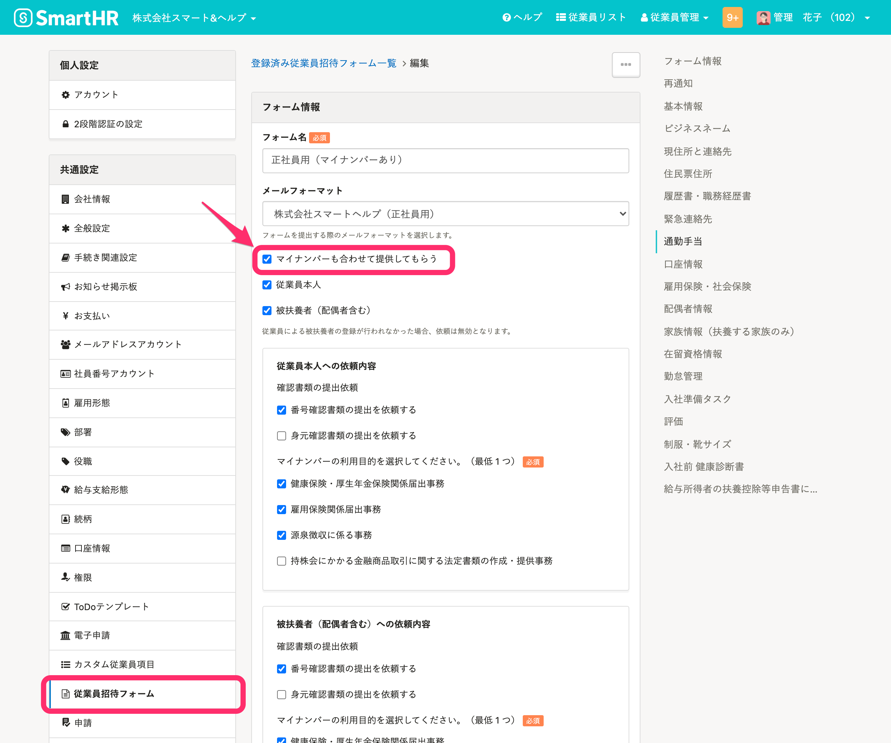

招待と同時に従業員にマイナンバーを入力してもらうには、従業員招待フォームの編集画面で設定が必要です。

# 招待とマイナンバーの入力を同時に依頼する方法

## 1\. 従業員招待フォームの設定画面で［マイナンバーも合わせて提供してもらう］にチェックを入れる

 **［共通設定］>［従業員招待フォーム］** にて、 **［フォーム情報］** の **［マイナンバーも合わせて提供してもらう］** にチェックを入れます。

従業員招待フォームの詳しい作成方法は、下記のページをご覧ください。

:::related
[従業員招待フォームのカスタマイズ](https://knowledge.smarthr.jp/hc/ja/articles/360026265233)
:::

## 2\. マイナンバーの提供を有効にした従業員招待フォームを使って、招待する

従業員をSmartHRに招待するときにフォームを選択する方法は、下記のページをご確認ください。

:::related
[招待の際、従業員招待フォームを選択する](https://knowledge.smarthr.jp/hc/ja/articles/360026265253)
:::
:::alert
従業員のマイナンバー情報の訂正は、その他の従業員情報の更新とは手順が異なります。
招待手続きと同時に提供されたマイナンバーに誤りがあった場合も、マイナンバーのみ訂正手順が異なります。
マイナンバーを差し戻す場合には、下記の手順で訂正してください。
[マイナンバーを訂正する](https://knowledge.smarthr.jp/hc/ja/articles/360026265813)
:::
