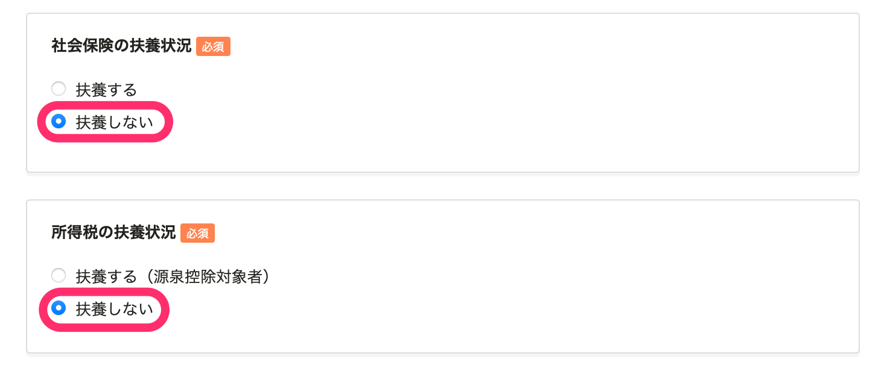

従業員に送るSmartHRへの招待フォームで、どのような家族情報を収集するかは、設定で変更ができます。

 **［共通設定］>［従業員招待フォーム］** の一覧画面で、設定を変更したい招待フォーム名をクリックすると、招待フォーム編集画面が表示されます。

# 扶養する家族のみ収集する場合（初期設定）

招待フォーム編集画面の **［家族情報］** 欄にある **［登録できる家族情報］** の設定で **［扶養する家族のみ］** を選択し、 **［更新する］** をクリックしてください。

 **［扶養する家族のみ］** と設定した招待フォームを送った場合、従業員が登録できる家族情報は、社会保険の扶養もしくは税法上の扶養である必要があります。

どちらの扶養でもない家族情報を登録しようとした場合は、以下のように警告が出て、登録できません。

# 扶養する家族 ＋ 扶養しない家族の情報を収集する場合

招待フォーム編集画面の **［家族情報］** 欄にある **［登録できる家族情報］** の設定で **［扶養する家族 + 扶養しない家族］** を選択し、 **［更新する］** をクリックしてください。

 **［扶養する家族 + 扶養しない家族］** と設定した招待フォームを送った場合、従業員は社会保険の扶養にも税法上の扶養にも該当しない家族情報の情報を登録できます。

:::alert
上記の設定で、扶養しない家族の情報を収集することができますが、マイナンバーは収集できません。
[SmartHR上で、扶養しない家族のマイナンバーを収集できますか？](https://knowledge.smarthr.jp/hc/ja/articles/360047748374)
:::
