あらかじめSmartHRに用意されている従業員招待フォームは、入力項目や必須・任意の設定を変更できません。

独自の従業員招待フォームが必要な場合、下記の手順で追加してください。

# 従業員招待フォームを追加する

## 1\. 画面右上のアカウント名 >［共通設定］＞［従業員招待フォーム］をクリック

画面右上の **［アカウント名▼］>［共通設定］>［従業員招待フォーム］** をクリックして、 **［従業員招待フォーム］** に移動します。

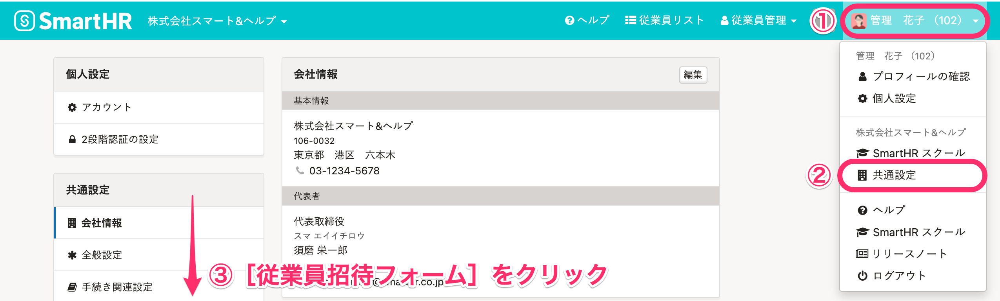

## 2.［フォームを追加する］をクリック

 **［フォームを追加する］** をクリックすると、 **［従業員招待フォーム］** の新規登録画面が表示されます。

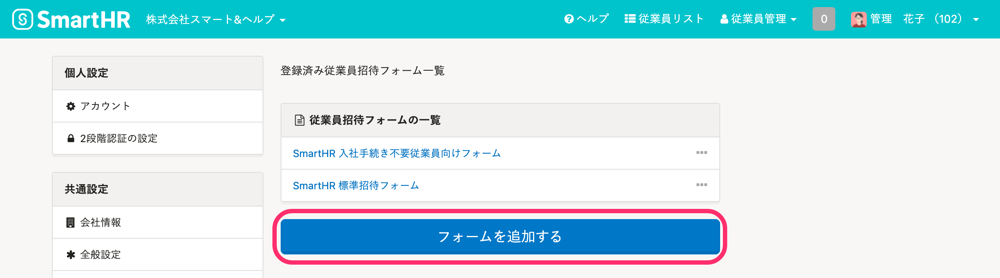

## 3.［フォーム情報］の設定

 **［フォーム情報］** にて、 **［フォーム名］** を入力し **［メールフォーマット］** を設定します。

招待と合わせてマイナンバーの提供を従業員に依頼する場合、 **［マイナンバーも合わせて提供してもらう］**  にチェックを入れ、対象者と依頼内容を設定します。

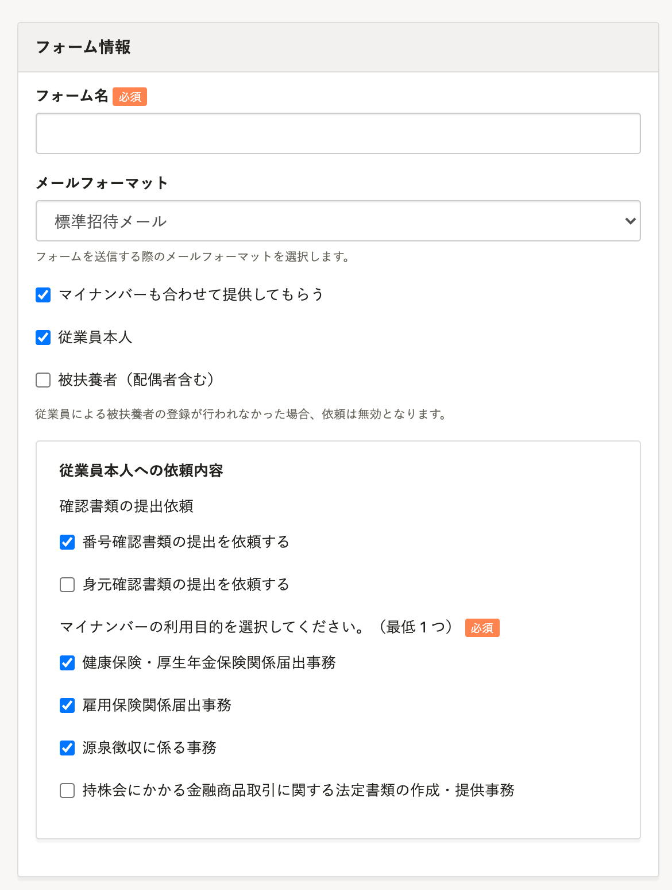

:::tips
 **［メールフォーマット］** とは、従業員が受け取るメールのフォーマットのことです。
独自の **［メールフォーマット］** を追加する場合、下記のページを参考にしてください。
[従業員が受け取るメールの内容をカスタマイズする](https://knowledge.smarthr.jp/hc/ja/articles/360026106674)
:::

## 4.［再通知］の設定

 **［再通知］** にて 、再通知メールを送るかどうかを設定します。

プルダウンメニューから、「再通知しない」もしくは、再通知の頻度を選択してください。

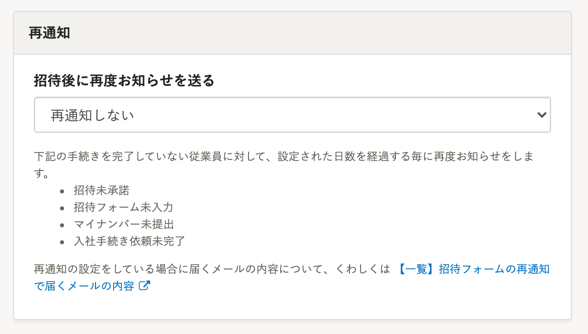

## 5.［基本情報］以下の項目の設定

各項目の表示、入力に関する設定を選択します。

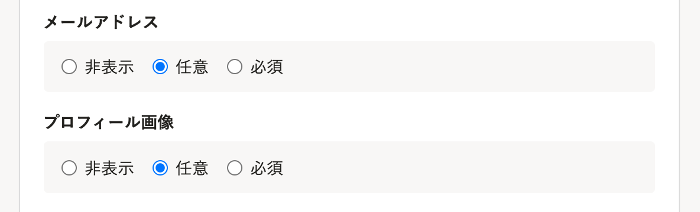

- 「非表示」：フォームで情報を収集する必要がない項目の場合に選んでください。
- 「任意」：従業員がフォームへの入力を省略しても構わない項目の場合に選んでください。
- 「必須」：従業員に必ず入力してほしい項目の場合に選んでください。

権限設定で閲覧不可にしている項目でも、「任意」「必須」を選んだ場合は **［従業員招待フォーム］** に表示されます。

:::alert
以下の項目はシステム上必須の情報となるため、「非表示」「任意」にはできません。
- 姓・名
- 姓・名（ヨミガナ）
- 生年月日
- 性別
- 住所
- 配偶者の有無
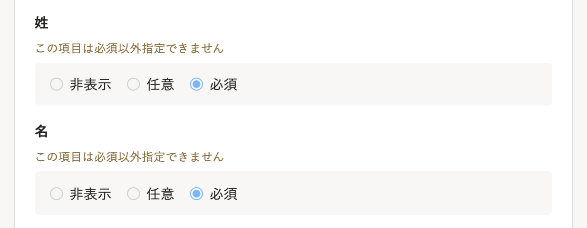
:::

## 6.［登録する］をクリック

 **［登録する］** をクリックすると、 **［従業員招待フォーム］** が登録されます。

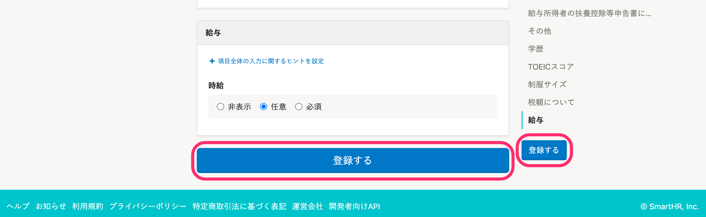

# 従業員招待フォームの表示確認をする（プレビュー）

 **［従業員招待フォームの一覧］** にて、表示確認したいフォームの  **［…］メニュー >［表示を確認する］**  をクリックすると、プレビューが表示されます。

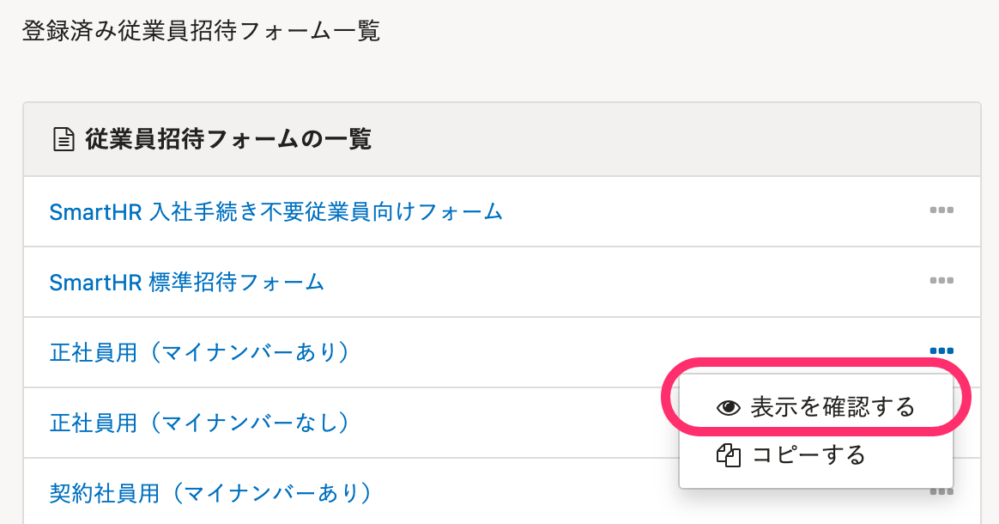

# 従業員招待フォームの項目を並び替える

項目グループ単位で並び替えできます。

## 1\. 項目を並び替えたいフォームをクリック

 **［従業員招待フォームの一覧］** にて、項目を並び替えたいフォームをクリックします。

## 2\. ［…］メニュー >［順番を変える］をクリック

項目名の右にある **［…］メニュー >［順番を変える］** をクリックします。

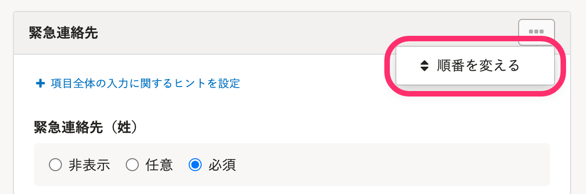

## 3\. 任意の順番に並び替え、［保存する］をクリック

ドラッグアンドドロップで任意の順番に並び替え、 **［保存する］** をクリックします。

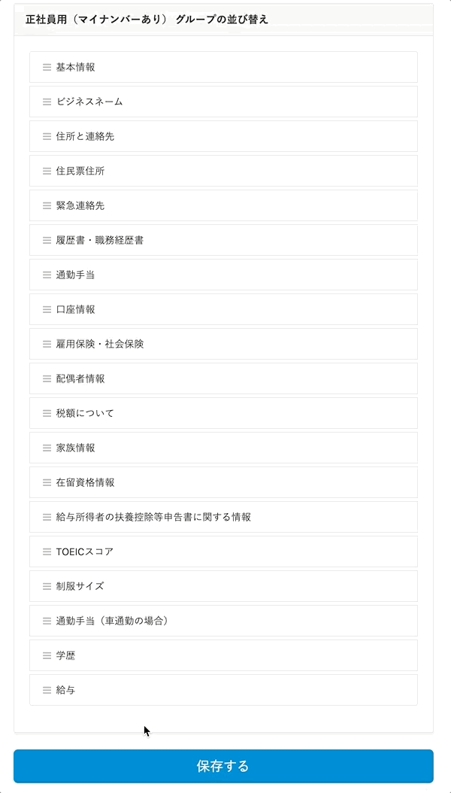

# 従業員招待フォームを複製する

下記のページをご覧ください。

:::related
[従業員招待フォームをコピーする](https://knowledge.smarthr.jp/hc/ja/articles/360026264193)
:::

# 従業員招待フォームを削除する

## 1\. 削除したいフォームをクリック

 **［従業員招待フォーム一覧］** より、削除したいフォームをクリックします。

## 2\. ［削除する］をクリック

右上の  **［…］メニュー >［削除する］** をクリックします。

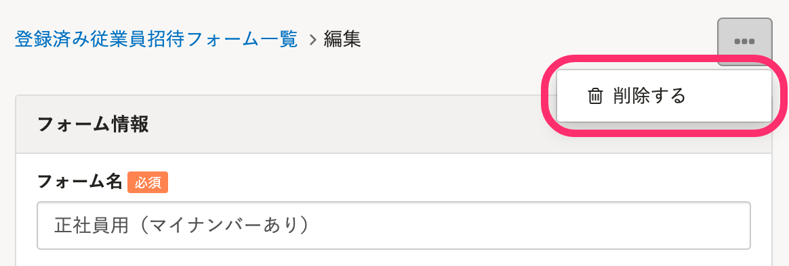

## 3\. メッセージを確認し、［OK］をクリック

表示されたメッセージを確認し、 **［OK］** をクリックすると、フォームが削除されます。
