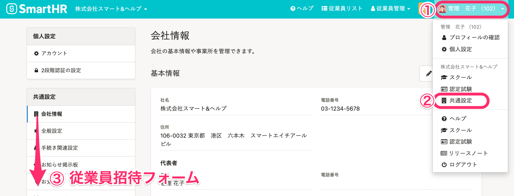
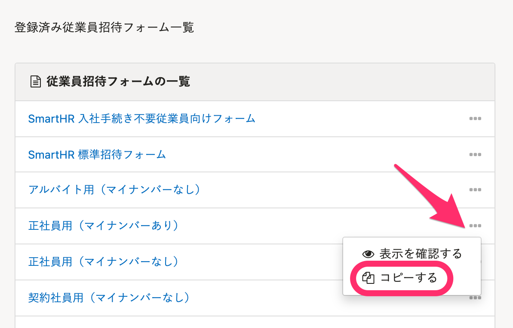
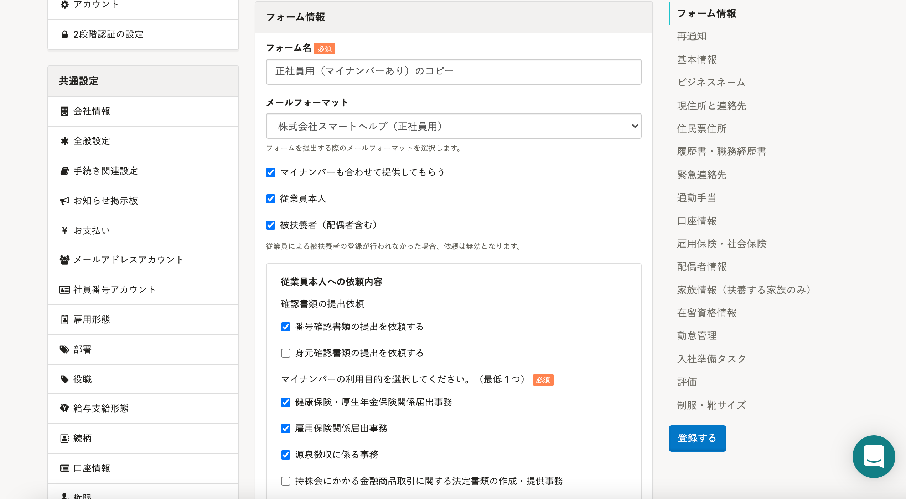

作成済の**従業員招待フォーム**はコピーが可能です。

# 操作手順

## 1\. 画面右上のアカウント名 >［共通設定］>［従業員招待フォーム］をクリック

管理者権限を持ったアカウントでSmartHRにログインします。

 **画面右上のアカウント名 >［共通設定］>［従業員招待フォーム］** をクリックすると、 **［登録済み従業員招待フォーム一覧］** の画面が表示されます。

## 2\. ［...］メニュー >［コピーする］をクリック

コピーしたいフォームの右端の **［…］メニュー >［コピーする］** を選択します。

## 3\. 従業員招待フォームを編集し、［登録する］をクリック

コピーされた従業員招待フォームの編集画面が表示されますので、カスタマイズして **［登録する］** をクリックしてください。

カスタマイズの方法は下記のページをご覧ください。

[従業員招待フォームのカスタマイズ](https://knowledge.smarthr.jp/hc/ja/articles/360026265233)
