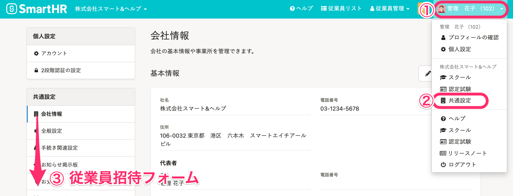
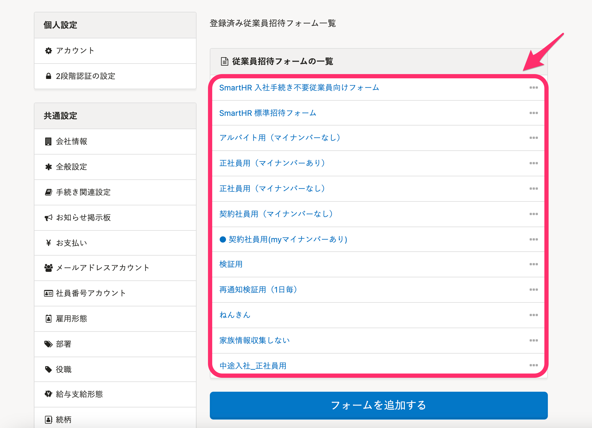
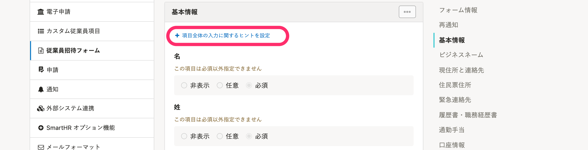
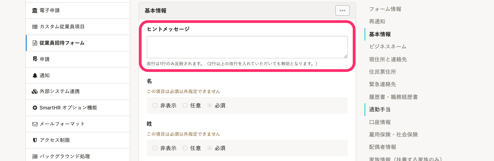
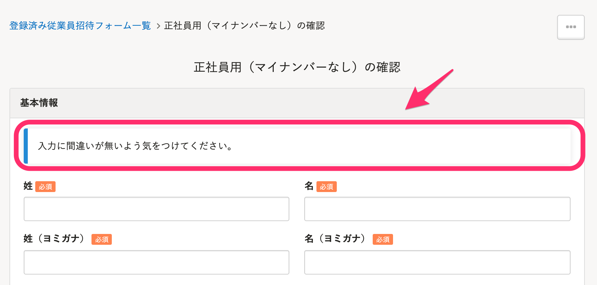

このページでは、従業員招待フォームの項目全体に、ヒントメッセージを設定する方法を説明します。

ヒントメッセージとは、フォームに入力する内容を説明するものです。

従業員が管理者の意図を理解して入力できるよう、記入例や注意点を記載しておきます。

項目ごとにヒントメッセージを設定する方法は、以下のページをご覧ください。

[カスタム従業員項目に［入力ヒント］を設定する](https://knowledge.smarthr.jp/hc/ja/articles/360026104834)

# 従業員招待フォームにヒントメッセージを設定する方法

## 1\. 画面右上のアカウント名 >［共通設定］>［従業員招待フォーム］をクリック　

 **画面右上のアカウント名 >［共通設定］** \> **［従業員招待フォーム］** をクリックすると、 **［登録済み従業員招待フォーム一覧］** の画面が表示されます。

## 2\. 従業員招待フォームをクリックする

 **［従業員招待フォームの一覧］** にある、ヒントメッセージを設定したい従業員招待フォームの名前をクリックしてください。

※デフォルトの招待フォームは設定の変更ができません。

従業員招待フォームをカスタマイズする方法は、以下のページをご覧ください。

[従業員招待フォームのカスタマイズ](https://knowledge.smarthr.jp/hc/ja/articles/360026265233)

## 3\. ［+項目全体の入力に関するヒントを設定］をクリック

項目にある **［＋項目全体の入力に関するヒントを設定］** をクリックすると、ヒントメッセージを入力する欄が表示されます。

ヒントメッセージの欄に文章を入力してください。

設定したヒントメッセージは、以下の画像のように表示されます。

申請フォームを使って従業員項目の情報を入力、収集する方法は以下のページをご覧ください。

[申請フォームを管理する](https://knowledge.smarthr.jp/hc/ja/articles/360026262313)
