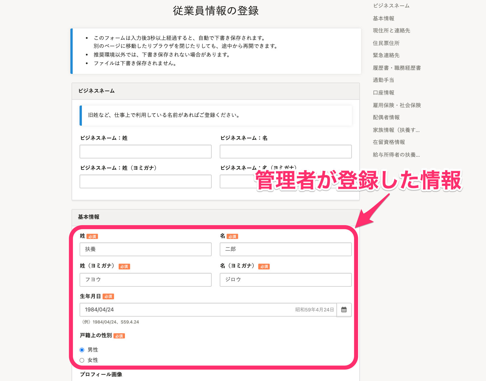

# A. はい、管理者が登録した従業員情報は、従業員の受け取る招待フォームに反映されます。

## 従業員画面での見え方

管理者が登録した情報は招待フォームで以下のように表示されます。

なお、従業員は各項目の情報を編集することもできます。

:::tips
送られた招待フォームに表示され、従業員が編集できる項目は、権限設定の影響は受けません。
従業員項目の権限設定について、詳しくは下記のページをご覧ください。
[従業員関連の閲覧・作成・更新・削除の権限を設定する](https://knowledge.smarthr.jp/hc/ja/articles/1500001368101)
:::

## 従業員を事前に登録する

従業員に招待フォームを送る前に、管理者はあらかじめ **［新規登録する（手入力）］** か **［新規登録する（ファイル）］** で従業員を登録しておく必要があります。

 **［新規登録する（手入力）］** にて手入力、または **［新規登録する（ファイル）］** でCSV/Excelファイルのアップロードにより登録された従業員情報が、従業員の受け取る招待フォームの項目に反映されます。
