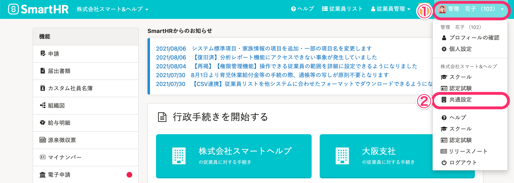
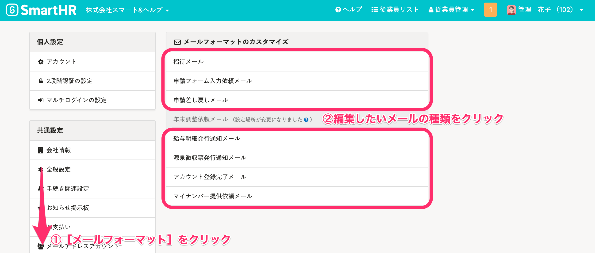
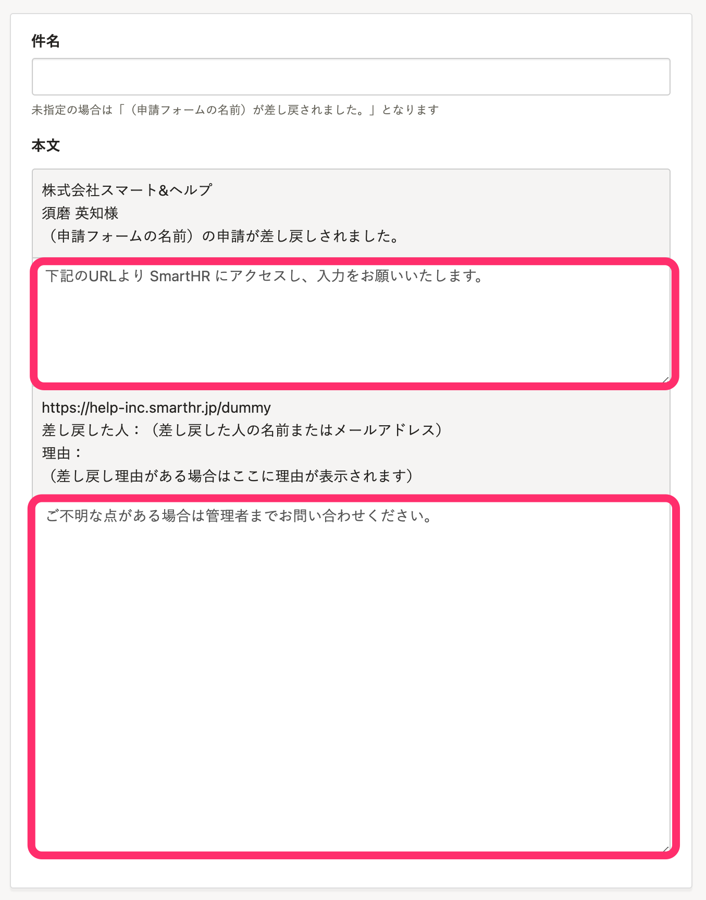
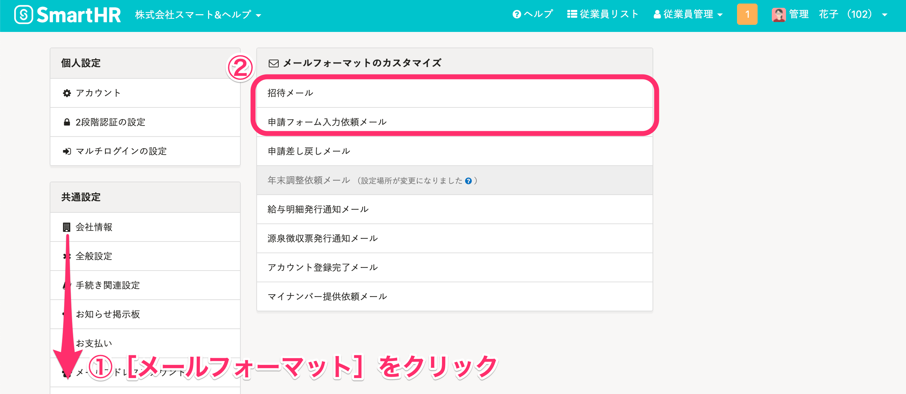
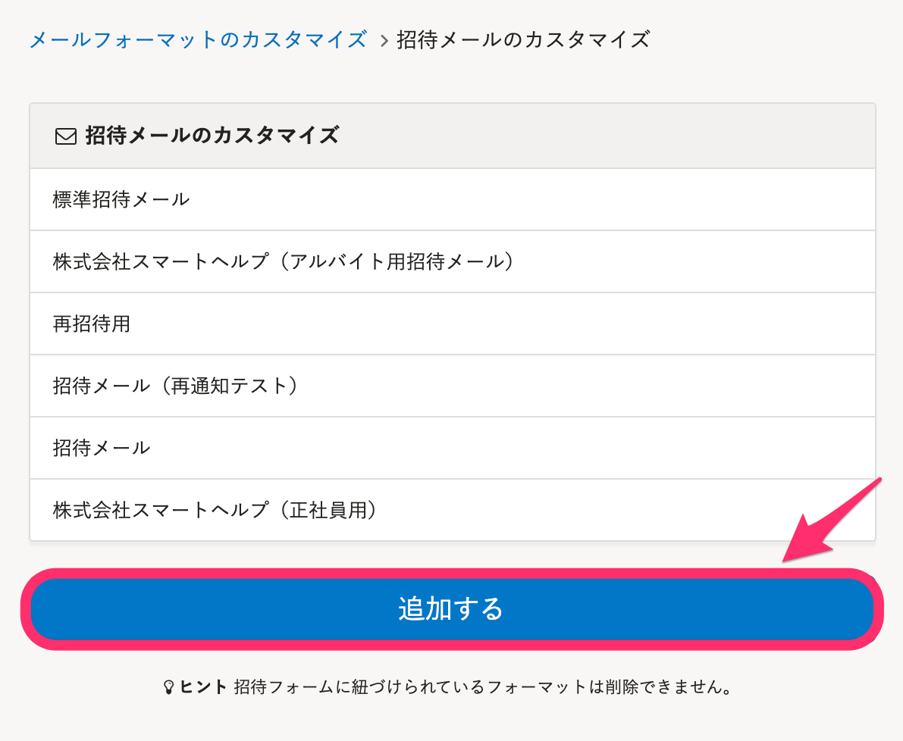
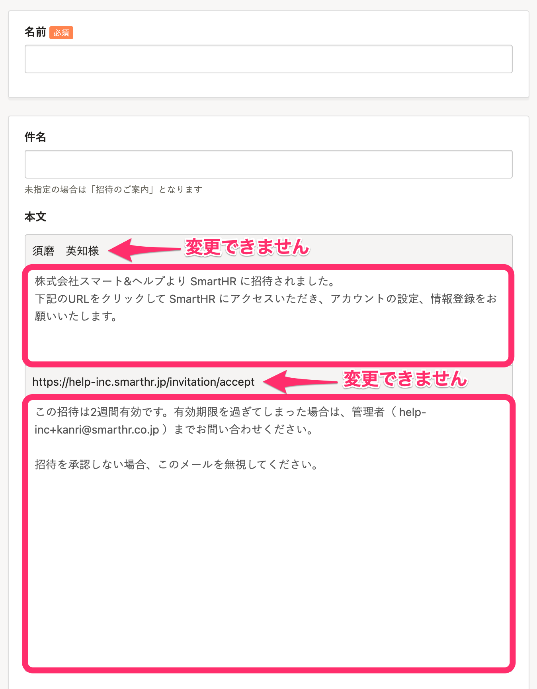

SmartHRから従業員に送られる下記のメールは、メールフォーマットを追加・編集できます。

- 招待メール
- 申請フォーム入力依頼メール
- 申請差し戻しメール
- 給与明細発行通知メール
- 源泉徴収票発行通知メール
- アカウント登録完了メール
- マイナンバー提供依頼メール

# メールフォーマットをカスタマイズする

## 1\. 画面右上のアカウント名 >［共通設定］をクリック

**画面右上のアカウント名** > **［共通設定］** をクリックすると、画面左側に共通設定のメニューが表示されます。

## 2\. ［メールフォーマット］> 編集したいメールの種類をクリック

画面左にある **［メールフォーマット］** をクリックし、編集したいメールの種類をクリックすると、編集画面に移動します。

## 3\. 内容を編集して［更新する］をクリック

 **［件名］** および **［本文］** 内の自由フィールド（下図ピンク枠）へ文章を入力し、画面下部にある **［更新する］** をクリックすると、メールフォーマットを更新できます。

:::alert
宛先やリンクなど、 **［本文］** 内のグレーアウトしている部分は変更できません。
:::

:::related
[給与明細の通知メールの件名に支給年月日を挿入するには？](https://knowledge.smarthr.jp/hc/ja/articles/360039194673)
:::

# メールフォーマットを追加する

招待時と申請フォーム入力依頼時に使用する、 **［招待メール］** 、 **［申請フォーム入力依頼メール］** は追加できます。

複数のメールフォーマットを用意しておき、招待フォームや申請フォームを作成時に使用するメールフォーマットを選択して、紐付けることが可能です。

:::related
[従業員招待フォームのカスタマイズ](https://knowledge.smarthr.jp/hc/ja/articles/360026265233)
[申請フォームを追加する](https://knowledge.smarthr.jp/hc/ja/articles/360026262293)
:::

## 1\. 画面右上のアカウント名 >［共通設定］をクリック

**画面右上のアカウント名** > **［共通設定］** をクリックすると、画面左側に共通設定のメニューが表示されます。

## 2\. ［メールフォーマット］> 追加したいメールの種類をクリック

画面左にある **［メールフォーマット］** をクリックすると、 **［メールフォーマットのカスタマイズ］** 欄にメールの一覧が表示されます。

フォーマットを追加したいメールの種類をクリックしてください。

## 3\. ［追加する］をクリック

画面下部にある **［追加する］** をクリックすると、新規登録画面に移動します。

## 4\. 内容を入力して［登録する］をクリック

メールフォーマットの **［名前］** と、 **［件名］** および **［本文］** 内の自由フィールド（下図ピンク枠）へ文章を入力し、画面下部にある **［登録する］** をクリックすると、メールフォーマットを登録できます。

:::alert
宛先やリンクなど、 **［本文］** 内のグレーアウトしている部分は変更できません。
:::

:::tips
従業員の氏名を登録していない場合は、本文の宛名は **［従業員名］** ではなく、メールアドレスが表示されます。
:::
