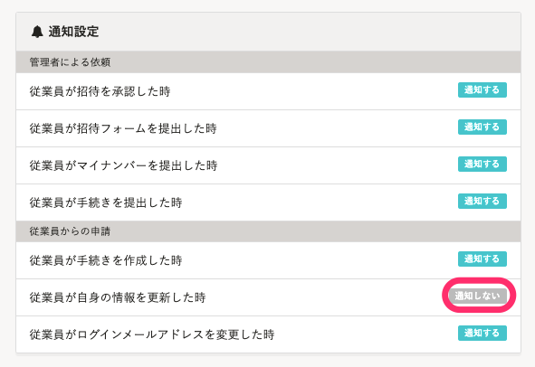
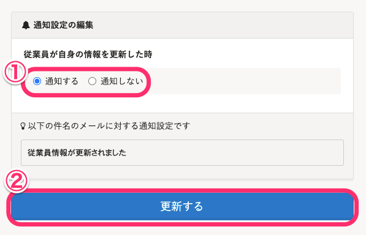
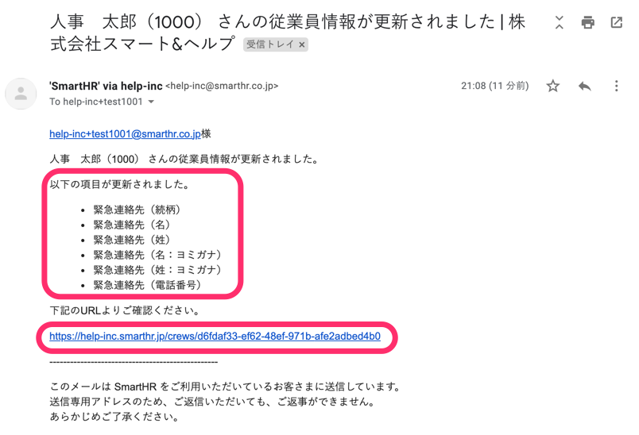
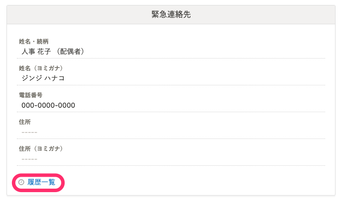
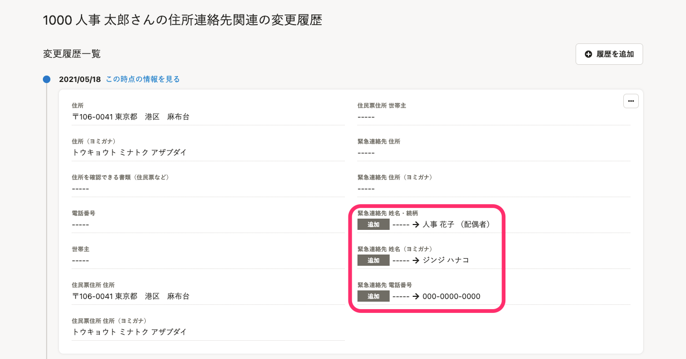

従業員が自身の情報を変更した際、通知を受け取る設定にしていると、管理者宛にメールが届きます。

:::related
[従業員自身による情報の閲覧・更新を制限する](https://knowledge.smarthr.jp/hc/ja/articles/360035656314)
:::

# 通知を設定する

## 1\. ［共通設定］>［通知］から、通知設定の一覧を開く

## 2\. ［従業員が自身の情報を更新した時］の設定を確認する

 **［従業員が自身の情報を更新した時］** の設定が **［通知する］** になっている場合は、新たな設定は不要です。

 **［通知しない］** になっていた場合は、 **［従業員が自身の情報を更新した時］** の項目をクリックして、通知設定の編集画面を開きます。

## 3\. 設定を［通知する］に変更して［更新する］をクリック

通知設定の編集画面で、 **［通知する］** を選択し、 **［更新する］** をクリックして変更を保存します。

 **［通知する］** になっている状態で従業員が自身の情報を変更すると、管理者宛に通知が届きます。

通知設定全般については、下記のページをご覧ください。

[通知の設定を確認・変更する](https://knowledge.smarthr.jp/hc/ja/articles/360033353774)

# 変更内容を確認する

## 1\. ［◯◯さんの従業員情報が更新されました］という件名のメールが届く

従業員が自身の情報を変更した際に通知をする設定になっている場合、管理者宛に通知メールが届きます。

メールには、変更があった項目と、変更があった従業員の従業員情報ページへのリンクが記載されています。

具体的な変更内容を確認する場合は、メール内のリンクをクリックし、SmartHRの従業員画面を開いてください。

## 2\. 変更があった項目の［履歴一覧］をクリック

変更があった項目の **［履歴一覧］** をクリックすると、 その項目の変更履歴を確認できます。

