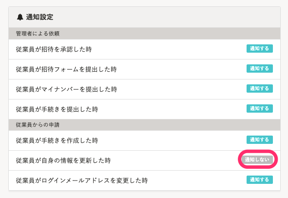
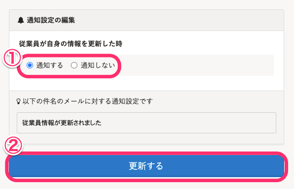

従業員が招待を承認した際や、手続きを提出した際、従業員自身の情報を変更した際などに、管理者へ通知をするかどうかの設定ができます。

# 1\. 管理者権限を持ったアカウントでSmartHRにログイン

# 2\. 画面右上のアカウント名 >［共通設定］>［通知］をクリック

現在の通知設定が一覧で確認できます。

設定を変更する場合は、項目の右側にある **［通知する］** または **［通知しない］** をクリックします。

# 3\. 通知設定の登録画面で、 **［通知する］** または **［通知しない］** を選択し、 **［更新する］** をクリック

この画面で、通知される際のメールのタイトルも確認できます。

 **［更新する］** をクリックすると通知設定一覧画面に戻り、通知設定の状況を確認できます。

:::tips
- 管理者権限のアカウントが複数ある場合、通知の設定はすべての管理者で共通となります。現在、管理者ごとの設定はできません。
-  **［従業員がログインメールアドレスを変更した時］** を **［通知する］** に設定している場合でも、 **［在籍状況］** が **［退職済］** の従業員がメールアドレスを変更したときは、個人情報保護のため通知メールが届きません。
:::
