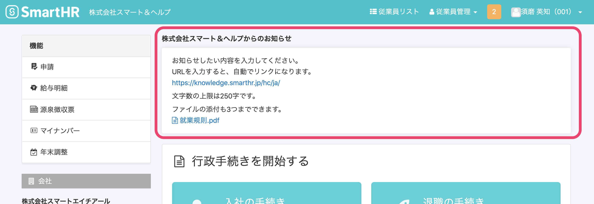

従業員がSmartHRにログインした後のページに、最大3つまでお知らせを掲載できます。

:::alert
スモールプランでのご利用は、2020年12月末日をもって終了しました。
2021年1月以降は、スタンダードプラン以上のプランで当機能をご利用いただけます。
スタンダードプランのご利用料金については、下記のフォームからお問い合わせください。
[スタンダードプラン自動お見積り](https://smarthr.jp/pricing/quote_standard)
:::

# お知らせの掲載手順

## 1\. 画面右上のアカウント名 > \[共通設定\] > \[お知らせ掲示板\] をクリック

画面右上にあるアカウント名をクリックして表示されるメニューから **\[共通設定\]** を選ぶと、画面が変わり左側に **\[共通設定\]** の一覧が表示されます。

**\[共通設定\]** にある **\[お知らせ掲示板\]** をクリックすると、 **\[お知らせ掲示板****\]** の設定画面が表示されます。

## 2\. お知らせ内容と対象の従業員を設定する

お知らせ設定画面で、 **\[公開 / 非公開\]** のステータスと、**\[お知らせ内容\]**  **\[対象の従業員\]** を設定してください。

お知らせの入力欄は1〜3があり、最大3つまで同時に設定できます。

### お知らせ内容

お知らせしたい内容を入力してください。

URLを入力すると、掲載時に自動でリンクになります。

文字数の上限は250字で、文字数のカウントには、URL部分も含まれます。

### 添付ファイル

PDF・JPEG・PNG・GIFのファイルを、合計3つまで添付できます。

添付できるファイルのサイズの上限は、PDF・JPEG・PNGの場合は10MBで、GIFの場合は2〜3MB程度です。

### 対象の従業員

雇用形態と在籍状況で、お知らせを表示する対象の従業員の絞り込みができます。

例えば **\[正社員\]** と **\[在職中\]** だけにチェックを入れると、正社員かつ在職中の従業員にのみお知らせが表示されます。

### 対象の従業員への通知

**\[対象の従業員に通知する\]** というチェックボックスにチェックを入れた状態で更新すると、対象の従業員にメールで通知が送られます。

:::tips
お知らせが表示されるのは、従業員に紐付いたアカウントのみです。
たとえば、管理者権限を持っているが従業員ではない社労士や、従業員情報がなくアカウントだけ付与された出向者がSmartHRにログインした場合、お知らせは表示されません。
:::

## 3\. \[更新\] をクリックする

お知らせ内容と対象を設定後、 **\[更新\]** をクリックすると、お知らせを掲載できます。

従業員画面では、以下のように表示されます。

### 対象の従業員への通知

**\[対象の従業員へ通知する\]** にチェックが入っていると、 **\[更新\]** をクリックした際に確認のダイアログが表示されます。

ダイアログの **\[更新\]** をクリックすると対象の従業員にメールで通知されます。

従業員への通知メールの本文にも、お知らせ内容が記載されます。

