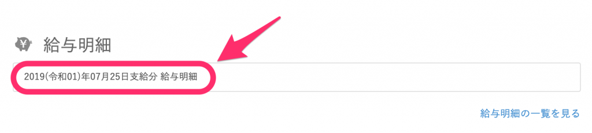
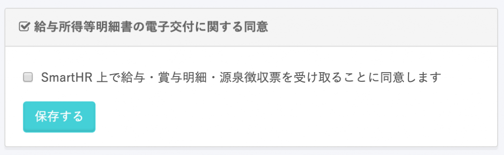
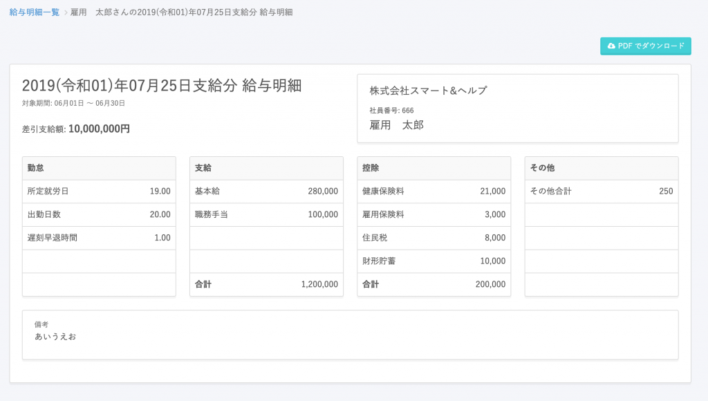
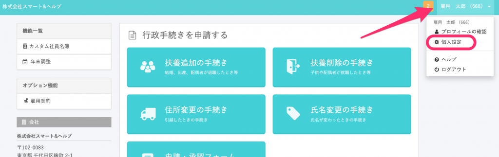
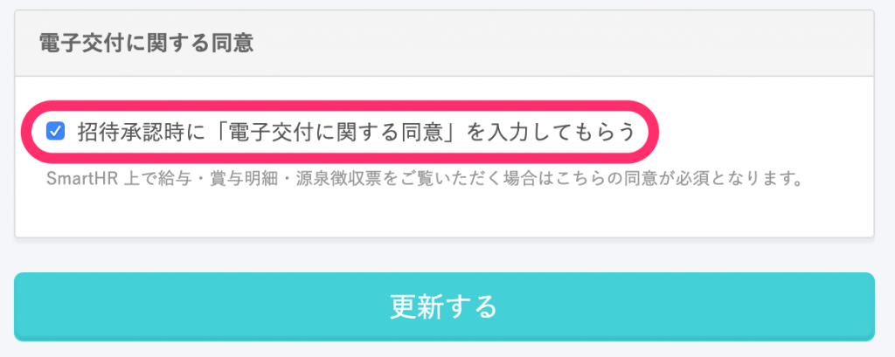

従業員が **「給与所得等明細書の電子交付に関する同意」** に同意していない場合の対応方法を説明します。

従業員が同意をしているかどうかの確認方法は、下記のページをご覧ください。

[電子交付に関する同意の有無を確認する](https://knowledge.smarthr.jp/hc/ja/articles/360026265073)

# 未同意の従業員から同意を得る方法

「給与所得等明細書の電子交付に関する同意」に未同意の従業員に、**同意依頼だけ送ることはできません。**

ただし、給与明細を確認するタイミングや、それ以外の任意のタイミングで、従業員から同意ができます。

## 給与明細を確認する際に、同意をする

管理者が従業員に給与明細を配布すると、従業員は給与明細の閲覧ができるようになります。

ただし、「給与所得等明細書の電子交付に関する同意」に未同意の場合は、明細へのリンクをクリックすると、明細ではなく同意画面に遷移します。

この画面で従業員が同意をすると、給与明細が表示されます。

## 従業員が、任意のタイミングで同意をする

従業員は、任意のタイミングで「給与所得等明細書の電子交付に関する同意」に同意できます。

SmartHRにログイン後、右上のメニューか、 **\[個人設定\]** を開くと、「給与所得等明細書の電子交付に関する同意」の項目があります。

こちらにチェックを入れることで、同意が完了します。

# SmartHRへの招待承認時に同意を得る方法

「給与所得等明細書の電子交付に関する同意」は、SmartHRへの招待と同時に依頼ができます。

**\[共通設定\] \[全般設定\]** にある「電子交付に関する同意」欄で、「招待承認時に「電子交付に関する同意」を入力してもらう」にチェックを入れてください。

こちらにチェックを入れると、従業員が招待を承認するタイミングで、「給与所得等明細書の電子交付に関する同意」への同意ができます。

:::tips
招待時に、従業員が「給与所得等明細書の電子交付に関する同意」に同意しない場合もあります。
その場合は、このページに記載しているタイミングで同意ができます。
:::
