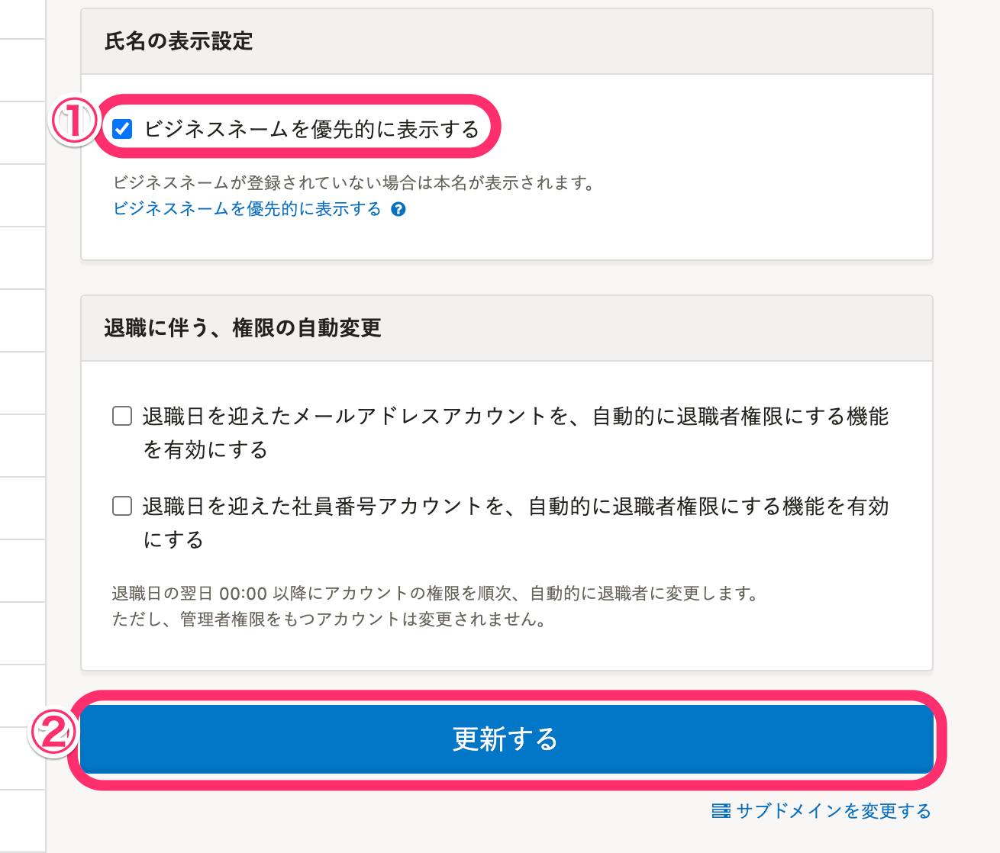
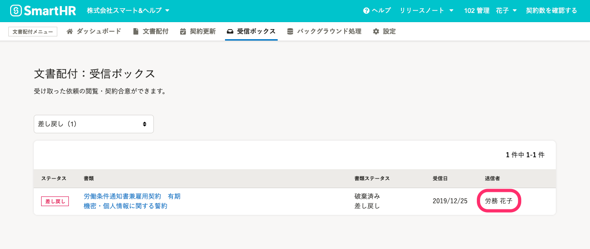

SmartHRの画面に戸籍名ではなくビジネスネームを優先的に表示させたい場合は、 **［共通設定］** にある **［全般設定］** 画面で設定できます。

現在、SmartHR基本機能では、給与明細がビジネスネームの表示に対応しています。各給与明細の画面に表示される氏名と、 **［給与明細一覧］** に表示される氏名に設定が適用されます。

オプション機能でビジネスネームの表示に対応しているのは、**カスタム社員名簿**、**組織図**、**文書配付**、**分析レポート**、**従業員サーベイ**、**人事評価**です。

# SmartHR基本機能での設定

## 1\. 画面右上のアカウント名 >［共通設定］をクリック

画面右上にあるアカウント名をクリックして表示されるメニューから **［共通設定］** を選ぶと、画面が変わり左側に **［共通設定］** の一覧が表示されます。

## 2.［全般設定］をクリック

 **［共通設定］** にある **［**  **全般設定］** をクリックすると、 **［**  **氏名の表示設定］** 項目が表示されます。

## 3\. ［ビジネスネームを優先的に表示する］にチェックを入れ、［更新する］をクリック

 **［氏名の表示設定］** 項目にある **［**  **ビジネスネームを優先的に表示する］** のチェックボックスにチェックを入れて、 **［**  **更新する］** をクリックすると、設定が完了します。

:::tips
この設定は**従業員単位ではなく一括で適用**されます。
ビジネスネームを登録していない従業員は、これまで通り本名を表示します。
登録されているビジネスネームは従業員情報の **［**  **基本情報］** 項目で確認できます。

:::

## 4\. 適用箇所を確認

給与明細画面にある各一覧名をクリックすると、 **［**  **給与明細一覧］** に表示される氏名がビジネスネームになっていることを確認できます。

また、**各給与明細**の内容画面を表示すると、右上に表示される名前がビジネスネームになっていることを確認できます。

:::tips
配布された従業員画面で表示される給与明細画面でも同じようにビジネスネームを確認できます。
 **［公開済］［確定済］［未確定］** どのステータスの給与明細に対しても反映されます。
:::

# オプション機能での設定

各オプション機能のビジネスネームの表示と設定方法を説明します。

## カスタム社員名簿

カスタム社員名簿は、名簿ごとにビジネスネームの優先表示設定ができます。

カスタム社員名簿トップページ画面右上にある設定マーク >  **［編集］** \>  **［3 掲載する情報］** より設定できます。

## 組織図

組織図機能は、組織図ごとにビジネスネームの優先表示設定ができます。

組織図名の右側にある **［組織図操作 ］** \>  **［表示設定］** より設定できます。

## 文書配付

文書配付は、受信ボックスと合意後書類の破棄依頼に送信者のビジネスネームが優先して表示されます。表示の設定は変更できません。

ビジネスネームの登録がある場合、受信ボックス一覧の **［送信者］** に表示される氏名と、合意後書類の破棄依頼コメントにビジネスネームを表示します。

## 分析レポート

分析レポートは、グラフごとにビジネスネームの表示を設定できます。

ビジネスネームの登録がある場合、データセットの編集画面で以下のデータ項目を選択すると、テーブルにビジネスネームを表示します。

-  **［ビジネスネーム：姓］** 
-  **［ビジネスネーム：名］** 
-  **［ビジネスネーム：姓（ヨミガナ）］** 
-  **［ビジネスネーム：名（ヨミガナ）］** 
-  **［ビジネスネーム：フルネーム］** 

## 従業員サーベイ

従業員サーベイは、ビジネスネームが優先して表示されます。表示の設定は変更できません。

ビジネスネームの登録がある場合、実施中のサーベイ一覧の **［**  **依頼者］** に表示される氏名と、 **［対象従業員一覧］** に表示される氏名にはビジネスネームを表示します。

## 人事評価

人事評価は従業員情報にビジネスネームの登録がある場合、従業員の**ビジネスネームを氏名として扱います**。設定は変更できません。

ビジネスネームの登録がある従業員は、**設定時にもビジネスネームを使用しないとエラーになります。**

