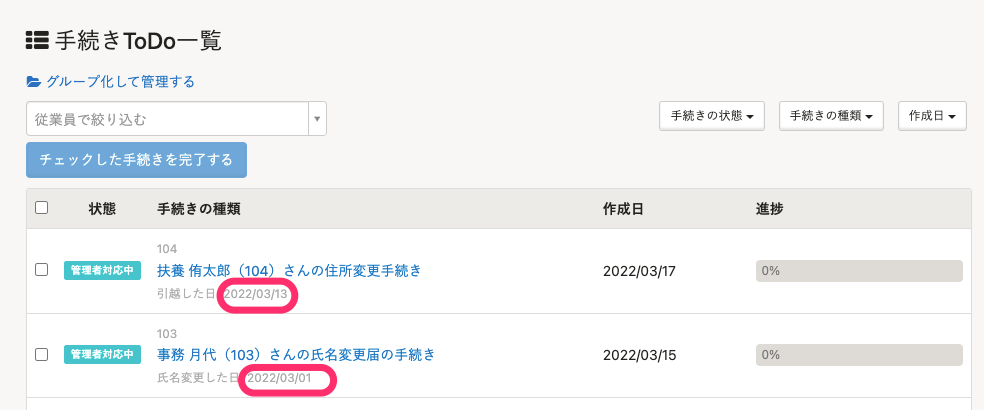
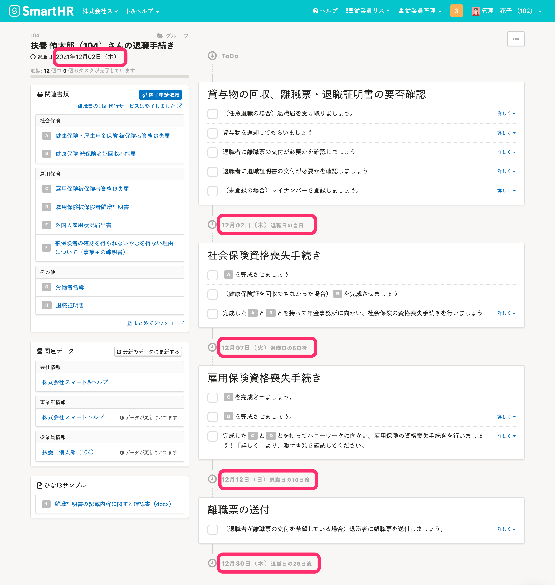

# A. いいえ、変更できません。変更するには、手続きを作り直してください

手続きを作成したあとに、手続きの基準となる日（入社年月日や退職年月日など）を変更しても、手続きToDo一覧・手続きToDo画面に表示される日付は更新されません。

手続きを削除し、再度作成し直す必要があります。

なお、書類に表示される基準となる日は変更できます。

:::related
[手続きで作成した書類を編集する](https://knowledge.smarthr.jp/hc/ja/articles/360026105774)
:::
