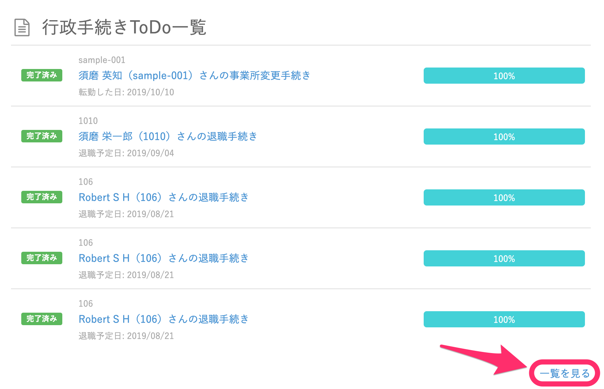
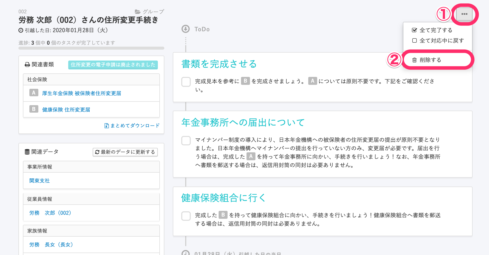
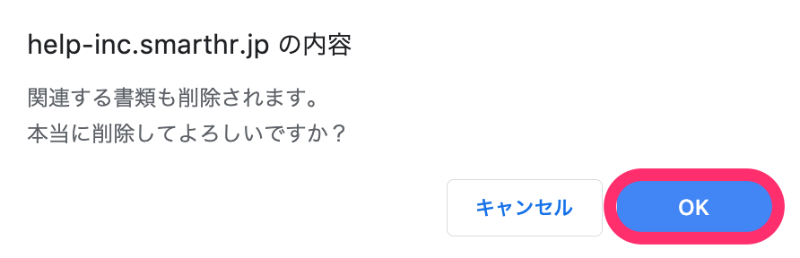

作成した手続きを削除する手順を記載します。

:::alert
- 削除するには該当手続きの「削除」権限が必要です。
- 関連する書類もすべて消えてしまいますので、ご注意ください。
- 一度削除してしまった手続きは、復元させることができません。
- 電子申請を行っている手続きは削除できません。
    （※ [電子申請の状態](https://knowledge.smarthr.jp/hc/ja/articles/360026265693)が「未送信」または「エラー」の場合は削除可能です）
- 複数の手続きを一括で削除することはできません。お手数ですが１件ずつ削除してください。
:::

# 1\. 削除したい手続きをクリック

トップページから、削除したい手続きをクリックします。

※手続きが6件以上ある場合は、右下にある **［一覧を見る］** から対象の手続きをクリックしてください。

# 2\. ［...］メニュー >［削除する］ボタンをクリック

手続き画面の右上にある **［...］メニュー**  を開き、 **［削除する］** ボタンをクリックします。

# 3\. 確認画面で［OK］ボタンをクリック

確認画面で **［OK］** ボタンをクリックします。
※ご利用のブラウザによって、ダイアログの表示が異なります。

