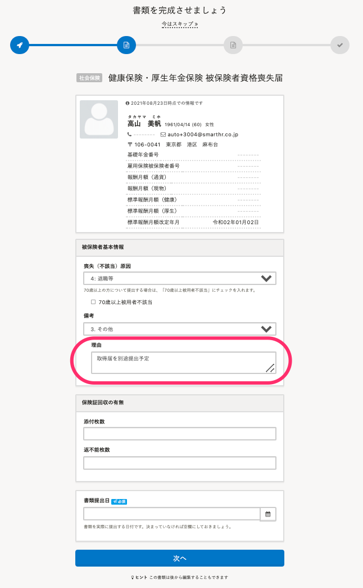
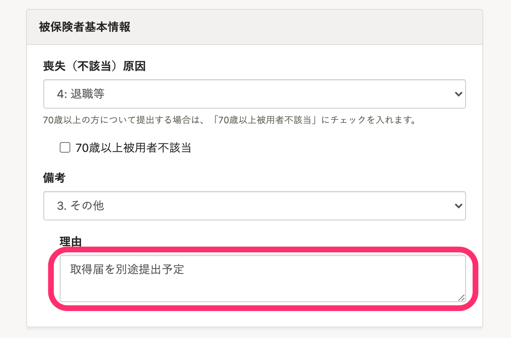
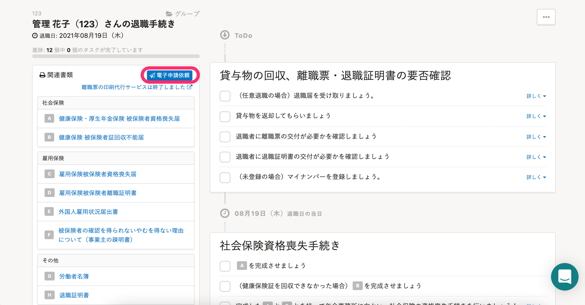
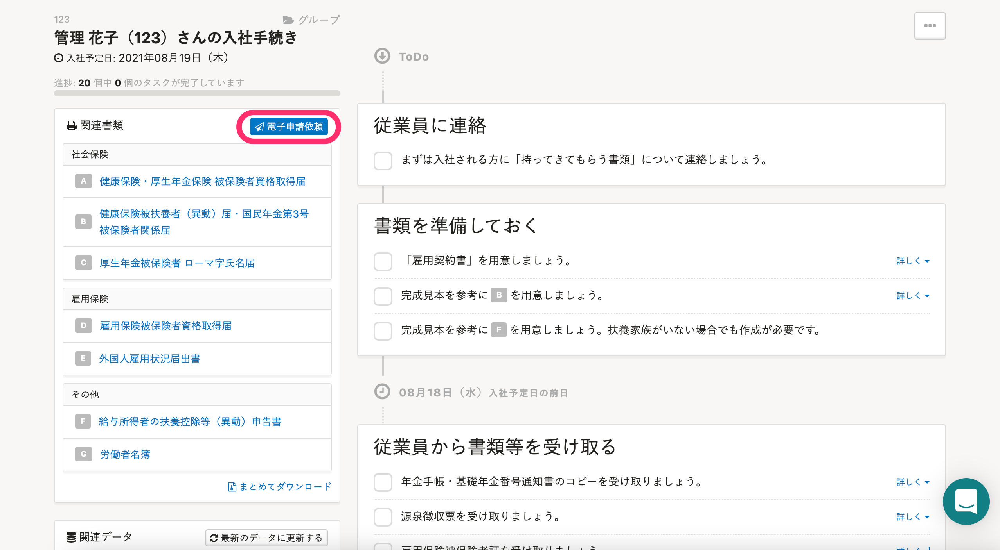

定年を迎えた従業員の再雇用時に必要な、社会保険の「資格喪失届」と「資格取得届」の手続きを作成する方法を説明します。

現在SmartHRでは、同日得喪の場合、社会保険の「資格喪失届」と「資格取得届」を同時に送付できません。

そのため **［退職手続き］** と **［入社手続き］** からそれぞれ書類を作成し、電子申請をしてください。

# 1\. 退職の手続きを作成する

トップページの **［退職の手続き］** から、該当従業員の退職の手続きを作成します。

この際に、「健康保険・厚生年金保険 被保険者資格喪失届」の手続き作成時、または作成後の書類編集画面の備考欄に **［取得届を別途提出予定］** と記載してください。

備考理由で **［3. その他］** を選択すると入力できます。

# 2\. 「健康保険・厚生年金保険 被保険者資格喪失届」を電子申請する

ToDoリストの左側にある **［電子申請依頼］** をクリックし、「健康保険・厚生年金保険 被保険者資格喪失届」を選択して申請してください。

# 3\. 従業員の退職を取り消す

ヘルプページの [2. 従業員情報を元に戻す｜退職を取り消す](https://knowledge.smarthr.jp/hc/ja/articles/360026107174) を参考に、従業員情報を修正してください。

# 4\. 入社の手続きを作成する

トップページの **［入社の手続き］** から、該当従業員の入社の手続きを作成します。

# 5\. 「健康保険・厚生年金保険 被保険者資格取得届」を電子申請する

ToDoリストの左側にある **［電子申請依頼］** をクリックし、「健康保険・厚生年金保険 被保険者資格取得届」を選択して申請してください。

:::tips
「資格取得届」の電子申請時に、「資格喪失届」の到達番号を記載したPDFファイルを添付して申請してください。
[添付書類がある場合｜電子申請手順 ① 申請を依頼する](https://knowledge.smarthr.jp/hc/ja/articles/360026266073)
[電子申請の到達番号とは](https://knowledge.smarthr.jp/hc/ja/articles/360026105834)
:::

## 雇用保険 高年齢雇用継続給付の申請が必要な場合

トップページの **［高年齢雇用継続給付金申請］** から手続きの作成および、電子申請をしてください。

:::related
[高年齢雇用継続給付金申請の電子申請を作成する](https://knowledge.smarthr.jp/hc/ja/articles/360045344294)
:::
