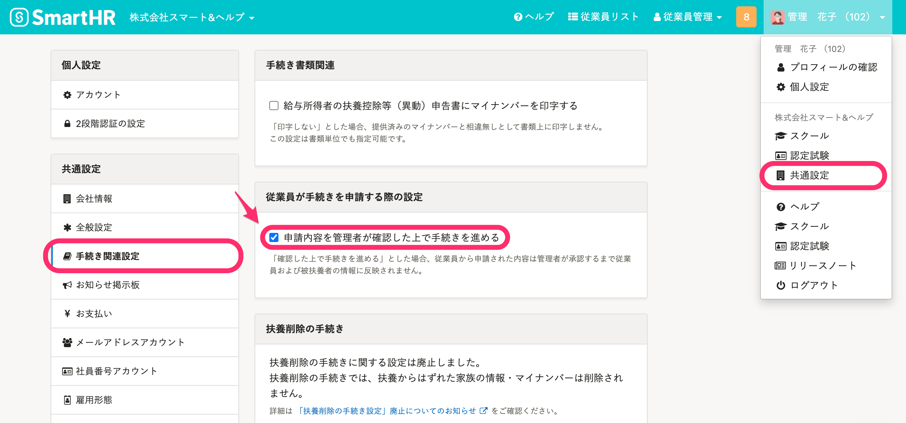
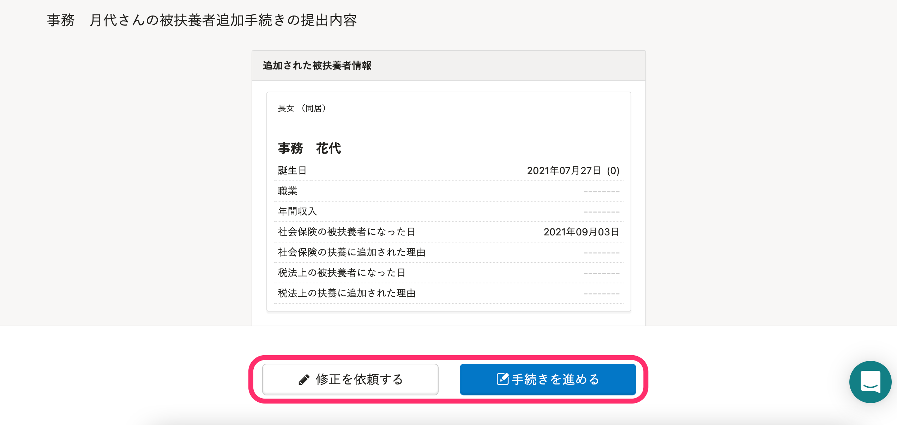
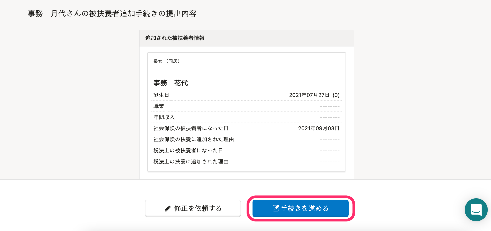
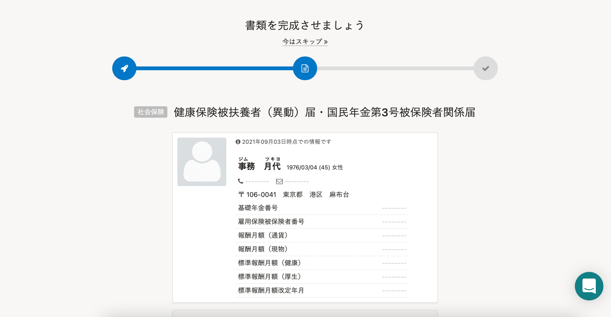
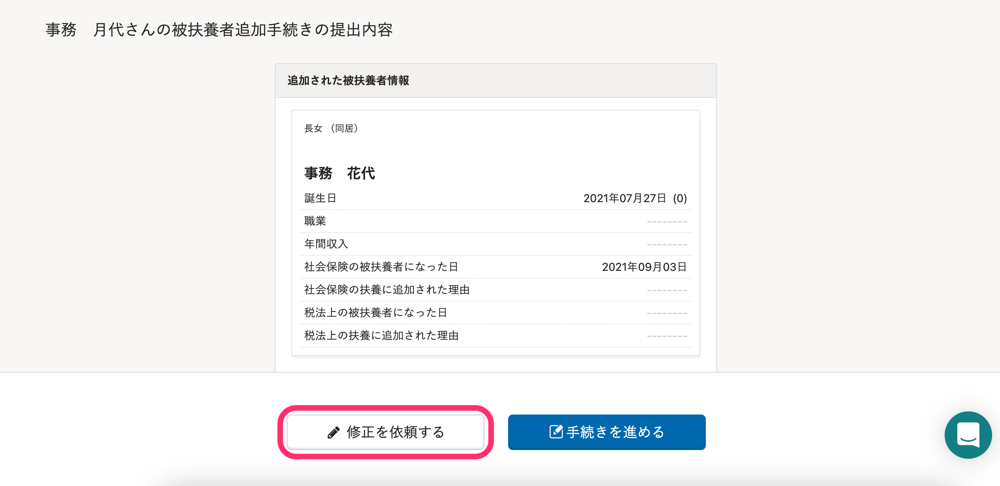
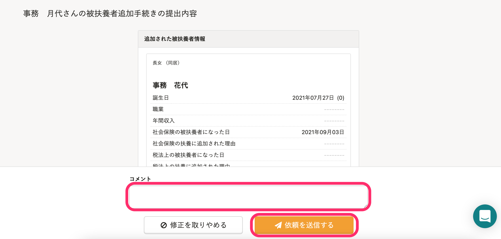
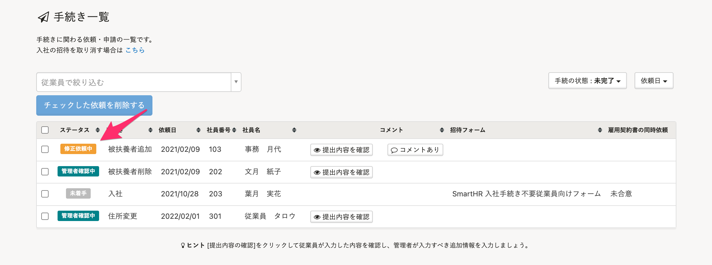

スタンダードプラン以上をご契約の場合、従業員から提出された手続きの内容を、管理者が承認するまで反映しないように設定できます。

また、提出された内容に修正がある場合は、従業員へ差し戻しも可能です。

スモールプランをご契約の場合は、入社手続きのみ対応しています。詳しくは、下記のヘルプページをご覧ください。

[従業員から情報が提出された後、入社手続きを進める](https://knowledge.smarthr.jp/hc/ja/articles/360026265873)

# 事前に必要な設定

 **［画面右上のアカウント名］>［共通設定］>［手続き関連設定］** にある、 **［申請内容を管理者が確認した上で手続きを進める］** にチェックを入れます。

上記の設定をすると、従業員から手続きが提出された際に、提出内容を確認する画面に **［修正を依頼する］［手続きを進める］** が表示されます。

# 提出された手続きを承認する

## 1\. ［手続きを進める］をクリック

提出内容の確認画面にある **［手続きを進める］** をクリックすると、従業員から提出された手続きを承認したことになります。

## 2\. 書類の作成に進む

そのまま手続き書類の作成に進むので、画面の手順に従って必要な情報を入力し、手続きを完成させます。

# 従業員に修正を依頼する

## 1\. ［修正を依頼する］をクリック

提出内容の確認画面にある **［修正を依頼する］** をクリックすると、従業員へのコメント欄が表示されます。

## 2\. ［依頼を送信する］をクリック

修正してほしい箇所などのコメントを入力し、 **［依頼を送信する］** をクリックすると、従業員へ修正を依頼できます。

## 3\. 手続きを再開する

従業員から情報が再度提出されるまでは、 **［修正依頼中］** ステータス として **［手続き一覧］** に表示されます。

従業員から再提出があると **［管理者確認中］** のステータスになるので、提出内容を確認してください。

