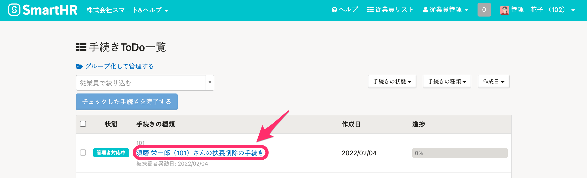
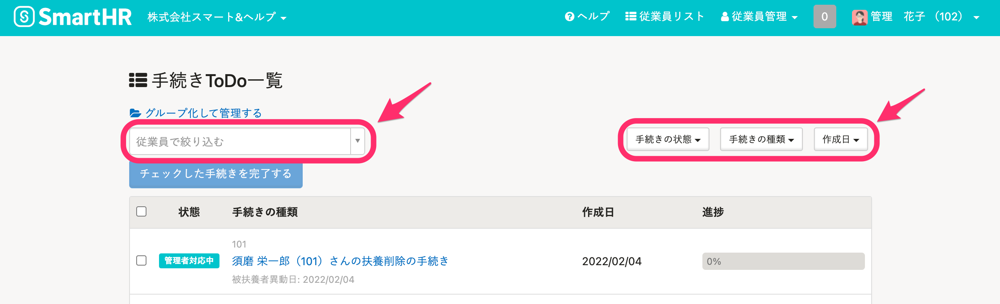
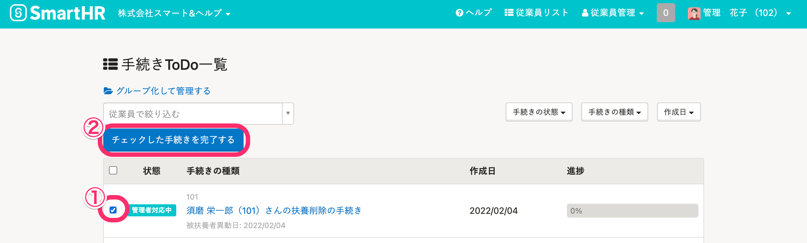

手続きの履歴は、 **トップページ >［手続きTodo一覧］** にある **［一覧を見る］** で確認できます。

# 手続き履歴の確認方法

 **トップページ >［手続きTodo一覧］** の右下にある **［一覧を見る］** をクリックすると、手続き履歴 画面に遷移します。

:::tips
 **［一覧を見る］** は手続きが **6件以上** 作成されると表示されます。
:::

# 手続き履歴画面の使い方

## 手続きのToDo画面にアクセスする

 **［手続きの種類］** 欄に表示されている手続きをクリックしてください。

## 特定の手続きを絞り込む

下記の条件を掛け合わせて検索できます。

- 従業員
- 手続きの状態
- 手続きの種類
- 作成日

## 手続きのステータスをまとめて \[完了\] にする

 **［状態］** 欄の左側にあるチェックボックスにチェックを入れ、 **［チェックした手続きを完了する］** をクリックしてください。

## 社会保険の「資格取得届」「資格喪失届」に複数人まとめて印字する

下記のページをご覧ください。

[1枚の書類に複数人の印字をする](https://knowledge.smarthr.jp/hc/ja/articles/360026265213)

## 手続きを削除する

下記のページをご覧ください。

[作成した手続きを削除する](https://knowledge.smarthr.jp/hc/ja/articles/360026107254)
