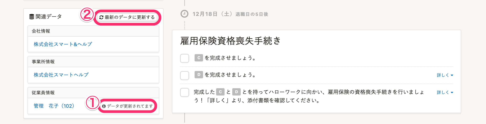
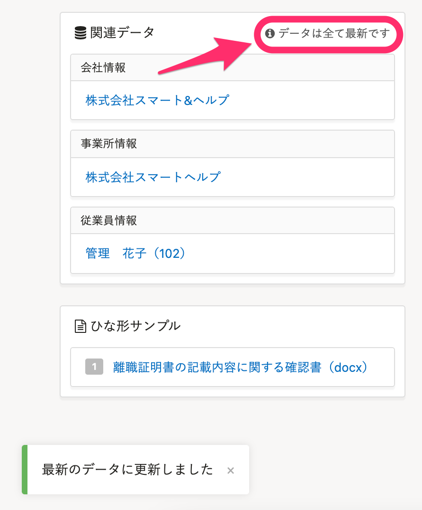

登録してあるデータと書類の内容が異なっていたり、修正した情報が反映されていなかったりする場合は、データが更新されていない可能性があります。

# 注意点

-  **［最新のデータに更新する］** をクリックした時点で、対象の手続きの内容がすべて更新されます。
- 入社・扶養追加・扶養削除の手続きにおいて、一部の家族情報の変更は書類に反映できません。[作成した手続きを削除し](https://knowledge.smarthr.jp/hc/ja/articles/360026107254)、作成し直してください。 
    - 書類に反映できないもの
        - 家族情報の削除
        - 扶養家族情報の削除（［扶養する］→［扶養しない］に変更）
    - 書類に反映できるもの
        - 氏名や生年月日など、基本情報の変更

# 1\. 従業員の手続きページを開く

管理者アカウントでログインし、対象の従業員の手続きページを開きます。

# 2.［関連データ］の［最新のデータに更新する］をクリック

左サイドメニューの **［関連データ］** に **［データが更新されています］（①）**  との表示があるかを確認します。

 **［データが更新されています］（①）**  が表示されている場合は、 **［最新のデータに更新する］（②）** をクリックしてください。

# 3\. 書類が書き換わったことを確認する

書類が任意の情報に書き換わったことを確認します。

 **［関連データ］** 隣の表記が **［データは全て最新です］** の場合、書類は最新の情報に書き換わっています。

 **［最新のデータに更新する］（②）** をクリックした時点で、対象の手続きすべてのデータが書き換わります。

:::tips
「従業員情報を変更したいが、過去の手続き内容は変更したくない」といった場合を考慮した仕様になっています。
例： 入社後に氏名変更した場合など（資格取得届の内容は変更させたくない）
:::
