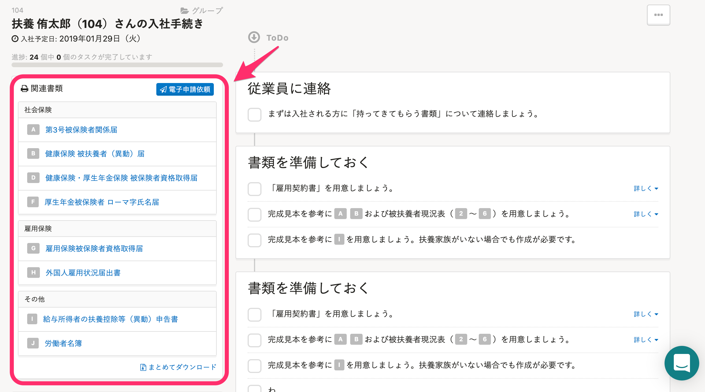
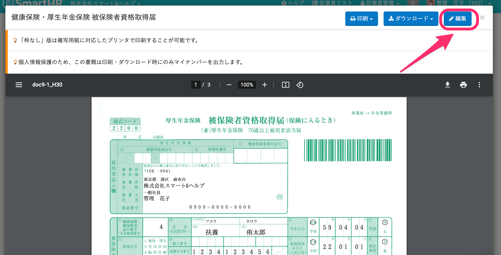
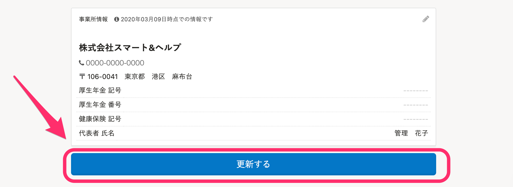
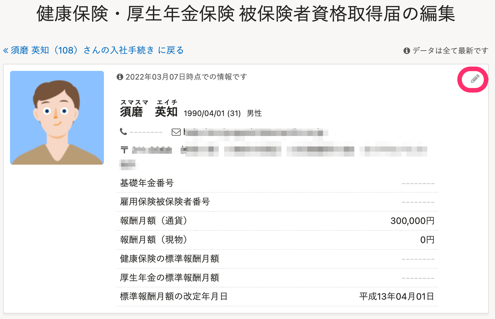
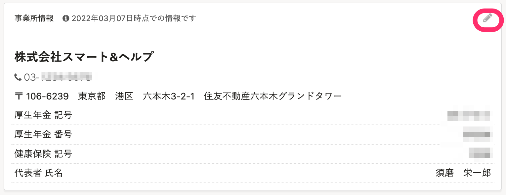
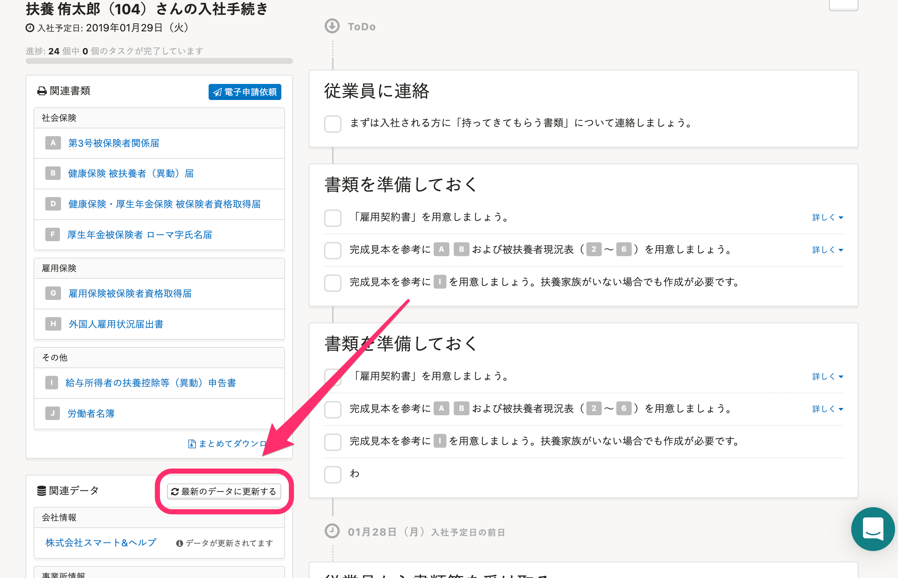

手続き時に作成した書類の内容は、後から編集できます。

:::alert
入社、扶養追加、扶養削除の手続きを作成したあとに家族情報の削除や、扶養家族情報の削除（扶養しないに変更）をしても、書類に反映できません。手続きを作成し直す必要があります。
なお、氏名や生年月日など、家族の基本情報の変更は反映されます。
:::

# 1\. ［関連書類］> 編集したい書類を選択

手続き画面の  **［関連書類］** から編集したい書類を選択します。

なお、会社情報や従業員情報は、画面左下の **［関連データ］** からも編集できます。

書類の項目ごとの修正方法については、あわせて下記のページを参照してください。

:::related
[【一覧】入退社の手続き書類の項目と修正方法](https://knowledge.smarthr.jp/hc/ja/articles/4412519883161)
:::

# 2\. 右上の **［** 編集 **］** をクリック

モーダルウィンドウが表示されるので、右上の **［編集］** をクリックします。

# 3\. 編集して **［** 更新する **］** をクリック

編集画面が表示されます。

画面に表示されている手続きの内容を修正する場合は、内容を編集して  **［更新する］** をクリックします。

また、従業員情報や事業所情報などを修正する場合は、該当セクション右上の **［鉛筆アイコン］** をクリックして編集します。

# 4. **［** 関連データ］> **［** 最新のデータに更新する］を選択

手続き画面に戻ります。

従業員情報や事業所情報などを更新した場合は、左下の **［関連データ］** \> **［最新のデータに更新する］** を押して、最新情報を書類に反映させます。

# 5\. 編集内容の反映を確認する

手続き画面の  **［関連書類］** から、編集した書類名を選択して、編集内容が反映されているか確認します。

:::related
[書類作成後に変更した情報を、作成済みの書類に反映する](https://knowledge.smarthr.jp/hc/ja/articles/360026106774)
:::
