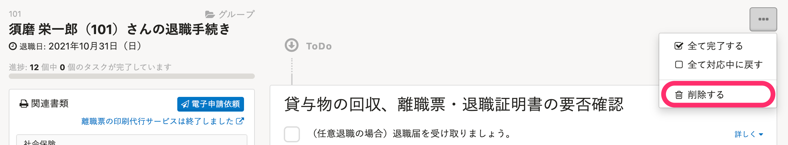
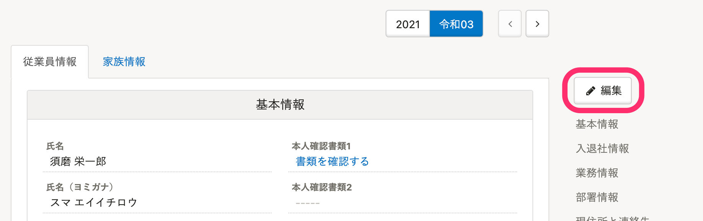
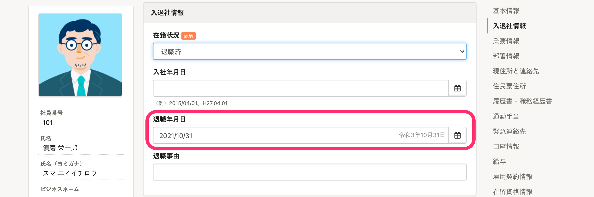
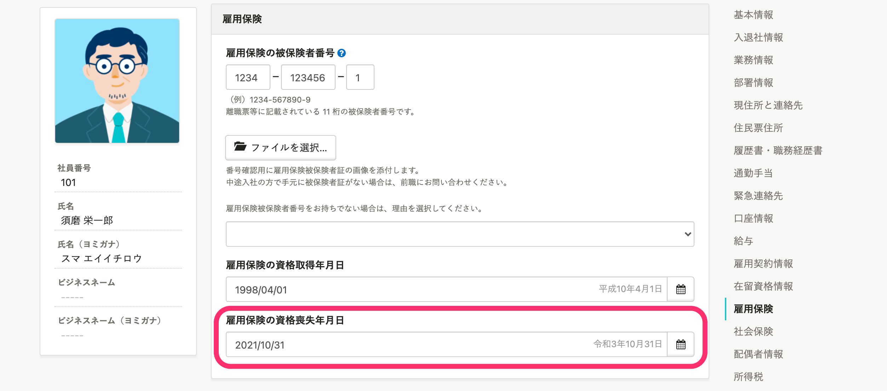
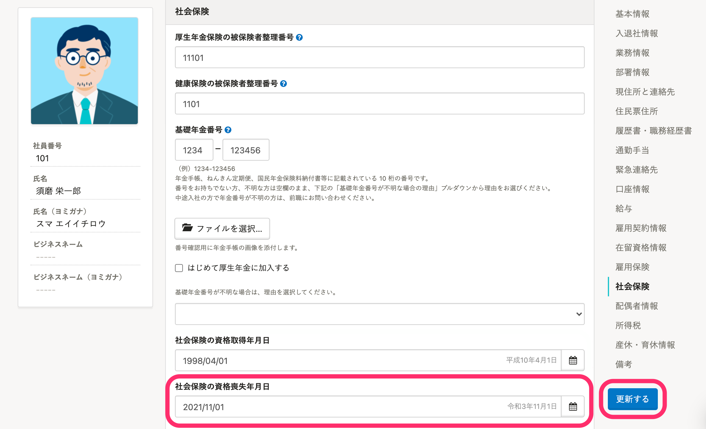

退職が取りやめになったり、誤って退職手続きを作成してしまった場合などに、退職手続きの削除と従業員情報を元に戻す手順をまとめています。

:::alert
すでに役所への申請を行なってしまっている場合は、別途役所への申請取り下げが必要です。
取り下げに関しましては、管轄の年金事務所やハローワーク、健康保険組合にお問い合わせください。
:::

# 1\. 退職手続きを削除する

削除したい退社手続きの手続きページで、右上の  **［...］メニュー >「削除する」** をクリックします。

詳しくは、[作成した手続きを削除する](https://knowledge.smarthr.jp/hc/ja/articles/360026107254)ページをご覧ください。

# 2\. 従業員情報を元に戻す

「退職の手続き」を作成したタイミングで、以下の従業員項目が変更されます。

- 退職年月日
- 雇用保険の資格喪失年月日
- 社会保険の資格喪失年月日

退職手続きを取り消す場合は、以下の手順で従業員情報を元に戻してください。

:::tips
 **［退職年月日］** の翌日になると、在籍状況が自動的に「退職済み」となります。
:::

## 2-1. 該当の従業員情報を表示し、「編集」をクリック

右上の  **「編集」** をクリックします。

## 2-2. ［退職年月日］を削除する

 **［入退社情報］>［退職年月日］** の日付を削除します。

すでに **［退職年月日］** を過ぎている場合は、 **［入退社情報］** \> **［在籍状況］** を **［在籍中］** に変更します。

## 2-3. ［雇用保険の資格喪失年月日］を削除する

 **［雇用保険］>［雇用保険の資格喪失年月日］** の日付を削除します。

## 2-4. ［社会保険の資格喪失年月日］を削除し、「更新する」をクリック

 **［社会保険］>［社会保険の資格喪失年月日］** の日付を削除します。

日付の削除が終わったら、画面右下の **「更新する」** をクリックし、変更内容を保存します。

