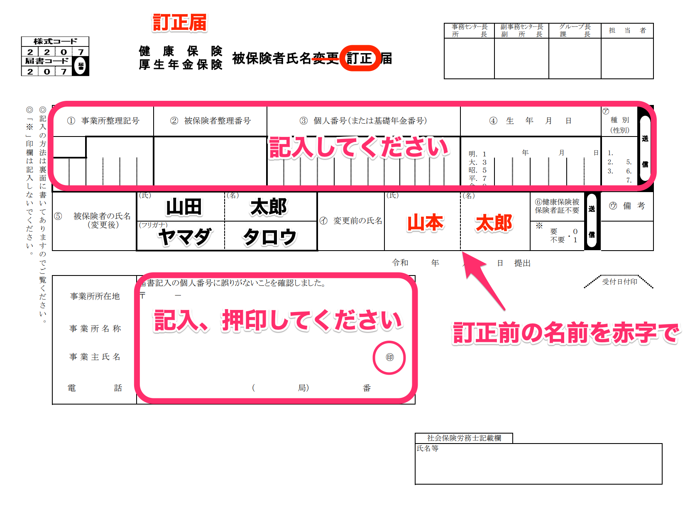
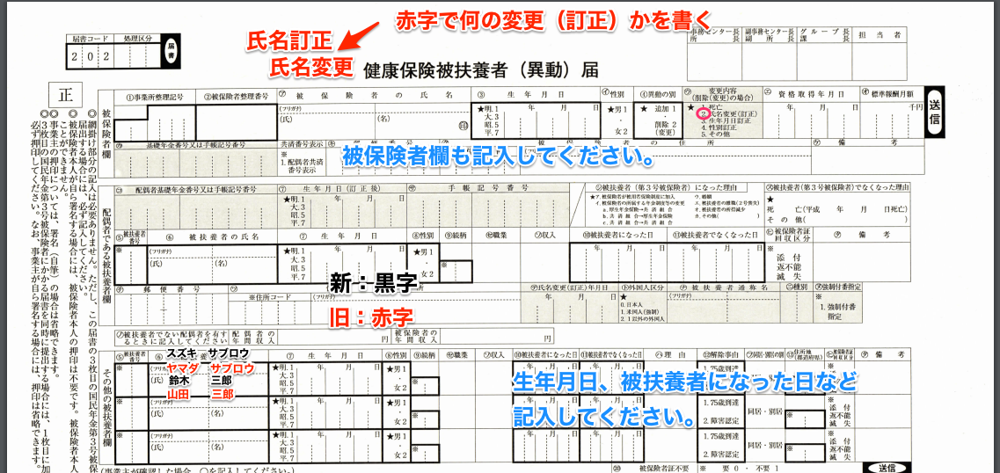

資格取得などを行ったあとに、氏名が間違っていたことに気がついた場合の、氏名訂正の方法をご案内します。

こちらは紙での手続をお願いします。

# 社会保険

## 被保険者（従業員本人）の場合

年金機構の例でご案内しております。他の健保もほぼ同様の対応で訂正可能です。

書類は以下のページにございます。

[被保険者の氏名に変更があったとき｜日本年金機構](https://www.nenkin.go.jp/service/kounen/kenpo-todoke/hihokensha/20140820-01.html)

### 添付書類

- 健康保険証

## 被扶養者の場合

従業員、被扶養者の場合いずれも、健康保険証を添付して提出してください。

## 雇用保険の場合

こちらの訂正届に記入、押印してください。

[雇用保険被保険者に係る訂正（取消）願](https://jsite.mhlw.go.jp/osaka-hellowork/library/osaka-hellowork/hw/kadoma/hoken/teiseinegai.pdf)

### 添付書類

- 被保険者証
- 事業主確認通知書
- 訂正の根拠が確認できる書類（氏名が確認できるもの）
