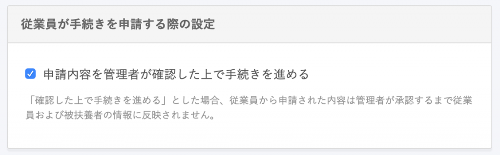

手続き入力依頼の一覧で使われているステータスの一覧です。

※このヘルプページは、スタンダードプラン、プロフェッショナルプランをご利用のお客さま向けの内容です。
※¥0プラン、またはスモールプランをご利用のお客さまの場合、 **［手続き一覧］** は **［入社手続き入力依頼］** と表示されています。

# ステータス一覧

| ステータス名 | 説明 | ToDo |
| --- | --- | --- |
| 未着手 | 従業員がまだ手続きを行っていない状態 | 招待した従業員に招待承認を促しましょう |
| メンバー対応中 | 従業員が手続きを始めた状態 | 手続きの申請完了を促しましょう |
| 管理者確認中 | 従業員が手続きを申請した状態 | 内容を確認し、次の手続きに進めましょう |
| 修正依頼中 | 修正依頼を送り、従業員が未対応な状態 | 従業員に修正対応を促しましょう |
| 管理者対応中 | 管理者側で手続きが作られた状態 | 手続きを進め、完了させましょう |
| 完了済み | 手続きのタスク ( ToDo ) がすべて完了となった状態 | なし |

スタンダードプラン、プロフェッショナルプランの場合、 **［**  **共通設定］>［手続き関連設定］** にある **［申請内容を管理者が確認した上で手続きを進める］** にチェックを入れると、扶養追加や住所変更などの手続きについても、管理者が承認するまで情報変更が反映されないようになります。

¥0プラン、またはスモールプランをご利用中の場合は、下記のヘルプページをご覧ください。

[【一覧】入社手続き入力依頼の一覧で使われているステータス](https://knowledge.smarthr.jp/hc/ja/articles/360026106334)
