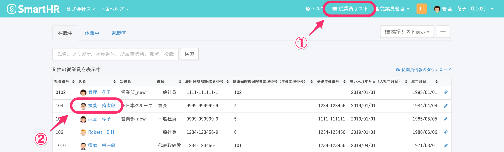
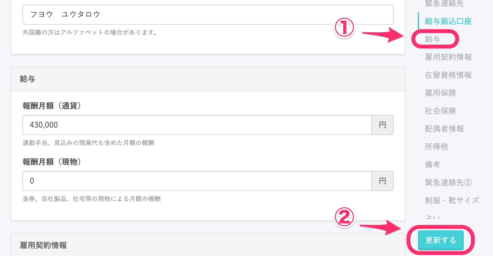
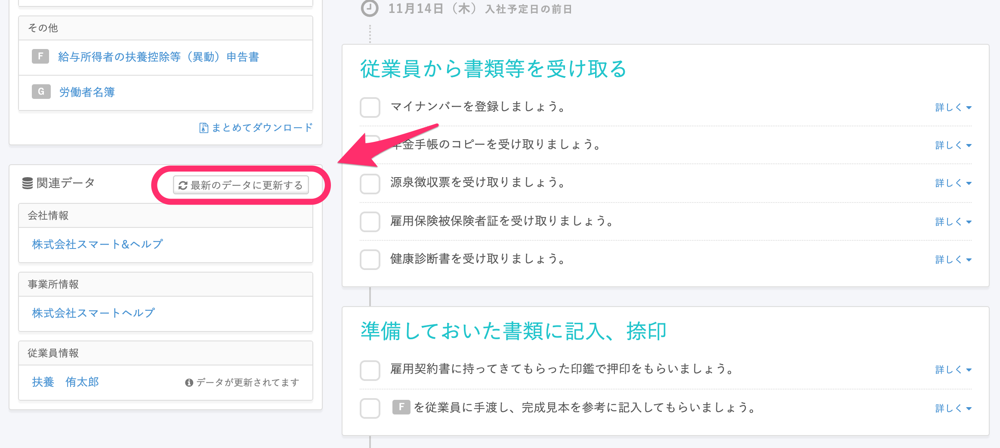
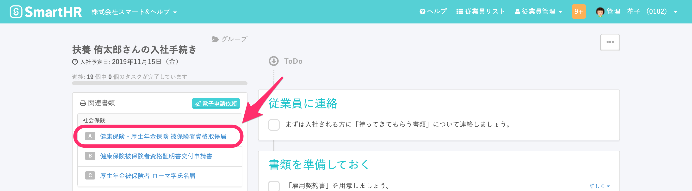
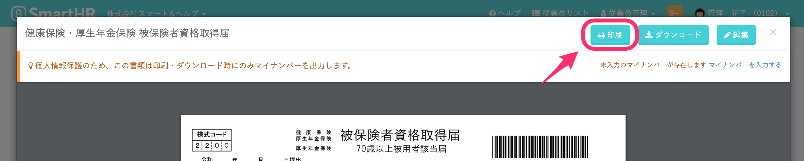
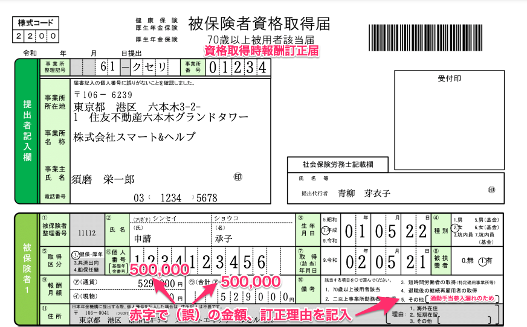

資格取得を行なったあと、報酬月額が間違っていた場合、紙に手書きで記入して訂正する必要があります。

# 1\. \[従業員リスト\] > 該当の従業員名 をクリック

管理者としてログインした後、 **\[従業員リスト\] > 該当の従業員名** をクリックします。

# 2\. 報酬月額を修正する

従業員情報ページが開けたら、右側のメニューにある **\[給与\]** をクリックしてください。

**\[給与\]** 項目に表示される入力欄を使って、報酬月額を修正します。

修正し終わったら、 **\[更新する\]** を押して内容を保存してください。

# 3\. 入社手続きページの \[最新のデータに更新する\] をクリック

内容を保存したらトップページに戻り、該当の従業員さまの入社手続きページを開きます。

画面左下にある **\[最新のデータに更新する\]** を押してください。

# 4\. \[健康保険・厚生年金保険 被保険者資格取得届\] をクリック

入社手続きの左上にある **\[健康保険・厚生年金保険 被保険者資格取得届\]** をクリックします。

# 5. \[健康保険・厚生年金保険 被保険者資格取得届\] を印刷

画面右上にある **\[印刷\]** をクリックして、印刷してください。

# 6\. 手書きで記入し、年金事務所に提出する

印刷した **\[健康保険・厚生年金保険 被保険者資格取得届\]** に、手書きで以下のように記入します。

記入した書類を年金事務所へ提出してください。

# 関東ITS健保の場合

下記のページを参照してください。

[取得時報酬訂正について | ［ITS］関東ITソフトウェア健康保険組合](http://www.its-kenpo.or.jp/hoken/jimu/santei/teisei.html)
