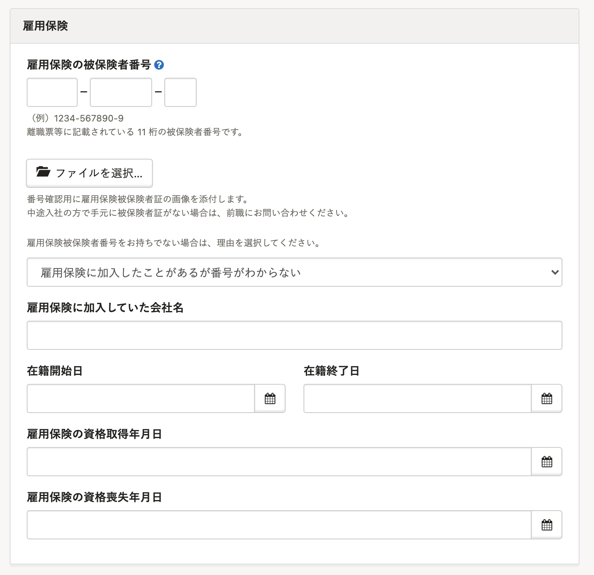

雇用保険被保険者番号が不明な場合でも、手続きを進めることが可能です。

- ［雇用保険の被保険者番号］欄は空欄
- 雇用保険に加入していた前職の会社名、在籍期間（雇用保険加入期間）を別紙に記入。（様式自由）

資格取得届に別紙を添付して提出をすれば、ハローワークが番号照会してくれます。

従業員ページに、前職情報を入力する欄をご用意していますのでご活用ください。

:::tips
電子申請をする場合の対応方法は下記のページをご確認ください。
[雇用保険被保険者番号が不明な場合に資格取得届を提出するには？](https://knowledge.smarthr.jp/hc/ja/articles/360026265653)
:::
