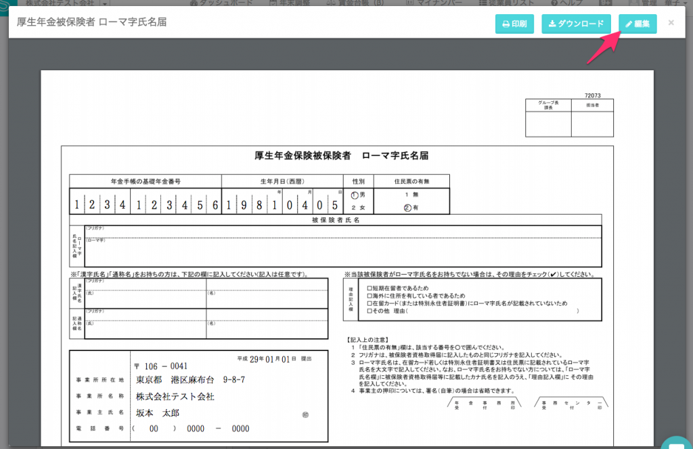
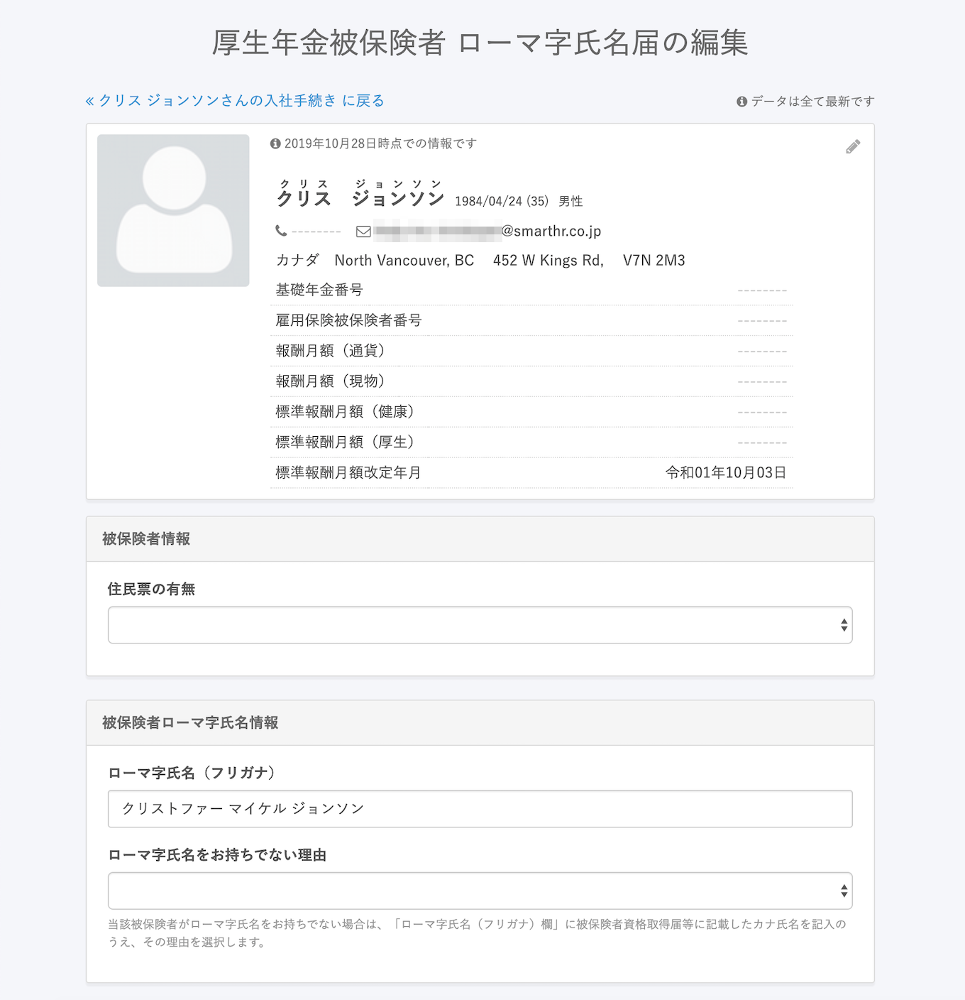
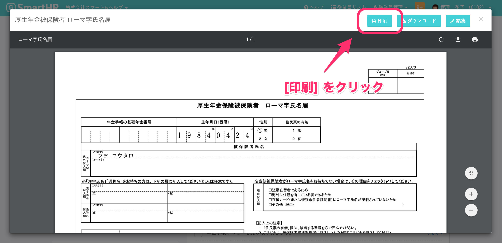

外国籍の従業員が社会保険に加入する場合や氏名変更を行う場合、年金事務所へ **\[ローマ字氏名届\]** を提出する必要があります。

# ローマ字氏名届の作成方法

## 1\. \[関連書類\] から \[ローマ字氏名届\] をクリック

入社手続きページ左の **\[関連書類\]** から **\[ローマ字氏名届\]** をクリックします。

## 2\. 右上の \[編集\] をクリック

右上の **\[編集\]** をクリックします。

## 3\. 編集した内容を保存する

ローマ字や必要事項を入力し、保存してください。

## 4\. 印刷した \[ローマ字氏名届\] を提出する

手続きページの **\[関連書類\]** から **\[ローマ字氏名届\]** を印刷し、会社の押印をし、資格取得届や氏名変更届とあわせて提出してください。

# 電子申請を行う場合

## 1\. \[ローマ字氏名届\] を印刷して押印する

作成したローマ字氏名届けをプリントアウトし、会社の印鑑で押印してください。

## 2\. PDFにした書類を添付する

押印した書類をスキャンなどでPDFに変換し、電子申請時にPDFの書類を添付してください。

:::alert
ローマ字氏名届は、すべての従業員の入社・氏名変更の手続きで自動生成されますが、提出が必要な対象は外国籍の従業員のみです。
日本国籍の従業員の場合は提出する必要はありません。
:::
