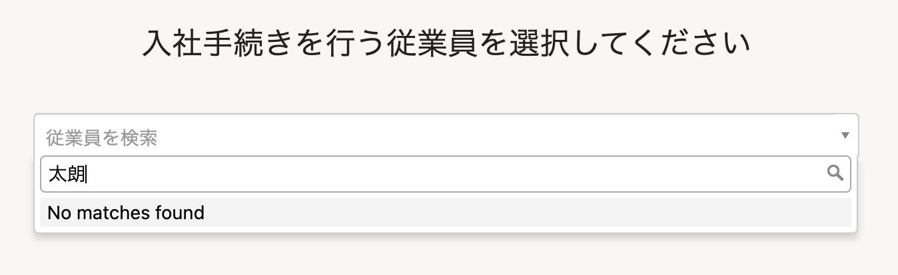
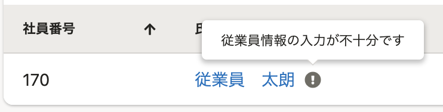
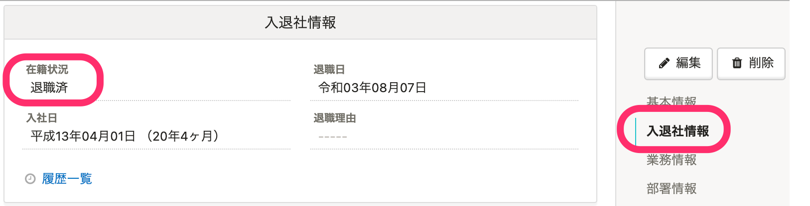
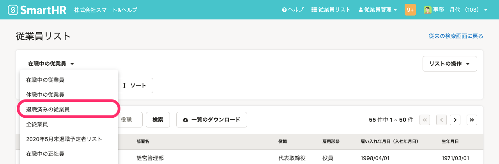

# A. 従業員情報の登録必須項目が未登録の場合か、従業員情報の在籍状況が［退職済］の場合です。

従業員情報の登録必須項目が未登録か、在籍情報が［退職済］の場合、手続き作成の対象として表示されません。

詳しくは、それぞれの項目をご覧ください。

## 従業員情報の登録必須項目が未登録の場合

 **［従業員リスト］** 上で、 **［！］アイコン** が表示されている場合は、登録されている従業員情報に不足がある状態です。

該当従業員を対象として表示させるには、下記のヘルプページを参考に、従業員情報の必須項目を入力してください。

[従業員リスト上に \[！\] アイコンが表示される条件は？](https://knowledge.smarthr.jp/hc/ja/articles/360027003153)

## 在籍状況が［退職済］の場合

在籍情報が **［退職済］** の従業員は、手続き作成の対象となりません。

従業員情報の画面で、 **［入退社情報］** 欄の **［在籍状況］** を確認してください。

退職済みの従業員は、従業員リストの **［退職済みの従業員］** でも確認できます。

:::tips
在籍状況が **［退職済］** の場合でも、 **「退職の手続き」**  は作成できます。
:::
