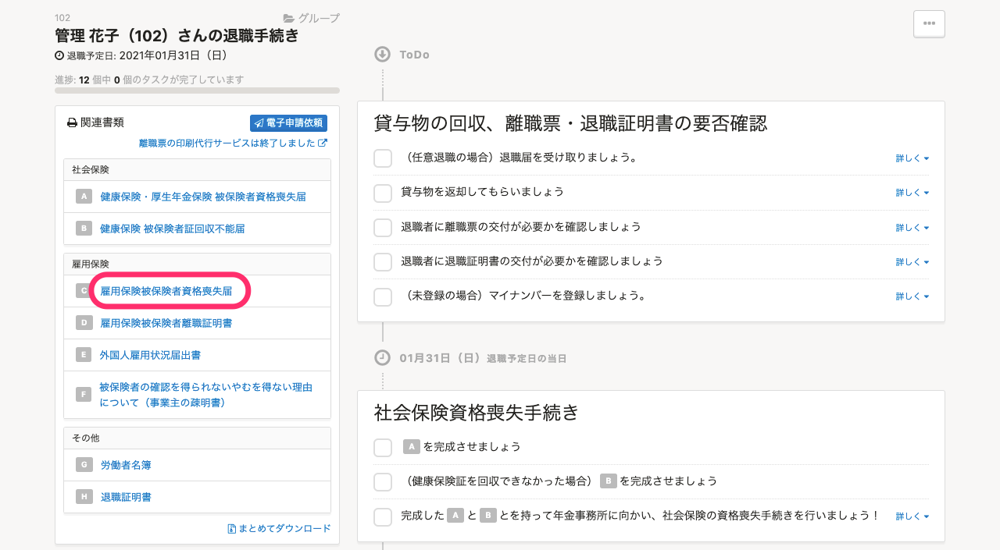
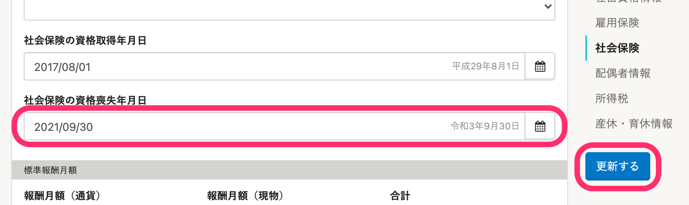

社員から役員へ異動する場合など、退職はせずに雇用保険被保険者資格喪失届のみ作成する方法を説明します。

現在SmartHRでは、特定の書類のみ作成する機能をご用意していないため、一度「退職の手続き」を作成し、必要な書類のみ処理をした後、退職日などの情報を元に戻していただく流れになります。

# 1\. 「退職の手続き」を作成する

トップページの［退職の手続き］から、喪失届を作成したい従業員の退職の手続きを作成します。

# 2\. ToDoリストのページで、必要な書類のみ処理する

ToDoリストのページの左側の［関連書類］の欄にある「雇用保険被保険者資格喪失届」をご利用ください。

# 3\. 従業員情報を修正する

「退職の手続き」を作成したタイミングで、以下の従業員項目が変更されます。

- 退職年月日
- 雇用保険の資格喪失年月日
- 社会保険の資格喪失年月日

変更が必要ない項目は、日付を削除して更新してください。

:::alert
退職の手続きを作成した際に **［退職日］** に過去の日付を入力した場合は、在籍状況が **［退職済］** に変更されます。
従業員情報の編集画面にある **［入退社情報］** \> **［在籍状況］** を手動で **［在職中］** に変更してください。

:::
