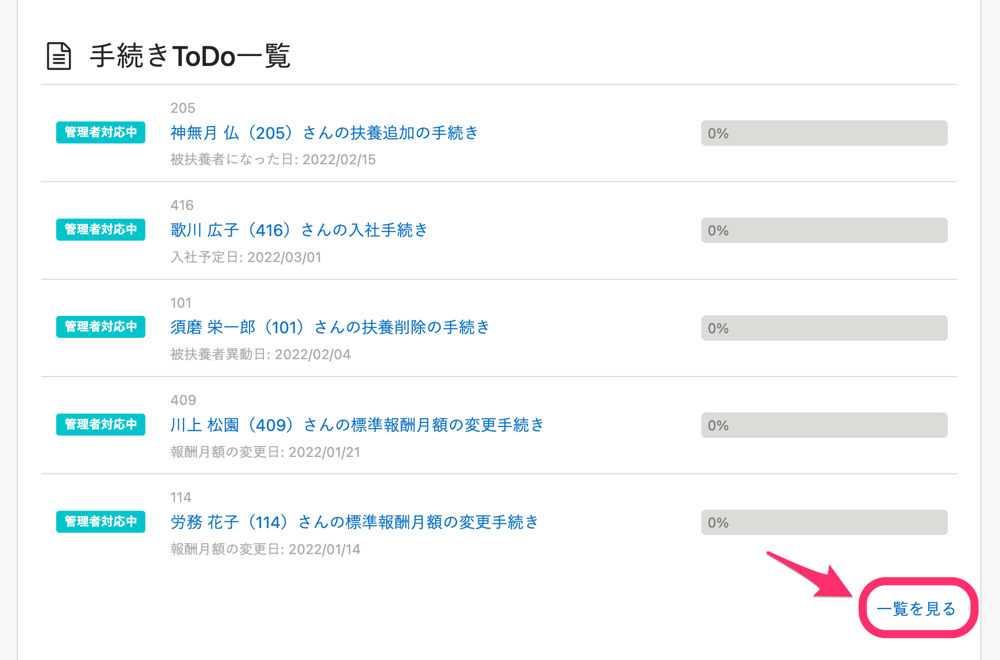
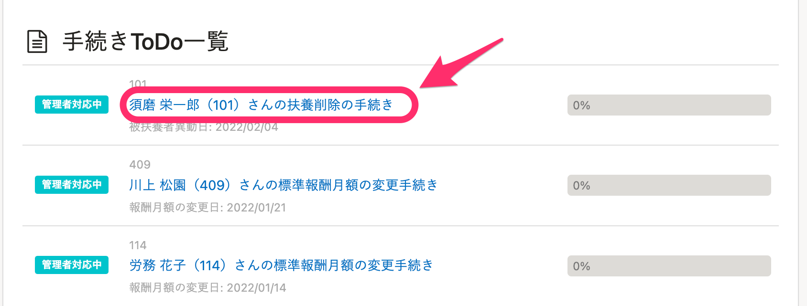
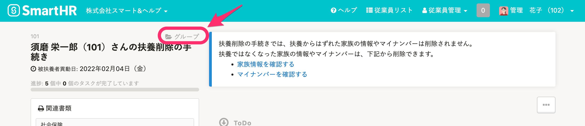
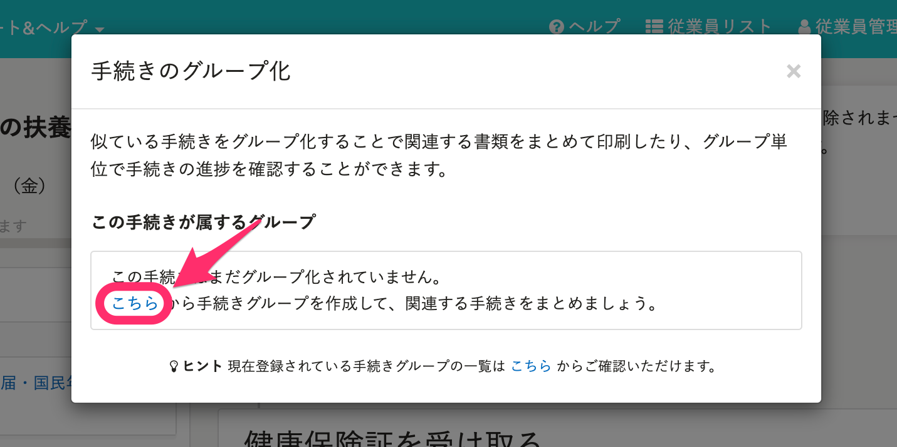
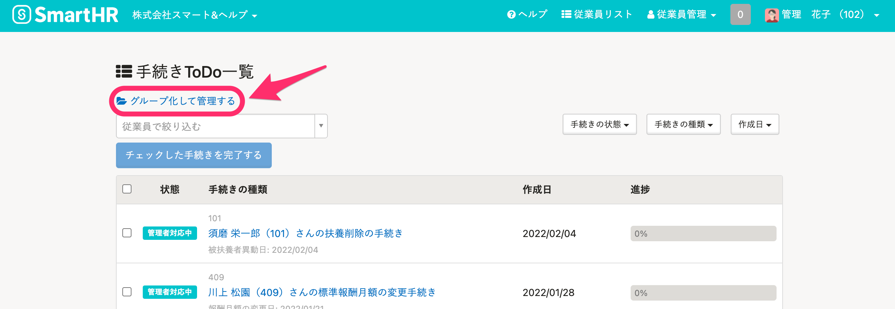
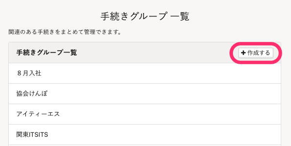
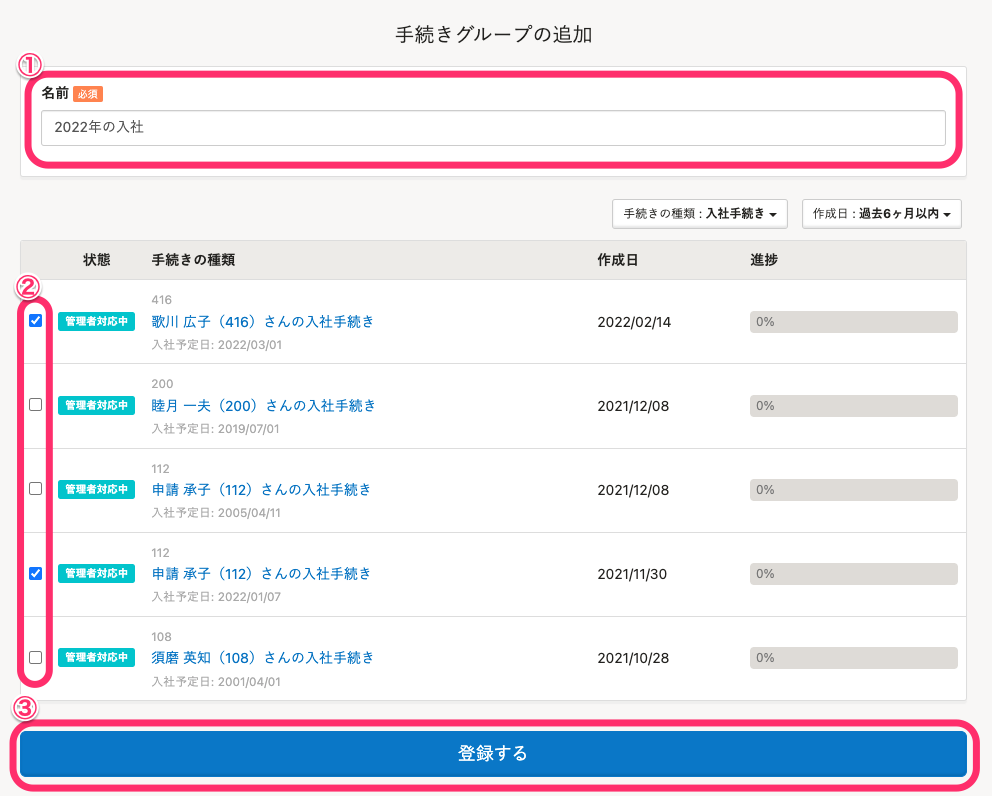
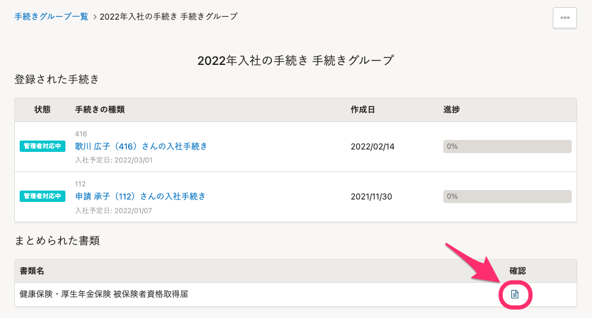
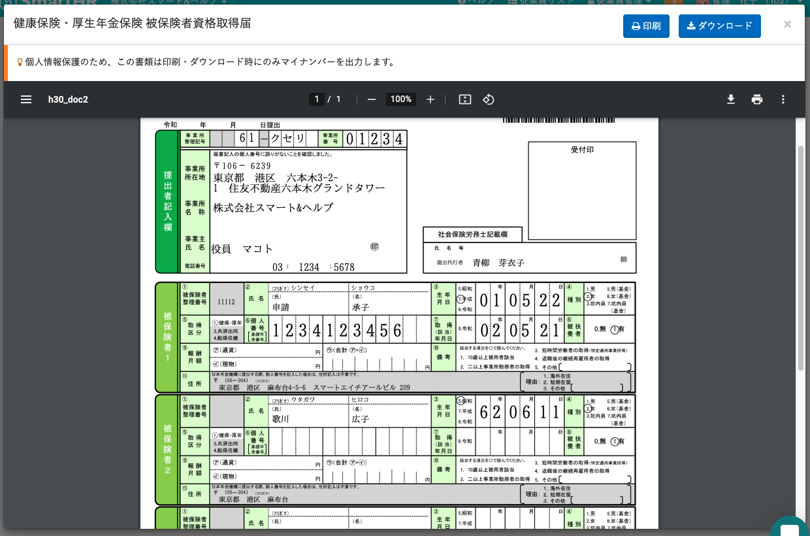

**資格取得届、資格喪失届**の場合は、手続きグループを作成することで、1枚の書類に複数人の印字ができます。

書類を作成するための情報入力、区分の選択などはこれまで通り、1人ずつ行なってください。

2022年4月1日現在、複数人印字は「資格取得届」「資格喪失届」のみ可能です。

# 1\. 手続きToDo一覧の［一覧を見る］をクリック

全員の手続き情報登録を完了させ、トップページの **［手続きToDo一覧］** 右下にある **［一覧を見る］** をクリックします。

:::tips
手続きToDo一覧に **［一覧を見る］** が表示されない場合は、手続きの名前をクリックします。

次に、左上に表示される **［グループ］** をクリックします。

 **［グループ］** をクリックすると表示されるモーダルの枠内にある［ **こちら］** をクリックして、手順4に進んでください。

:::

# 2\. ［グループ化して管理する］をクリック

画面左上に表示される **［グループ化して管理する］** をクリックします。

# 3\. 手続きグループ一覧画面で［作成する］をクリック

手続きグループ一覧の画面右上にある **［作成する］** をクリックします。

# 4\. グループ名・印字する従業員を選んで登録する

グループの名前を入力し、従業員リストの左端にあるチェックを入れて、書類に印字する従業員を選びます。

グループの名前と印字する従業員を設定したら、画面下部にある **［登録する］** をクリックします。

# 5\. ファイルアイコンをクリック

**\[登録する\]** をクリックすると表示される画面の下に、  **［まとめられた書類］** 項目があります。

 **［まとめられた書類］** 項目の **［確認］** 欄にあるファイルアイコンをクリックして、書類を開いてください。

# 6\. 複数名が印字された書類を確認する

ファイルアイコンをクリックすると、複数名が印字された書類が表示されます。

