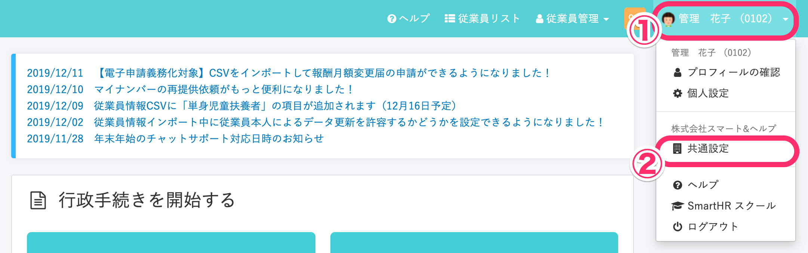
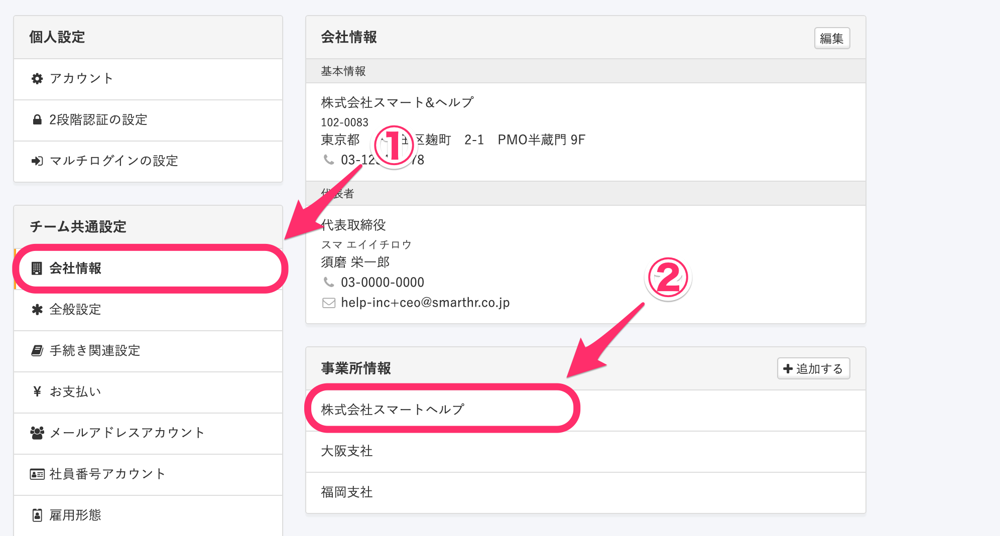
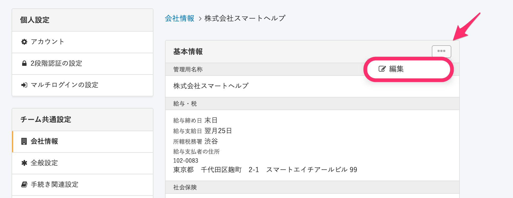
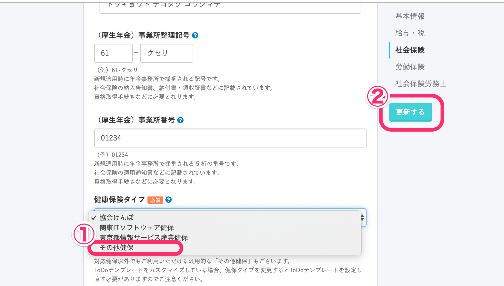

「その他健保」は、全国健康保険協会（協会けんぽ）、関東ITソフトウェア健康保険組合（関東ITS）、東京都情報サービス産業健康保険組合（TJK） 以外の健保組合にご加入の会社さま向けに、汎用的にご利用いただける健康保険タイプです。

- 書類の様式は協会けんぽと同様です。
- 普通用紙に印刷してご利用いただけます。
- 健保組合用には基礎年金番号は非表示、健保の事業所整理番号を表示できます。

協会けんぽ、関東ITS、TJK については、 下記のページをご覧ください。

[「健康保険タイプ」を設定する](https://knowledge.smarthr.jp/hc/ja/articles/360026265453)

# 必ずご確認いただきたいこと

事前に、ご加入の健保組合に「協会けんぽと同様の書類でも対応可能かどうか」をご確認ください。
※一部の健保組合では専用の用紙のみの受付としている場合もございます。

# 設定方法

## 1\. 画面右上のアカウント名 > \[共通設定\] をクリック

**画面右上のアカウント名 > \[共通設定\]** をクリックします。

## 2\. \[会社情報\] で任意の事業所名をクリック

画面左に **\[共通設定\]** が表示されるので、メニューにある **\[会社情報\]** をクリックしてください。

**\[事業所情報\]** 欄で任意の事業所名をクリックします。

## 3\. \[...\] メニューをクリック

画面右上に表示される、 **\[...\] メニュー > \[編集\]** をクリックしてください。

## 4\. \[その他健保\] をクリック

**\[社会保険\]** の **\[健康保険タイプ\]** にて、**\[その他健保\]**を選択してください。

**\[健康保険組合の名称\]** という項目が表示されますので、健康保険組合名を入力し、**\[更新する\]**をクリックしてください。

