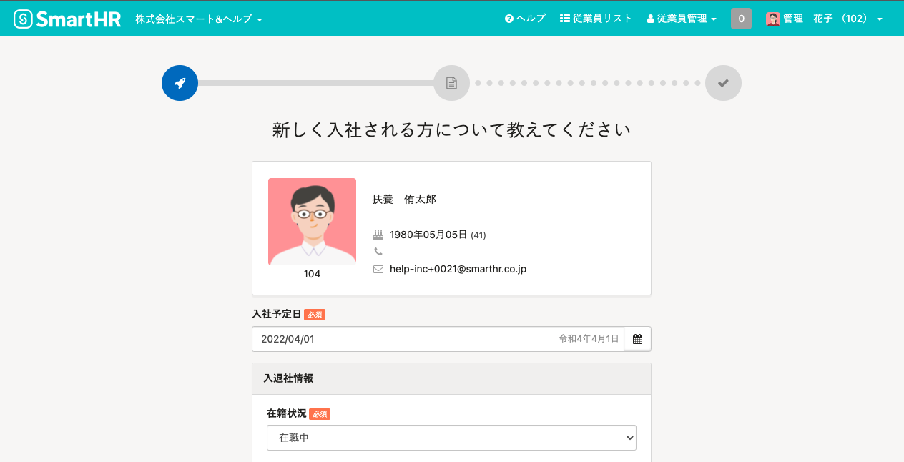

入社の手続きには2通りの開始方法があります。

| 登録済みの従業員から選ぶ | 管理者が従業員から基本情報を取り寄せ、情報を入力し手続きを進める方法です。 |
| --- | --- |
| 本人に基本情報を入力してもらう | 基本情報の入力を従業員自身に依頼し手続きを進める方法です。 |

# 登録済みの従業員から選ぶ場合

## 1\. トップページ >［入社の手続き］をクリック

トップページの **［入社の手続き］** をクリックします。

## 2.［登録済みの従業員から選ぶ］をクリック

入社手続きの進め方を選択する画面が表示されたら、 **［登録済みの従業員から選ぶ］** をクリックします。

## 3.［入社手続きを開始する］をクリック

手続きを行う従業員を選択し、 **［入社手続きを開始する］** をクリックします。

## 4\. 手続きに必要な情報を入力する

画面の手順に従い、手続きに必要な情報を入力してください（これらは後で変更することが可能です）。

## 5\. ToDoリストを参考に書類を作成する

入社手続きが作成されるので、ToDoを参考に書類の作成・提出などを行なってください。

# 本人に基本情報を入力してもらう場合

## 1\. トップページの［入社の手続き］をクリック

トップページの画面中央にある **［入社の手続き］** をクリックします。

## 2. ［本人に基本情報を入力してもらう］をクリック

入社手続きの進め方を選択する画面が表示されたら、 **［本人に基本情報を入力してもらう］** をクリックします。

## 3\. 従業員を選択して［依頼を作成する］をクリック

任意の従業員招待フォームを選択し、入力依頼をする人にチェックを入れて **［依頼を作成する］** をクリックします。

:::tips
従業員登録をしていない場合は、下記を参考に登録してください。
[従業員情報を追加・登録する](https://knowledge.smarthr.jp/hc/ja/articles/360026266493)
:::

## 4.［バックグラウンド処理一覧］を確認する

依頼の進捗状況は、 **［バックグラウンド処理一覧］** のリンクから確認できます。

:::tips
従業員本人が情報を入力したあとの、管理者側の入社手続きの進め方については、下記を参照してください。
[従業員から情報が提出された後、入社手続きを進める](https://knowledge.smarthr.jp/hc/ja/articles/360026265873)
:::
