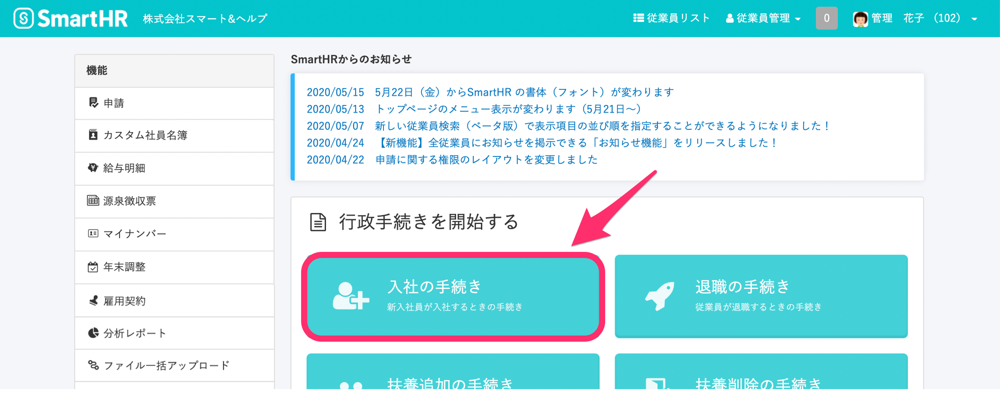
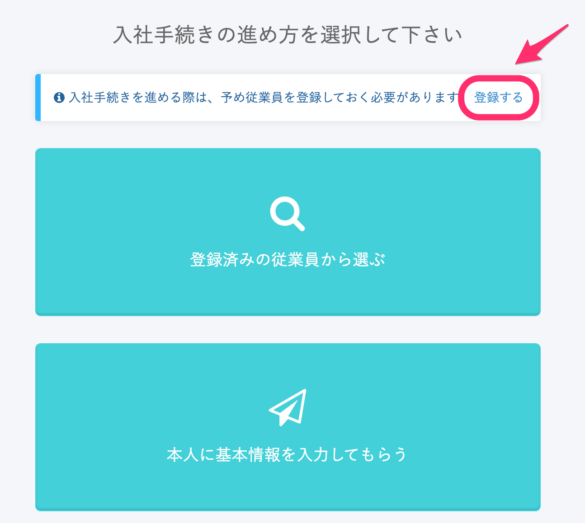
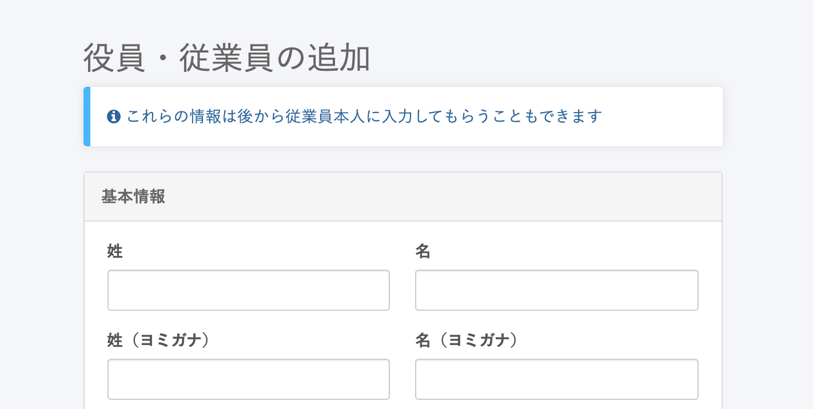
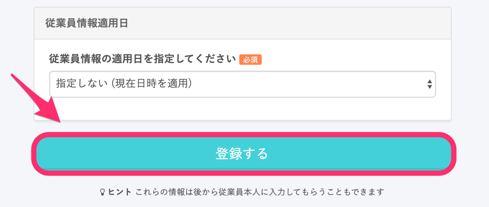
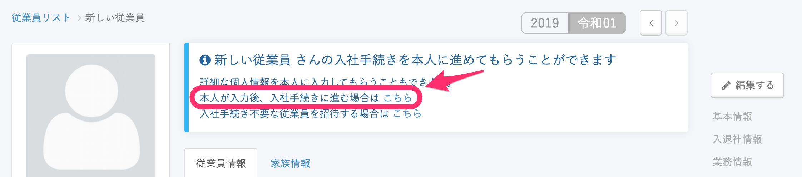
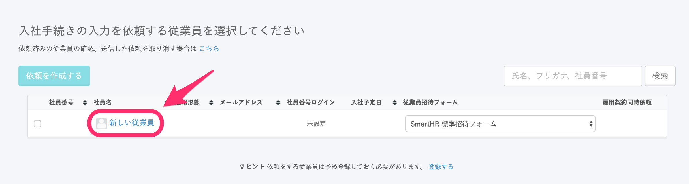
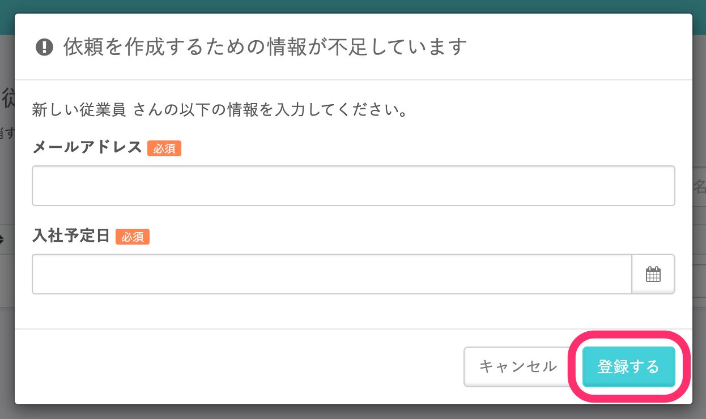
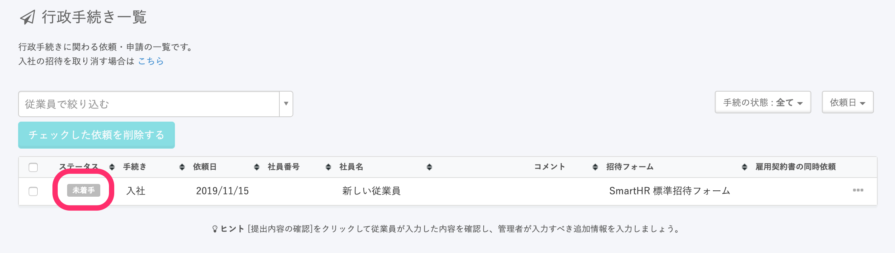

入社手続きの前に従業員本人に情報を入力してもらうには、 **トップページ > \[入社の手続き\]** で従業員を登録した上で、入社手続きの入力を依頼をします。 

# 1\. \[入社の手続き\] をクリック

ログイン後のトップページにある **\[入社の手続き\]** をクリックします。

# 2\. 入社手続きの選択画面で \[登録する\] をクリック

入社の手続きを選択する画面下部にある、 **\[登録する\]** をクリックします。

# 3\. 役員・従業員の追加画面で \[登録する\] をクリック

**\[役員・従業員の追加\]** 画面で氏名等必須項目を入力し、画面下部にある **\[登録する\]** ボタンをクリックします。

# 4. \[本人が入力後、入社手続きに進む場合はこちら\] をクリック

**\[登録する\]** をクリックした次の画面の上部に、メッセージが表示されます。

メッセージに記載の「本人が入力後、入社手続きに進む場合は **\[こちら\]** 」をクリックしてください。

# 5\. 入力依頼する人をチェックし、 \[依頼を作成する\] をクリック

入力依頼をする人をチェックし、画面上部にある **\[依頼を作成する\] ボタン**をクリックします。

# 6\. メールアドレスと入社予定日を入力する

送信先のメールアドレスや入社予定日が未入力の場合、入力画面が表示します。

それぞれの項目を入力後、右下の **\[登録する\]** をクリックして下さい。

# 7\. 依頼の送信を確認する

従業員にアカウントの招待と入力依頼が送信され、一覧に表示されます。

招待を受けた従業員が情報を入力し、提出を行うと、ステータスが変更されます。

従業員がどこまで対応するとステータスが変更されるかについては、下記のページで詳しくご案内しています。

[入社の手続き依頼をした後のステータスはどう遷移する？](https://knowledge.smarthr.jp/hc/ja/articles/360026103554)

また、従業員本人が情報を入力した後の入社手続きの進め方は、下記のページをご確認ください。

[従業員から情報が提出された後、入社手続きを進める](https://knowledge.smarthr.jp/hc/ja/articles/360026265873)
